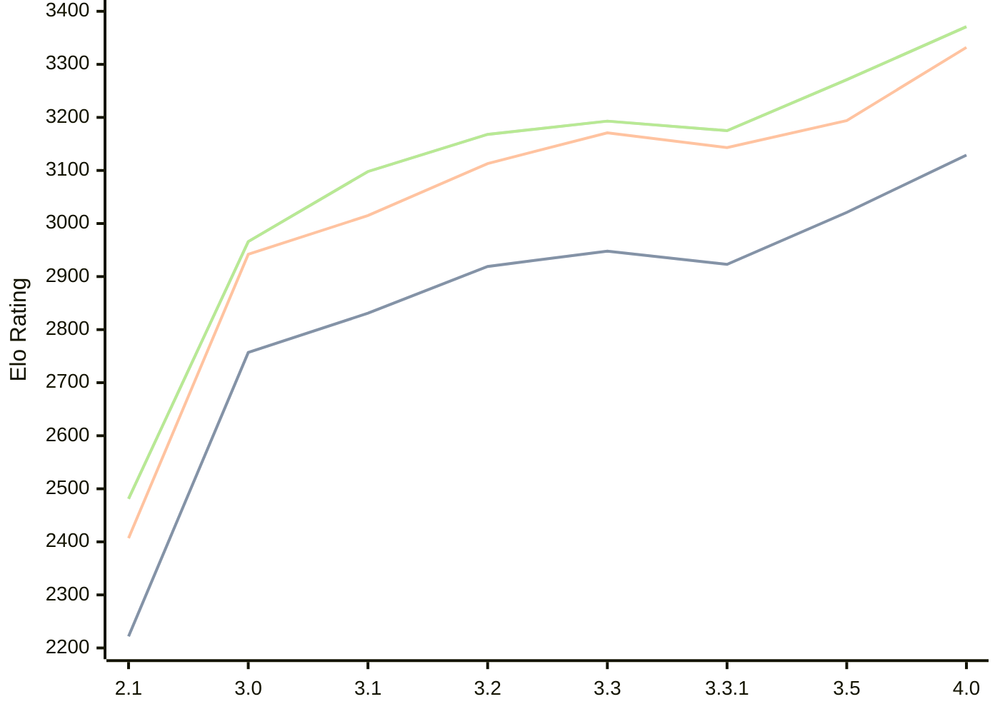

# Engine: Petrel

Author: Aleks Peshkov

Home: https://github.com/AleksPeshkov/petrel

## Elo Ratings

| Version | Published | STC 8.0+0.08s  | LTC 60.0+0.60s | VLTC 2m24s+1.12s | Comment |
| --- | --- | --- | --- | --- | --- |
| 4.0 | 2026-08-04 | 3129(+108) | 3332(+138) | 3371(+100) |  |
| 3.5 | 2026-06-02 | 3021(+98) | 3194(+51) | 3271(+96) |  |
| 3.3.1 | 2026-02-10 | 2923(-25) | 3143(-28) | 3175(-18) |  |
| 3.3 | 2026-02-09 | 2948(+29) | 3171(+58) | 3193(+25) |  |
| 3.2 | 2025-12-21 | 2919(+88) | 3113(+98) | 3168(+70) |  |
| 3.1 | 2025-11-28 | 2831(+74) | 3015(+73) | 3098(+132) |  |
| 3.0 | 2025-11-26 | 2757(+535) | 2942(+535) | 2966(+485) |  |
| 2.1 | 2025-10-13 | 2222 | 2407 | 2481 |  |
 | | | cElo (∆ prev) | cElo (∆ prev) | cElo (∆ prev) | 

<a href="https://github.com/computer-chess-index/cci/issues/new?template=submit-version.yml&title=[VERSION]+Petrel+<version>&body=###%20Engine%20name%0APetrel%0A%0A###%20Version%0A4.0" target="_blank">Submit new version</a>

 Test Conditions:

GUI/CLI: <a href=https://github.com/cutechess/cutechess target="_blank">Cute-Chess</a> 
Elo Calculation: <a href=https://www.remi-coulom.fr/Bayesian-Elo/ target="_blank">Bayesian-Elo</a> 
CPU: Intel(R) Core(TM) i5-7500T 2.70GHz 
Opening book: 8_moves_v3 
\* STC: 8.0+0.08s, LTC: 60.0+0.60s, VLTC: 2m24s+1.12s

 Lists:
Ratings: <a href=https://github.com/computer-chess-index/cci/blob/main/lists/CCIRatings.csv target="_blank">Complete list</a>

Generated: 2026-09-01 04:37:29

## Ratings Verlauf

## Detailed Evaluation Results

| Version | Time Control | Elo  | Range +/- | Matches | Score | Average Opponent Elo | Draws |
| --- | --- | --- | --- | --- | --- | --- | --- |
| 4.0 | VLTC (2m24s+1.12s) | 3371 | 28 | 322 | 50% | 3368 | 74% |
| 4.0 | LTC (60.0+0.60s) | 3332 | 29 | 302 | 49% | 3339 | 73% |
| 4.0 | STC (8.0+0.08s) | 3129 | 31 | 280 | 48% | 3141 | 57% |
| --- | --- | --- | --- | --- | --- | --- | --- |
| 3.5 | VLTC (2m24s+1.12s) | 3271 | 27 | 368 | 49% | 3278 | 65% |
| 3.5 | LTC (60.0+0.60s) | 3194 | 27 | 364 | 51% | 3183 | 61% |
| 3.5 | STC (8.0+0.08s) | 3021 | 28 | 364 | 49% | 3028 | 53% |
| --- | --- | --- | --- | --- | --- | --- | --- |
| 3.3.1 | VLTC (2m24s+1.12s) | 3175 | 35 | 228 | 52% | 3159 | 53% |
| 3.3.1 | LTC (60.0+0.60s) | 3143 | 42 | 158 | 53% | 3124 | 56% |
| 3.3.1 | STC (8.0+0.08s) | 2923 | 41 | 170 | 49% | 2934 | 49% |
| --- | --- | --- | --- | --- | --- | --- | --- |
| 3.3 | VLTC (2m24s+1.12s) | 3193 | 104 | 24 | 58% | 3129 | 58% |
| 3.3 | LTC (60.0+0.60s) | 3171 | 102 | 24 | 54% | 3135 | 67% |
| 3.3 | STC (8.0+0.08s) | 2948 | 110 | 24 | 50% | 2952 | 42% |
| --- | --- | --- | --- | --- | --- | --- | --- |
| 3.2 | VLTC (2m24s+1.12s) | 3168 | 35 | 226 | 49% | 3179 | 58% |
| 3.2 | LTC (60.0+0.60s) | 3113 | 33 | 260 | 52% | 3098 | 56% |
| 3.2 | STC (8.0+0.08s) | 2919 | 33 | 264 | 50% | 2920 | 46% |
| --- | --- | --- | --- | --- | --- | --- | --- |
| 3.1 | VLTC (2m24s+1.12s) | 3098 | 35 | 232 | 51% | 3092 | 53% |
| 3.1 | LTC (60.0+0.60s) | 3015 | 36 | 212 | 52% | 2996 | 54% |
| 3.1 | STC (8.0+0.08s) | 2831 | 37 | 224 | 48% | 2850 | 43% |
| --- | --- | --- | --- | --- | --- | --- | --- |
| 3.0 | VLTC (2m24s+1.12s) | 2966 | 51 | 128 | 57% | 2888 | 34% |
| 3.0 | LTC (60.0+0.60s) | 2942 | 43 | 184 | 59% | 2853 | 33% |
| 3.0 | STC (8.0+0.08s) | 2757 | 56 | 108 | 53% | 2714 | 29% |
| --- | --- | --- | --- | --- | --- | --- | --- |
| 2.1 | VLTC (2m24s+1.12s) | 2481 | 57 | 110 | 48% | 2511 | 25% |
| 2.1 | LTC (60.0+0.60s) | 2407 | 58 | 108 | 48% | 2427 | 17% |
| 2.1 | STC (8.0+0.08s) | 2222 | 62 | 88 | 51% | 2215 | 24% |
| --- | --- | --- | --- | --- | --- | --- | --- |