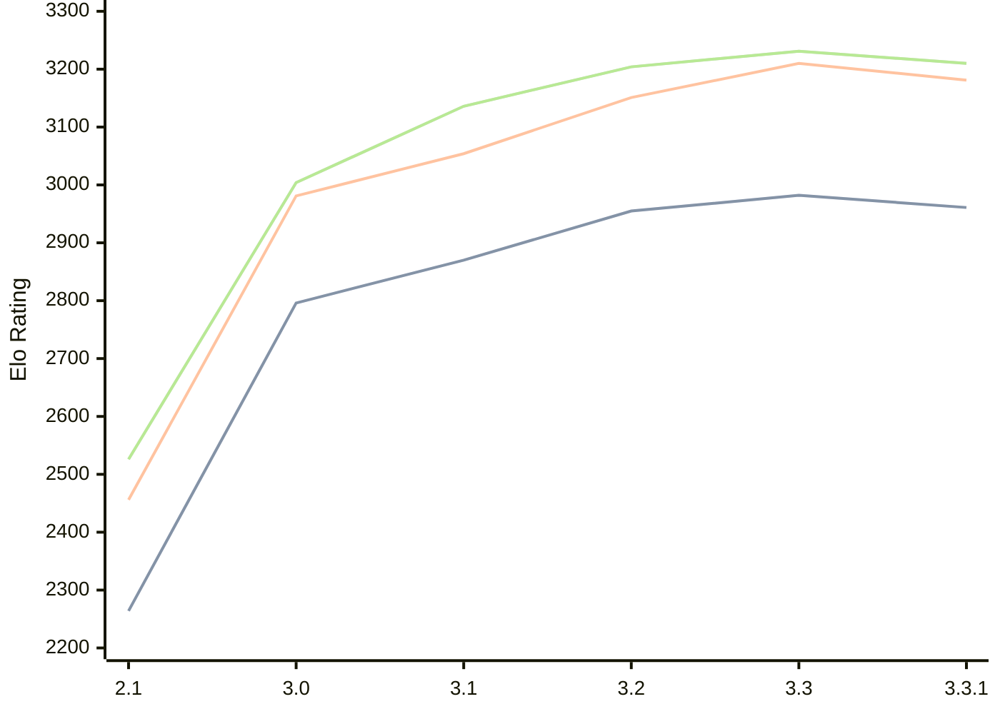

# Engine: Petrel

Author: Aleks Peshkov

Home: https://github.com/AleksPeshkov/petrel

## Ratings nach Version

| Version | Published | STC 8.0+0.08s  | LTC 60.0+0.60s | VLTC 2m24s+1.12s | Comment |
| --- | --- | --- | --- | --- | --- |
| 3.3.1 | 2026-02-10 | 2961(+new) | 3181(+new) | 3210(+new) |  |
| 2.3.1 | 2026-02-10 |  |  |  |  |
| 3.3 | 2026-02-09 | 2982(+new) | 3210(+new) | 3231(+new) |  |
| 2.3 | 2026-02-09 |  |  |  |  |
| 2.2 | 2025-12-27 |  |  |  | Rerelease |
| 3.2 | 2025-12-21 | 2955(+85) | 3151(+97) | 3204(+68) |  |
| 3.1 | 2025-11-28 | 2870(+74) | 3054(+73) | 3136(+132) |  |
| 3.0 | 2025-11-26 | 2796(+532) | 2981(+525) | 3004(+478) |  |
| 2.1 | 2025-10-13 | 2264(+new) | 2456(+new) | 2526(+new) |  |
| 1,4.1 | 2025-10-10 |  |  |  |  |
| 1,3,1 | 2025-09-13 |  |  |  |  |
| 1,2 | 2025-09-08 |  |  |  |  |
| 1.0 | 2025-08-14 |  |  |  |  |
 | | | cElo (∆ prev) | cElo (∆ prev) | cElo (∆ prev) | 

 Test Conditions:

GUI/CLI: <a href=https://github.com/cutechess/cutechess target="_blank">Cute-Chess</a> 
Elo Calculation: <a href=https://www.remi-coulom.fr/Bayesian-Elo/ target="_blank">Bayesian-Elo</a> 
CPU: Intel(R) Core(TM) i5-7500T 2.70GHz 
Opening book: 8_moves_v3 
\* STC: 8.0+0.08s, LTC: 60.0+0.60s, VLTC: 2m24s+1.12s

 Lists:
Ratings: <a href=https://github.com/computer-chess-index/cci/blob/main/lists/CCIRatings.csv target="_blank">Complete list</a>

Generated: 2026-03-15 06:24:52

## Ratings Verlauf

⬛ STC (8.0+0.08s) &nbsp;&nbsp; 🟧 LTC (60.0+0.60s) &nbsp;&nbsp; 🟩 VLTC (2m24s+1.12s)

