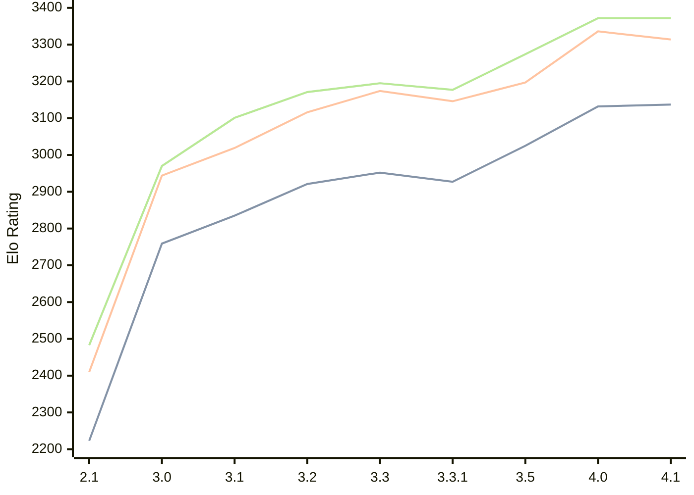

# Engine: Petrel

Author: Aleks Peshkov

Home: https://github.com/AleksPeshkov/petrel

## Elo Ratings

| Version | Published | STC 8.0+0.08s  | LTC 60.0+0.60s | VLTC 2m24s+1.12s | Comment |
| --- | --- | --- | --- | --- | --- |
| 4.1 | 2026-09-08 | 3137(+5) | 3314(-22) | 3372(0) |  |
| 4.0 | 2026-08-04 | 3132(+107) | 3336(+139) | 3372(+98) |  |
| 3.5 | 2026-06-02 | 3025(+98) | 3197(+51) | 3274(+97) |  |
| 3.3.1 | 2026-02-10 | 2927(-25) | 3146(-28) | 3177(-18) |  |
| 3.3 | 2026-02-09 | 2952(+31) | 3174(+58) | 3195(+24) |  |
| 3.2 | 2025-12-21 | 2921(+86) | 3116(+97) | 3171(+70) |  |
| 3.1 | 2025-11-28 | 2835(+76) | 3019(+75) | 3101(+131) |  |
| 3.0 | 2025-11-26 | 2759(+536) | 2944(+534) | 2970(+487) |  |
| 2.1 | 2025-10-13 | 2223 | 2410 | 2483 |  |
 | | | cElo (∆ prev) | cElo (∆ prev) | cElo (∆ prev) | 

<a href="https://github.com/computer-chess-index/cci/issues/new?template=submit-version.yml&title=[VERSION]+Petrel+<version>&body=###%20Engine%20name%0APetrel%0A%0A###%20Version%0A4.1" target="_blank">Submit new version</a>

 Test Conditions:

GUI/CLI: <a href=https://github.com/cutechess/cutechess target="_blank">Cute-Chess</a> 
Elo Calculation: <a href=https://www.remi-coulom.fr/Bayesian-Elo/ target="_blank">Bayesian-Elo</a> 
CPU: Intel(R) Core(TM) i5-7500T 2.70GHz 
Opening book: 8_moves_v3 
\* STC: 8.0+0.08s, LTC: 60.0+0.60s, VLTC: 2m24s+1.12s

 Lists:
Ratings: <a href=https://github.com/computer-chess-index/cci/blob/main/lists/CCIRatings.csv target="_blank">Complete list</a>

Generated: 2026-09-23 04:40:47

## Ratings Verlauf

## Detailed Evaluation Results

| Version | Time Control | Elo  | Range +/- | Matches | Score | Average Opponent Elo | Draws |
| --- | --- | --- | --- | --- | --- | --- | --- |
| 4.1 | VLTC (2m24s+1.12s) | 3372 | 32 | 232 | 49% | 3382 | 75% |
| 4.1 | LTC (60.0+0.60s) | 3314 | 32 | 244 | 51% | 3306 | 70% |
| 4.1 | STC (8.0+0.08s) | 3137 | 31 | 272 | 53% | 3114 | 63% |
| --- | --- | --- | --- | --- | --- | --- | --- |
| 4.0 | VLTC (2m24s+1.12s) | 3372 | 27 | 338 | 50% | 3372 | 74% |
| 4.0 | LTC (60.0+0.60s) | 3336 | 28 | 322 | 49% | 3341 | 72% |
| 4.0 | STC (8.0+0.08s) | 3132 | 30 | 308 | 49% | 3140 | 57% |
| --- | --- | --- | --- | --- | --- | --- | --- |
| 3.5 | VLTC (2m24s+1.12s) | 3274 | 27 | 368 | 49% | 3281 | 65% |
| 3.5 | LTC (60.0+0.60s) | 3197 | 27 | 364 | 51% | 3186 | 61% |
| 3.5 | STC (8.0+0.08s) | 3025 | 28 | 364 | 49% | 3032 | 53% |
| --- | --- | --- | --- | --- | --- | --- | --- |
| 3.3.1 | VLTC (2m24s+1.12s) | 3177 | 35 | 228 | 52% | 3160 | 53% |
| 3.3.1 | LTC (60.0+0.60s) | 3146 | 42 | 158 | 53% | 3127 | 56% |
| 3.3.1 | STC (8.0+0.08s) | 2927 | 41 | 170 | 49% | 2938 | 49% |
| --- | --- | --- | --- | --- | --- | --- | --- |
| 3.3 | VLTC (2m24s+1.12s) | 3195 | 104 | 24 | 58% | 3131 | 58% |
| 3.3 | LTC (60.0+0.60s) | 3174 | 102 | 24 | 54% | 3137 | 67% |
| 3.3 | STC (8.0+0.08s) | 2952 | 110 | 24 | 50% | 2955 | 42% |
| --- | --- | --- | --- | --- | --- | --- | --- |
| 3.2 | VLTC (2m24s+1.12s) | 3171 | 35 | 226 | 49% | 3182 | 58% |
| 3.2 | LTC (60.0+0.60s) | 3116 | 33 | 260 | 52% | 3101 | 56% |
| 3.2 | STC (8.0+0.08s) | 2921 | 33 | 264 | 50% | 2923 | 46% |
| --- | --- | --- | --- | --- | --- | --- | --- |
| 3.1 | VLTC (2m24s+1.12s) | 3101 | 35 | 232 | 51% | 3094 | 53% |
| 3.1 | LTC (60.0+0.60s) | 3019 | 36 | 212 | 52% | 3000 | 54% |
| 3.1 | STC (8.0+0.08s) | 2835 | 37 | 224 | 48% | 2853 | 43% |
| --- | --- | --- | --- | --- | --- | --- | --- |
| 3.0 | VLTC (2m24s+1.12s) | 2970 | 51 | 128 | 57% | 2892 | 34% |
| 3.0 | LTC (60.0+0.60s) | 2944 | 43 | 184 | 59% | 2855 | 33% |
| 3.0 | STC (8.0+0.08s) | 2759 | 56 | 108 | 53% | 2716 | 29% |
| --- | --- | --- | --- | --- | --- | --- | --- |
| 2.1 | VLTC (2m24s+1.12s) | 2483 | 57 | 110 | 48% | 2514 | 25% |
| 2.1 | LTC (60.0+0.60s) | 2410 | 58 | 108 | 48% | 2430 | 17% |
| 2.1 | STC (8.0+0.08s) | 2223 | 62 | 88 | 51% | 2217 | 24% |
| --- | --- | --- | --- | --- | --- | --- | --- |