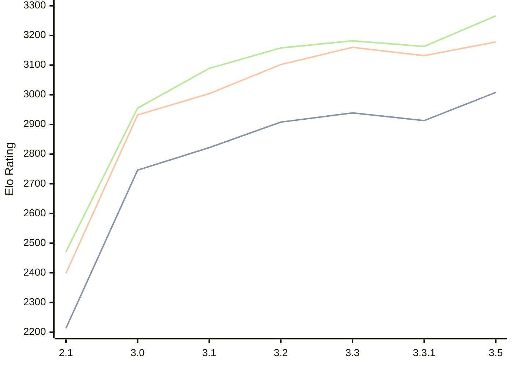

# Engine: Petrel

Author: Aleks Peshkov

Home: https://github.com/AleksPeshkov/petrel

## Elo Ratings

| Version | Published | STC 8.0+0.08s  | LTC 60.0+0.60s | VLTC 2m24s+1.12s | Comment |
| --- | --- | --- | --- | --- | --- |
| 3.5 | 2026-06-02 | 3008(+new) | 3178(+new) | 3266(+new) |  |
| 3.4 | 2026-03-19 |  |  |  |  |
| 2.4 | 2026-03-19 |  |  |  |  |
| 3.3.1 | 2026-02-10 | 2913(+new) | 3132(+new) | 3163(+new) |  |
| 2.3.1 | 2026-02-10 |  |  |  |  |
| 3.3 | 2026-02-09 | 2939(+new) | 3160(+new) | 3182(+new) |  |
| 2.3 | 2026-02-09 |  |  |  |  |
| 2.2 | 2025-12-27 |  |  |  | Rerelease |
| 3.2 | 2025-12-21 | 2908(+86) | 3102(+98) | 3158(+69) |  |
| 3.1 | 2025-11-28 | 2822(+76) | 3004(+72) | 3089(+134) |  |
| 3.0 | 2025-11-26 | 2746(+533) | 2932(+534) | 2955(+484) |  |
| 2.1 | 2025-10-13 | 2213(+new) | 2398(+new) | 2471(+new) |  |
| 1,4.1 | 2025-10-10 |  |  |  |  |
| 1,3,1 | 2025-09-13 |  |  |  |  |
| 1,2 | 2025-09-08 |  |  |  |  |
| 1.0 | 2025-08-14 |  |  |  |  |
 | | | cElo (∆ prev) | cElo (∆ prev) | cElo (∆ prev) | 

<a href="https://github.com/computer-chess-index/cci/issues/new?template=submit-version.yml&title=[VERSION]+Petrel+<version>&body=###%20Engine%20name%0APetrel%0A%0A###%20Version%0A3.5" target="_blank">Submit new version</a>

 Test Conditions:

GUI/CLI: <a href=https://github.com/cutechess/cutechess target="_blank">Cute-Chess</a> 
Elo Calculation: <a href=https://www.remi-coulom.fr/Bayesian-Elo/ target="_blank">Bayesian-Elo</a> 
CPU: Intel(R) Core(TM) i5-7500T 2.70GHz 
Opening book: 8_moves_v3 
\* STC: 8.0+0.08s, LTC: 60.0+0.60s, VLTC: 2m24s+1.12s

 Lists:
Ratings: <a href=https://github.com/computer-chess-index/cci/blob/main/lists/CCIRatings.csv target="_blank">Complete list</a>

Generated: 2026-08-01 06:27:50

## Ratings Verlauf

⬛ STC (8.0+0.08s) &nbsp;&nbsp; 🟧 LTC (60.0+0.60s) &nbsp;&nbsp; 🟩 VLTC (2m24s+1.12s)

dark mode: 🟩STC (8.0+0.08s) 🟧LTC (60.0+0.60s) ⬜VLTC (2m24s+1.12s)

## Detailed Evaluation Results

| Version | Time Control | Elo  | Range +/- | Matches | Score | Average Opponent Elo | Draws |
| --- | --- | --- | --- | --- | --- | --- | --- |
| 3.5 | VLTC (2m24s+1.12s) | 3266 | 27 | 352 | 50% | 3266 | 66% |
| 3.5 | LTC (60.0+0.60s) | 3178 | 28 | 348 | 50% | 3170 | 61% |
| 3.5 | STC (8.0+0.08s) | 3008 | 28 | 360 | 49% | 3019 | 54% |
| --- | --- | --- | --- | --- | --- | --- | --- |
| 3.3.1 | VLTC (2m24s+1.12s) | 3163 | 35 | 228 | 52% | 3147 | 53% |
| 3.3.1 | LTC (60.0+0.60s) | 3132 | 42 | 158 | 53% | 3113 | 56% |
| 3.3.1 | STC (8.0+0.08s) | 2913 | 41 | 170 | 49% | 2924 | 49% |
| --- | --- | --- | --- | --- | --- | --- | --- |
| 3.3 | VLTC (2m24s+1.12s) | 3182 | 104 | 24 | 58% | 3119 | 58% |
| 3.3 | LTC (60.0+0.60s) | 3160 | 102 | 24 | 54% | 3124 | 67% |
| 3.3 | STC (8.0+0.08s) | 2939 | 110 | 24 | 50% | 2942 | 42% |
| --- | --- | --- | --- | --- | --- | --- | --- |
| 3.2 | VLTC (2m24s+1.12s) | 3158 | 35 | 226 | 49% | 3168 | 58% |
| 3.2 | LTC (60.0+0.60s) | 3102 | 33 | 260 | 52% | 3086 | 56% |
| 3.2 | STC (8.0+0.08s) | 2908 | 33 | 264 | 50% | 2909 | 46% |
| --- | --- | --- | --- | --- | --- | --- | --- |
| 3.1 | VLTC (2m24s+1.12s) | 3089 | 35 | 232 | 51% | 3081 | 53% |
| 3.1 | LTC (60.0+0.60s) | 3004 | 36 | 212 | 52% | 2986 | 54% |
| 3.1 | STC (8.0+0.08s) | 2822 | 37 | 224 | 48% | 2839 | 43% |
| --- | --- | --- | --- | --- | --- | --- | --- |
| 3.0 | VLTC (2m24s+1.12s) | 2955 | 51 | 128 | 57% | 2878 | 34% |
| 3.0 | LTC (60.0+0.60s) | 2932 | 43 | 184 | 59% | 2842 | 33% |
| 3.0 | STC (8.0+0.08s) | 2746 | 56 | 108 | 53% | 2703 | 29% |
| --- | --- | --- | --- | --- | --- | --- | --- |
| 2.1 | VLTC (2m24s+1.12s) | 2471 | 57 | 110 | 48% | 2502 | 25% |
| 2.1 | LTC (60.0+0.60s) | 2398 | 58 | 108 | 48% | 2418 | 17% |
| 2.1 | STC (8.0+0.08s) | 2213 | 62 | 88 | 51% | 2206 | 24% |
| --- | --- | --- | --- | --- | --- | --- | --- |