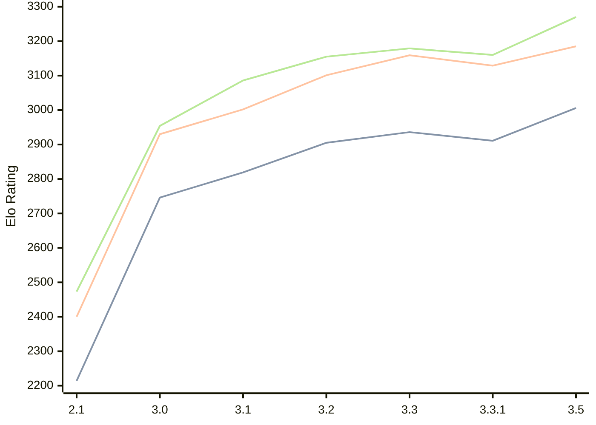

# Engine: Petrel

Author: Aleks Peshkov

Home: https://github.com/AleksPeshkov/petrel

## Elo Ratings

| Version | Published | STC 8.0+0.08s  | LTC 60.0+0.60s | VLTC 2m24s+1.12s | Comment |
| --- | --- | --- | --- | --- | --- |
| 3.5 | 2026-06-02 | 3006(+new) | 3185(+new) | 3270(+new) |  |
| 3.4 | 2026-03-19 |  |  |  |  |
| 2.4 | 2026-03-19 |  |  |  |  |
| 3.3.1 | 2026-02-10 | 2911(+new) | 3129(+new) | 3160(+new) |  |
| 2.3.1 | 2026-02-10 |  |  |  |  |
| 3.3 | 2026-02-09 | 2936(+new) | 3159(+new) | 3179(+new) |  |
| 2.3 | 2026-02-09 |  |  |  |  |
| 2.2 | 2025-12-27 |  |  |  | Rerelease |
| 3.2 | 2025-12-21 | 2905(+86) | 3101(+99) | 3155(+69) |  |
| 3.1 | 2025-11-28 | 2819(+73) | 3002(+72) | 3086(+132) |  |
| 3.0 | 2025-11-26 | 2746(+532) | 2930(+530) | 2954(+481) |  |
| 2.1 | 2025-10-13 | 2214(+new) | 2400(+new) | 2473(+new) |  |
| 1,4.1 | 2025-10-10 |  |  |  |  |
| 1,3,1 | 2025-09-13 |  |  |  |  |
| 1,2 | 2025-09-08 |  |  |  |  |
| 1.0 | 2025-08-14 |  |  |  |  |
 | | | cElo (∆ prev) | cElo (∆ prev) | cElo (∆ prev) | 

<a href="https://github.com/computer-chess-index/cci/issues/new?template=submit-version.yml&title=[VERSION]+Petrel+<version>&body=###%20Engine%20name%0APetrel%0A%0A###%20Version%0A3.5" target="_blank">Submit new version</a>

 Test Conditions:

GUI/CLI: <a href=https://github.com/cutechess/cutechess target="_blank">Cute-Chess</a> 
Elo Calculation: <a href=https://www.remi-coulom.fr/Bayesian-Elo/ target="_blank">Bayesian-Elo</a> 
CPU: Intel(R) Core(TM) i5-7500T 2.70GHz 
Opening book: 8_moves_v3 
\* STC: 8.0+0.08s, LTC: 60.0+0.60s, VLTC: 2m24s+1.12s

 Lists:
Ratings: <a href=https://github.com/computer-chess-index/cci/blob/main/lists/CCIRatings.csv target="_blank">Complete list</a>

Generated: 2026-06-24 06:26:58

## Ratings Verlauf

## Ratings Verlauf

⬛ STC (8.0+0.08s) &nbsp;&nbsp; 🟧 LTC (60.0+0.60s) &nbsp;&nbsp; 🟩 VLTC (2m24s+1.12s)

dark mode: 🟩STC (8.0+0.08s) 🟧LTC (60.0+0.60s) ⬜VLTC (2m24s+1.12s)

## Detailed Evaluation Results

| Version | Time Control | Elo  | Range +/- | Matches | Score | Average Opponent Elo | Draws |
| --- | --- | --- | --- | --- | --- | --- | --- |
| 3.5 | VLTC (2m24s+1.12s) | 3270 | 31 | 270 | 51% | 3263 | 66% |
| 3.5 | LTC (60.0+0.60s) | 3185 | 32 | 268 | 52% | 3159 | 60% |
| 3.5 | STC (8.0+0.08s) | 3006 | 32 | 272 | 49% | 3016 | 53% |
| --- | --- | --- | --- | --- | --- | --- | --- |
| 3.3.1 | VLTC (2m24s+1.12s) | 3160 | 35 | 228 | 52% | 3146 | 53% |
| 3.3.1 | LTC (60.0+0.60s) | 3129 | 42 | 158 | 53% | 3110 | 56% |
| 3.3.1 | STC (8.0+0.08s) | 2911 | 41 | 170 | 49% | 2921 | 49% |
| --- | --- | --- | --- | --- | --- | --- | --- |
| 3.3 | VLTC (2m24s+1.12s) | 3179 | 104 | 24 | 58% | 3116 | 58% |
| 3.3 | LTC (60.0+0.60s) | 3159 | 102 | 24 | 54% | 3123 | 67% |
| 3.3 | STC (8.0+0.08s) | 2936 | 110 | 24 | 50% | 2939 | 42% |
| --- | --- | --- | --- | --- | --- | --- | --- |
| 3.2 | VLTC (2m24s+1.12s) | 3155 | 35 | 226 | 49% | 3166 | 58% |
| 3.2 | LTC (60.0+0.60s) | 3101 | 33 | 260 | 52% | 3085 | 56% |
| 3.2 | STC (8.0+0.08s) | 2905 | 33 | 264 | 50% | 2908 | 46% |
| --- | --- | --- | --- | --- | --- | --- | --- |
| 3.1 | VLTC (2m24s+1.12s) | 3086 | 35 | 232 | 51% | 3079 | 53% |
| 3.1 | LTC (60.0+0.60s) | 3002 | 36 | 212 | 52% | 2984 | 54% |
| 3.1 | STC (8.0+0.08s) | 2819 | 37 | 224 | 48% | 2838 | 43% |
| --- | --- | --- | --- | --- | --- | --- | --- |
| 3.0 | VLTC (2m24s+1.12s) | 2954 | 51 | 128 | 57% | 2876 | 34% |
| 3.0 | LTC (60.0+0.60s) | 2930 | 43 | 184 | 59% | 2840 | 33% |
| 3.0 | STC (8.0+0.08s) | 2746 | 56 | 108 | 53% | 2703 | 29% |
| --- | --- | --- | --- | --- | --- | --- | --- |
| 2.1 | VLTC (2m24s+1.12s) | 2473 | 57 | 110 | 48% | 2504 | 25% |
| 2.1 | LTC (60.0+0.60s) | 2400 | 58 | 108 | 48% | 2419 | 17% |
| 2.1 | STC (8.0+0.08s) | 2214 | 62 | 88 | 51% | 2209 | 24% |
| --- | --- | --- | --- | --- | --- | --- | --- |