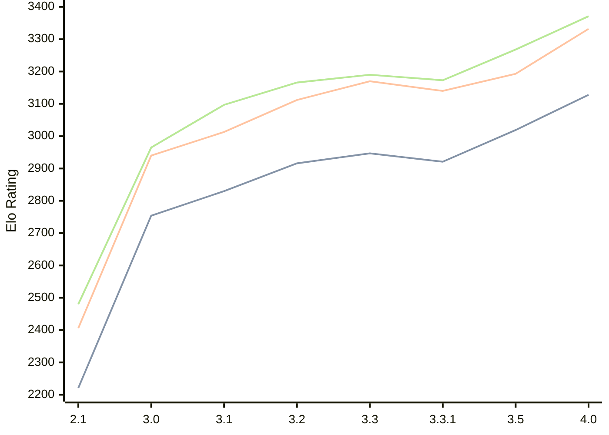

# Engine: Petrel

Author: Aleks Peshkov

Home: https://github.com/AleksPeshkov/petrel

## Elo Ratings

| Version | Published | STC 8.0+0.08s  | LTC 60.0+0.60s | VLTC 2m24s+1.12s | Comment |
| --- | --- | --- | --- | --- | --- |
| 4.0 | 2026-08-04 | 3128(+109) | 3332(+139) | 3371(+103) |  |
| 3.5 | 2026-06-02 | 3019(+98) | 3193(+53) | 3268(+95) |  |
| 3.3.1 | 2026-02-10 | 2921(-26) | 3140(-30) | 3173(-17) |  |
| 3.3 | 2026-02-09 | 2947(+31) | 3170(+58) | 3190(+24) |  |
| 3.2 | 2025-12-21 | 2916(+86) | 3112(+99) | 3166(+69) |  |
| 3.1 | 2025-11-28 | 2830(+76) | 3013(+73) | 3097(+132) |  |
| 3.0 | 2025-11-26 | 2754(+533) | 2940(+534) | 2965(+485) |  |
| 2.1 | 2025-10-13 | 2221 | 2406 | 2480 |  |
 | | | cElo (∆ prev) | cElo (∆ prev) | cElo (∆ prev) | 

<a href="https://github.com/computer-chess-index/cci/issues/new?template=submit-version.yml&title=[VERSION]+Petrel+<version>&body=###%20Engine%20name%0APetrel%0A%0A###%20Version%0A4.0" target="_blank">Submit new version</a>

 Test Conditions:

GUI/CLI: <a href=https://github.com/cutechess/cutechess target="_blank">Cute-Chess</a> 
Elo Calculation: <a href=https://www.remi-coulom.fr/Bayesian-Elo/ target="_blank">Bayesian-Elo</a> 
CPU: Intel(R) Core(TM) i5-7500T 2.70GHz 
Opening book: 8_moves_v3 
\* STC: 8.0+0.08s, LTC: 60.0+0.60s, VLTC: 2m24s+1.12s

 Lists:
Ratings: <a href=https://github.com/computer-chess-index/cci/blob/main/lists/CCIRatings.csv target="_blank">Complete list</a>

Generated: 2026-08-27 06:27:38

## Ratings Verlauf

⬛ STC (8.0+0.08s) &nbsp;&nbsp; 🟧 LTC (60.0+0.60s) &nbsp;&nbsp; 🟩 VLTC (2m24s+1.12s)

dark mode: 🟩STC (8.0+0.08s) 🟧LTC (60.0+0.60s) ⬜VLTC (2m24s+1.12s)

## Detailed Evaluation Results

| Version | Time Control | Elo  | Range +/- | Matches | Score | Average Opponent Elo | Draws |
| --- | --- | --- | --- | --- | --- | --- | --- |
| 4.0 | VLTC (2m24s+1.12s) | 3371 | 28 | 306 | 50% | 3367 | 74% |
| 4.0 | LTC (60.0+0.60s) | 3332 | 29 | 294 | 49% | 3337 | 72% |
| 4.0 | STC (8.0+0.08s) | 3128 | 32 | 276 | 48% | 3139 | 57% |
| --- | --- | --- | --- | --- | --- | --- | --- |
| 3.5 | VLTC (2m24s+1.12s) | 3268 | 27 | 368 | 49% | 3275 | 65% |
| 3.5 | LTC (60.0+0.60s) | 3193 | 27 | 364 | 51% | 3181 | 61% |
| 3.5 | STC (8.0+0.08s) | 3019 | 28 | 364 | 49% | 3025 | 53% |
| --- | --- | --- | --- | --- | --- | --- | --- |
| 3.3.1 | VLTC (2m24s+1.12s) | 3173 | 35 | 228 | 52% | 3156 | 53% |
| 3.3.1 | LTC (60.0+0.60s) | 3140 | 42 | 158 | 53% | 3121 | 56% |
| 3.3.1 | STC (8.0+0.08s) | 2921 | 41 | 170 | 49% | 2932 | 49% |
| --- | --- | --- | --- | --- | --- | --- | --- |
| 3.3 | VLTC (2m24s+1.12s) | 3190 | 104 | 24 | 58% | 3127 | 58% |
| 3.3 | LTC (60.0+0.60s) | 3170 | 102 | 24 | 54% | 3133 | 67% |
| 3.3 | STC (8.0+0.08s) | 2947 | 110 | 24 | 50% | 2950 | 42% |
| --- | --- | --- | --- | --- | --- | --- | --- |
| 3.2 | VLTC (2m24s+1.12s) | 3166 | 35 | 226 | 49% | 3177 | 58% |
| 3.2 | LTC (60.0+0.60s) | 3112 | 33 | 260 | 52% | 3096 | 56% |
| 3.2 | STC (8.0+0.08s) | 2916 | 33 | 264 | 50% | 2917 | 46% |
| --- | --- | --- | --- | --- | --- | --- | --- |
| 3.1 | VLTC (2m24s+1.12s) | 3097 | 35 | 232 | 51% | 3090 | 53% |
| 3.1 | LTC (60.0+0.60s) | 3013 | 36 | 212 | 52% | 2994 | 54% |
| 3.1 | STC (8.0+0.08s) | 2830 | 37 | 224 | 48% | 2847 | 43% |
| --- | --- | --- | --- | --- | --- | --- | --- |
| 3.0 | VLTC (2m24s+1.12s) | 2965 | 51 | 128 | 57% | 2886 | 34% |
| 3.0 | LTC (60.0+0.60s) | 2940 | 43 | 184 | 59% | 2850 | 33% |
| 3.0 | STC (8.0+0.08s) | 2754 | 56 | 108 | 53% | 2711 | 29% |
| --- | --- | --- | --- | --- | --- | --- | --- |
| 2.1 | VLTC (2m24s+1.12s) | 2480 | 57 | 110 | 48% | 2510 | 25% |
| 2.1 | LTC (60.0+0.60s) | 2406 | 58 | 108 | 48% | 2426 | 17% |
| 2.1 | STC (8.0+0.08s) | 2221 | 62 | 88 | 51% | 2215 | 24% |
| --- | --- | --- | --- | --- | --- | --- | --- |