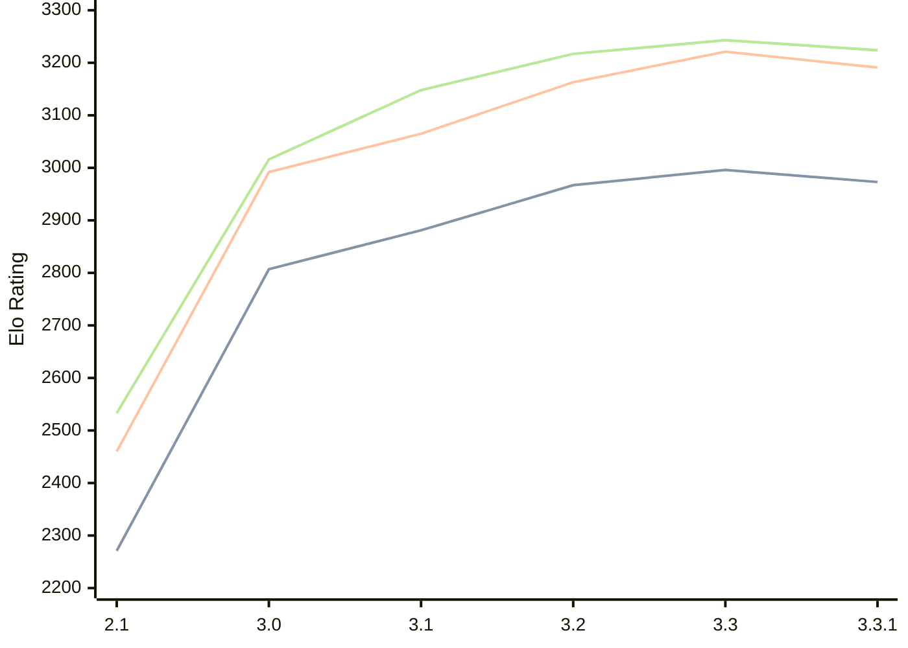

# Engine: Petrel

Author: Aleks Peshkov

Home: https://github.com/AleksPeshkov/petrel

## Elo Ratings

| Version | Published | STC 8.0+0.08s  | LTC 60.0+0.60s | VLTC 2m24s+1.12s | Comment |
| --- | --- | --- | --- | --- | --- |
| 3.4 | 2026-03-19 |  |  |  |  |
| 2.4 | 2026-03-19 |  |  |  |  |
| 3.3.1 | 2026-02-10 | 2973(+new) | 3191(+new) | 3224(+new) |  |
| 2.3.1 | 2026-02-10 |  |  |  |  |
| 3.3 | 2026-02-09 | 2996(+new) | 3221(+new) | 3243(+new) |  |
| 2.3 | 2026-02-09 |  |  |  |  |
| 2.2 | 2025-12-27 |  |  |  | Rerelease |
| 3.2 | 2025-12-21 | 2967(+86) | 3163(+98) | 3217(+69) |  |
| 3.1 | 2025-11-28 | 2881(+74) | 3065(+73) | 3148(+132) |  |
| 3.0 | 2025-11-26 | 2807(+536) | 2992(+532) | 3016(+483) |  |
| 2.1 | 2025-10-13 | 2271(+new) | 2460(+new) | 2533(+new) |  |
| 1,4.1 | 2025-10-10 |  |  |  |  |
| 1,3,1 | 2025-09-13 |  |  |  |  |
| 1,2 | 2025-09-08 |  |  |  |  |
| 1.0 | 2025-08-14 |  |  |  |  |
 | | | cElo (∆ prev) | cElo (∆ prev) | cElo (∆ prev) | 

<a href="https://github.com/computer-chess-index/cci/issues/new?template=submit-version.yml&title=[VERSION]+Petrel+<version>&body=###%20Engine%20name%0APetrel%0A%0A###%20Version%0A3.4" target="_blank">Submit new version</a>

 Test Conditions:

GUI/CLI: <a href=https://github.com/cutechess/cutechess target="_blank">Cute-Chess</a> 
Elo Calculation: <a href=https://www.remi-coulom.fr/Bayesian-Elo/ target="_blank">Bayesian-Elo</a> 
CPU: Intel(R) Core(TM) i5-7500T 2.70GHz 
Opening book: 8_moves_v3 
\* STC: 8.0+0.08s, LTC: 60.0+0.60s, VLTC: 2m24s+1.12s

 Lists:
Ratings: <a href=https://github.com/computer-chess-index/cci/blob/main/lists/CCIRatings.csv target="_blank">Complete list</a>

Generated: 2026-05-15 06:26:34

## Ratings Verlauf

⬛ STC (8.0+0.08s) &nbsp;&nbsp; 🟧 LTC (60.0+0.60s) &nbsp;&nbsp; 🟩 VLTC (2m24s+1.12s)

dark mode: 🟩STC (8.0+0.08s) 🟧LTC (60.0+0.60s) ⬜VLTC (2m24s+1.12s)

## Detailed Evaluation Results

| Version | Time Control | Elo  | Range +/- | Matches | Score | Average Opponent Elo | Draws |
| --- | --- | --- | --- | --- | --- | --- | --- |
| 3.3.1 | VLTC (2m24s+1.12s) | 3224 | 35 | 228 | 52% | 3208 | 53% |
| 3.3.1 | LTC (60.0+0.60s) | 3191 | 42 | 158 | 53% | 3173 | 56% |
| 3.3.1 | STC (8.0+0.08s) | 2973 | 41 | 170 | 49% | 2984 | 49% |
| --- | --- | --- | --- | --- | --- | --- | --- |
| 3.3 | VLTC (2m24s+1.12s) | 3243 | 104 | 24 | 58% | 3179 | 58% |
| 3.3 | LTC (60.0+0.60s) | 3221 | 102 | 24 | 54% | 3185 | 67% |
| 3.3 | STC (8.0+0.08s) | 2996 | 110 | 24 | 50% | 2998 | 42% |
| --- | --- | --- | --- | --- | --- | --- | --- |
| 3.2 | VLTC (2m24s+1.12s) | 3217 | 35 | 226 | 49% | 3228 | 58% |
| 3.2 | LTC (60.0+0.60s) | 3163 | 33 | 260 | 52% | 3147 | 56% |
| 3.2 | STC (8.0+0.08s) | 2967 | 33 | 264 | 50% | 2969 | 46% |
| --- | --- | --- | --- | --- | --- | --- | --- |
| 3.1 | VLTC (2m24s+1.12s) | 3148 | 35 | 232 | 51% | 3141 | 53% |
| 3.1 | LTC (60.0+0.60s) | 3065 | 36 | 212 | 52% | 3046 | 54% |
| 3.1 | STC (8.0+0.08s) | 2881 | 37 | 224 | 48% | 2898 | 43% |
| --- | --- | --- | --- | --- | --- | --- | --- |
| 3.0 | VLTC (2m24s+1.12s) | 3016 | 51 | 128 | 57% | 2938 | 34% |
| 3.0 | LTC (60.0+0.60s) | 2992 | 43 | 184 | 59% | 2903 | 33% |
| 3.0 | STC (8.0+0.08s) | 2807 | 56 | 108 | 53% | 2763 | 29% |
| --- | --- | --- | --- | --- | --- | --- | --- |
| 2.1 | VLTC (2m24s+1.12s) | 2533 | 57 | 110 | 48% | 2564 | 25% |
| 2.1 | LTC (60.0+0.60s) | 2460 | 58 | 108 | 48% | 2480 | 17% |
| 2.1 | STC (8.0+0.08s) | 2271 | 62 | 88 | 51% | 2264 | 24% |
| --- | --- | --- | --- | --- | --- | --- | --- |