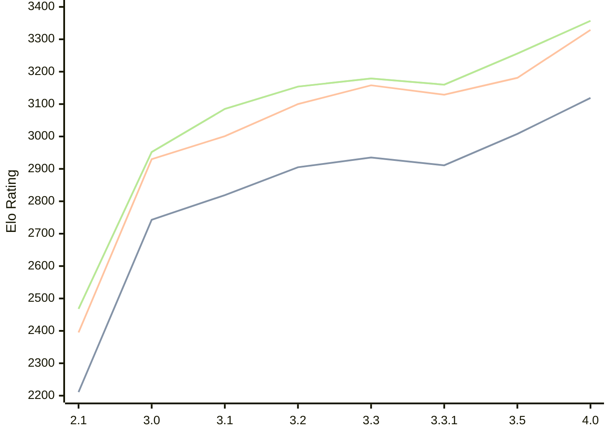

# Engine: Petrel

Author: Aleks Peshkov

Home: https://github.com/AleksPeshkov/petrel

## Elo Ratings

| Version | Published | STC 8.0+0.08s  | LTC 60.0+0.60s | VLTC 2m24s+1.12s | Comment |
| --- | --- | --- | --- | --- | --- |
| 4.0 | 2026-08-04 | 3119(+111) | 3329(+148) | 3357(+101) |  |
| 3.5 | 2026-06-02 | 3008(+97) | 3181(+52) | 3256(+96) |  |
| 3.3.1 | 2026-02-10 | 2911(-24) | 3129(-29) | 3160(-19) |  |
| 3.3 | 2026-02-09 | 2935(+30) | 3158(+58) | 3179(+25) |  |
| 3.2 | 2025-12-21 | 2905(+86) | 3100(+99) | 3154(+69) |  |
| 3.1 | 2025-11-28 | 2819(+76) | 3001(+71) | 3085(+133) |  |
| 3.0 | 2025-11-26 | 2743(+532) | 2930(+535) | 2952(+484) |  |
| 2.1 | 2025-10-13 | 2211 | 2395 | 2468 |  |
 | | | cElo (∆ prev) | cElo (∆ prev) | cElo (∆ prev) | 

<a href="https://github.com/computer-chess-index/cci/issues/new?template=submit-version.yml&title=[VERSION]+Petrel+<version>&body=###%20Engine%20name%0APetrel%0A%0A###%20Version%0A4.0" target="_blank">Submit new version</a>

 Test Conditions:

GUI/CLI: <a href=https://github.com/cutechess/cutechess target="_blank">Cute-Chess</a> 
Elo Calculation: <a href=https://www.remi-coulom.fr/Bayesian-Elo/ target="_blank">Bayesian-Elo</a> 
CPU: Intel(R) Core(TM) i5-7500T 2.70GHz 
Opening book: 8_moves_v3 
\* STC: 8.0+0.08s, LTC: 60.0+0.60s, VLTC: 2m24s+1.12s

 Lists:
Ratings: <a href=https://github.com/computer-chess-index/cci/blob/main/lists/CCIRatings.csv target="_blank">Complete list</a>

Generated: 2026-08-12 08:04:50

## Ratings Verlauf

⬛ STC (8.0+0.08s) &nbsp;&nbsp; 🟧 LTC (60.0+0.60s) &nbsp;&nbsp; 🟩 VLTC (2m24s+1.12s)

dark mode: 🟩STC (8.0+0.08s) 🟧LTC (60.0+0.60s) ⬜VLTC (2m24s+1.12s)

## Detailed Evaluation Results

| Version | Time Control | Elo  | Range +/- | Matches | Score | Average Opponent Elo | Draws |
| --- | --- | --- | --- | --- | --- | --- | --- |
| 4.0 | VLTC (2m24s+1.12s) | 3357 | 30 | 270 | 51% | 3352 | 73% |
| 4.0 | LTC (60.0+0.60s) | 3329 | 31 | 258 | 51% | 3324 | 72% |
| 4.0 | STC (8.0+0.08s) | 3119 | 34 | 236 | 49% | 3129 | 59% |
| --- | --- | --- | --- | --- | --- | --- | --- |
| 3.5 | VLTC (2m24s+1.12s) | 3256 | 27 | 368 | 49% | 3263 | 65% |
| 3.5 | LTC (60.0+0.60s) | 3181 | 27 | 364 | 51% | 3168 | 61% |
| 3.5 | STC (8.0+0.08s) | 3008 | 28 | 364 | 49% | 3015 | 53% |
| --- | --- | --- | --- | --- | --- | --- | --- |
| 3.3.1 | VLTC (2m24s+1.12s) | 3160 | 35 | 228 | 52% | 3144 | 53% |
| 3.3.1 | LTC (60.0+0.60s) | 3129 | 42 | 158 | 53% | 3110 | 56% |
| 3.3.1 | STC (8.0+0.08s) | 2911 | 41 | 170 | 49% | 2921 | 49% |
| --- | --- | --- | --- | --- | --- | --- | --- |
| 3.3 | VLTC (2m24s+1.12s) | 3179 | 104 | 24 | 58% | 3116 | 58% |
| 3.3 | LTC (60.0+0.60s) | 3158 | 102 | 24 | 54% | 3121 | 67% |
| 3.3 | STC (8.0+0.08s) | 2935 | 110 | 24 | 50% | 2939 | 42% |
| --- | --- | --- | --- | --- | --- | --- | --- |
| 3.2 | VLTC (2m24s+1.12s) | 3154 | 35 | 226 | 49% | 3166 | 58% |
| 3.2 | LTC (60.0+0.60s) | 3100 | 33 | 260 | 52% | 3083 | 56% |
| 3.2 | STC (8.0+0.08s) | 2905 | 33 | 264 | 50% | 2907 | 46% |
| --- | --- | --- | --- | --- | --- | --- | --- |
| 3.1 | VLTC (2m24s+1.12s) | 3085 | 35 | 232 | 51% | 3078 | 53% |
| 3.1 | LTC (60.0+0.60s) | 3001 | 36 | 212 | 52% | 2982 | 54% |
| 3.1 | STC (8.0+0.08s) | 2819 | 37 | 224 | 48% | 2836 | 43% |
| --- | --- | --- | --- | --- | --- | --- | --- |
| 3.0 | VLTC (2m24s+1.12s) | 2952 | 51 | 128 | 57% | 2876 | 34% |
| 3.0 | LTC (60.0+0.60s) | 2930 | 43 | 184 | 59% | 2839 | 33% |
| 3.0 | STC (8.0+0.08s) | 2743 | 56 | 108 | 53% | 2700 | 29% |
| --- | --- | --- | --- | --- | --- | --- | --- |
| 2.1 | VLTC (2m24s+1.12s) | 2468 | 57 | 110 | 48% | 2499 | 25% |
| 2.1 | LTC (60.0+0.60s) | 2395 | 58 | 108 | 48% | 2415 | 17% |
| 2.1 | STC (8.0+0.08s) | 2211 | 62 | 88 | 51% | 2205 | 24% |
| --- | --- | --- | --- | --- | --- | --- | --- |