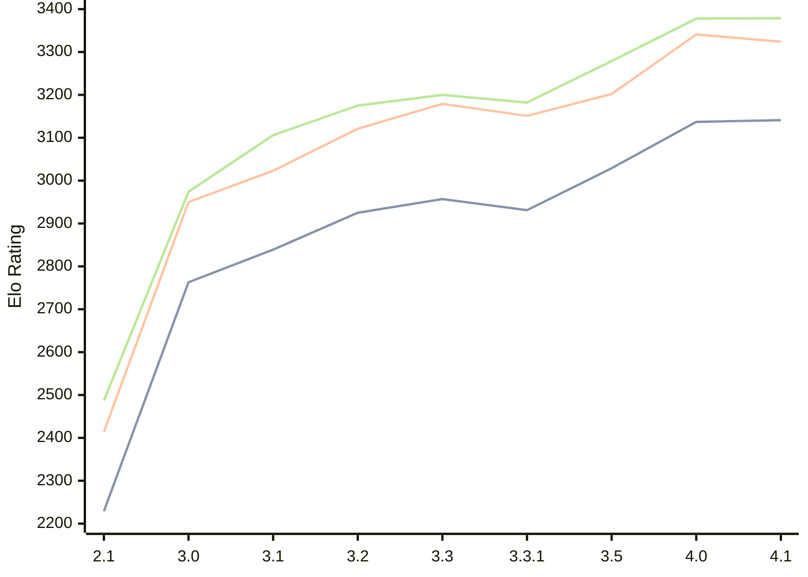

# Engine: Petrel

Author: Aleks Peshkov

Home: https://github.com/AleksPeshkov/petrel

## Elo Ratings E1

| Version | Published | STC 8.0+0.08s  | LTC 60.0+0.60s | VLTC 2m24s+1.12s | Comment |
| --- | --- | --- | --- | --- | --- |
| 4.1 | 2026-09-08 | 2967 | 3236 | 3332 |  |
 | | | cElo (∆ prev) | cElo (∆ prev) | cElo (∆ prev) | 

## Elo Ratings P1

| Version | Published | STC 8.0+0.08s  | LTC 60.0+0.60s | VLTC 2m24s+1.12s | Comment |
| --- | --- | --- | --- | --- | --- |
| 4.1 | 2026-09-08 | 3317 | 3488 | 3579 |  |
 | | | cElo (∆ prev) | cElo (∆ prev) | cElo (∆ prev) | 

## Elo Ratings T1

| Version | Published | STC 8.0+0.08s  | LTC 60.0+0.60s | VLTC 2m24s+1.12s | Comment |
| --- | --- | --- | --- | --- | --- |
| 4.1 | 2026-09-08 | 3141(+4) | 3324(-17) | 3379(+1) |  |
| 4.0 | 2026-08-04 | 3137(+108) | 3341(+139) | 3378(+99) |  |
| 3.5 | 2026-06-02 | 3029(+98) | 3202(+51) | 3279(+97) |  |
| 3.3.1 | 2026-02-10 | 2931(-26) | 3151(-28) | 3182(-18) |  |
| 3.3 | 2026-02-09 | 2957(+32) | 3179(+58) | 3200(+25) |  |
| 3.2 | 2025-12-21 | 2925(+86) | 3121(+98) | 3175(+69) |  |
| 3.1 | 2025-11-28 | 2839(+76) | 3023(+73) | 3106(+132) |  |
| 3.0 | 2025-11-26 | 2763(+534) | 2950(+536) | 2974(+487) |  |
| 2.1 | 2025-10-13 | 2229 | 2414 | 2487 |  |
 | | | cElo (∆ prev) | cElo (∆ prev) | cElo (∆ prev) | 

<a href="https://github.com/computer-chess-index/cci/issues/new?template=submit-version.yml&title=[VERSION]+Petrel+<version>&body=###%20Engine%20name%0APetrel%0A%0A###%20Version%0A4.1" target="_blank">Submit new version</a>

 Test Conditions:

GUI/CLI: <a href=https://github.com/cutechess/cutechess target="_blank">Cute-Chess</a> 
Elo Calculation: <a href=https://www.remi-coulom.fr/Bayesian-Elo/ target="_blank">Bayesian-Elo</a> 
CPU for P1: Intel(R) Core(TM) Ultra 7 265T (1.50 GHz) - P-Core 
CPU for E1: Intel(R) Core(TM) Ultra 7 265T (1.50 GHz) - E-Core 
CPU for T1: Intel(R) Core(TM) i5-7500T 2.70GHz 
Opening book: 8_moves_v3 
\* STC: 8.0+0.08s, LTC: 60.0+0.60s, VLTC: 2m24s+1.12s

 Lists:
Ratings: <a href=https://github.com/computer-chess-index/cci/blob/main/lists/CCIRatings.csv target="_blank">Complete list</a>

Generated: 2026-10-09 14:14:36

## Ratings Verlauf

```mermaid
%%{init: {"theme":"base","themeVariables":{"seriesColors:['#a3a3a3','#222221','#faa371']}}}%%
xychart-beta
  x-axis ["2.1", "3.0", "3.1", "3.2", "3.3", "3.3.1", "3.5", "4.0", "4.1"]
  y-axis "Elo Rating" 2200 --> 3400
  line "" [2229, 2763, 2839, 2925, 2957, 2931, 3029, 3137, 3141]
  line "STC (8.0+0.08s)" [2229, 2763, 2839, 2925, 2957, 2931, 3029, 3137, 3141]
  line "LTC (60.0+0.60s)" [2414, 2950, 3023, 3121, 3179, 3151, 3202, 3341, 3324]
  line "" [2487, 2974, 3106, 3175, 3200, 3182, 3279, 3378, 3379]
  line "VLTC (2m24s+1.12s)" [2487, 2974, 3106, 3175, 3200, 3182, 3279, 3378, 3379]
```

## Detailed Evaluation Results

| Version | Time Control | Elo  | Range +/- | Matches | Score | Average Opponent Elo | Draws |
| --- | --- | --- | --- | --- | --- | --- | --- |
| 4.1 | VLTC (2m24s+1.12s) | 3579 | 39 | 162 | 53% | 3556 | 74% |
| 4.1 | VLTC (2m24s+1.12s) | 3332 | 32 | 250 | 48% | 3344 | 66% |
| 4.1 | VLTC (2m24s+1.12s) | 3379 | 32 | 236 | 49% | 3387 | 75% |
| 4.1 | LTC (60.0+0.60s) | 3488 | 37 | 184 | 49% | 3498 | 71% |
| 4.1 | LTC (60.0+0.60s) | 3236 | 32 | 256 | 48% | 3254 | 64% |
| 4.1 | LTC (60.0+0.60s) | 3324 | 32 | 250 | 52% | 3312 | 70% |
| 4.1 | STC (8.0+0.08s) | 2967 | 31 | 300 | 44% | 3015 | 51% |
| --- | --- | --- | --- | --- | --- | --- | --- |
| 4.1 | STC (8.0+0.08s) | 3141 | 31 | 276 | 53% | 3120 | 63% |
| --- | --- | --- | --- | --- | --- | --- | --- |
| 4.1 | STC (8.0+0.08s) | 3317 | 41 | 158 | 49% | 3325 | 59% |
| --- | --- | --- | --- | --- | --- | --- | --- |
| 4.0 | VLTC (2m24s+1.12s) | 3378 | 27 | 338 | 50% | 3378 | 74% |
| 4.0 | LTC (60.0+0.60s) | 3341 | 28 | 322 | 49% | 3347 | 72% |
| 4.0 | STC (8.0+0.08s) | 3137 | 30 | 308 | 49% | 3146 | 57% |
| --- | --- | --- | --- | --- | --- | --- | --- |
| 3.5 | VLTC (2m24s+1.12s) | 3279 | 27 | 368 | 49% | 3286 | 65% |
| 3.5 | LTC (60.0+0.60s) | 3202 | 27 | 364 | 51% | 3191 | 61% |
| 3.5 | STC (8.0+0.08s) | 3029 | 28 | 364 | 49% | 3038 | 53% |
| --- | --- | --- | --- | --- | --- | --- | --- |
| 3.3.1 | VLTC (2m24s+1.12s) | 3182 | 35 | 228 | 52% | 3166 | 53% |
| 3.3.1 | LTC (60.0+0.60s) | 3151 | 42 | 158 | 53% | 3132 | 56% |
| 3.3.1 | STC (8.0+0.08s) | 2931 | 41 | 170 | 49% | 2942 | 49% |
| --- | --- | --- | --- | --- | --- | --- | --- |
| 3.3 | VLTC (2m24s+1.12s) | 3200 | 104 | 24 | 58% | 3136 | 58% |
| 3.3 | LTC (60.0+0.60s) | 3179 | 102 | 24 | 54% | 3143 | 67% |
| 3.3 | STC (8.0+0.08s) | 2957 | 110 | 24 | 50% | 2961 | 42% |
| --- | --- | --- | --- | --- | --- | --- | --- |
| 3.2 | VLTC (2m24s+1.12s) | 3175 | 35 | 226 | 49% | 3186 | 58% |
| 3.2 | LTC (60.0+0.60s) | 3121 | 33 | 260 | 52% | 3105 | 56% |
| 3.2 | STC (8.0+0.08s) | 2925 | 33 | 264 | 50% | 2927 | 46% |
| --- | --- | --- | --- | --- | --- | --- | --- |
| 3.1 | VLTC (2m24s+1.12s) | 3106 | 35 | 232 | 51% | 3100 | 53% |
| 3.1 | LTC (60.0+0.60s) | 3023 | 36 | 212 | 52% | 3004 | 54% |
| 3.1 | STC (8.0+0.08s) | 2839 | 37 | 224 | 48% | 2857 | 43% |
| --- | --- | --- | --- | --- | --- | --- | --- |
| 3.0 | VLTC (2m24s+1.12s) | 2974 | 51 | 128 | 57% | 2896 | 34% |
| 3.0 | LTC (60.0+0.60s) | 2950 | 43 | 184 | 59% | 2859 | 33% |
| 3.0 | STC (8.0+0.08s) | 2763 | 56 | 108 | 53% | 2720 | 29% |
| --- | --- | --- | --- | --- | --- | --- | --- |
| 2.1 | VLTC (2m24s+1.12s) | 2487 | 57 | 110 | 48% | 2519 | 25% |
| 2.1 | LTC (60.0+0.60s) | 2414 | 58 | 108 | 48% | 2434 | 17% |
| 2.1 | STC (8.0+0.08s) | 2229 | 62 | 88 | 51% | 2222 | 24% |
| --- | --- | --- | --- | --- | --- | --- | --- |