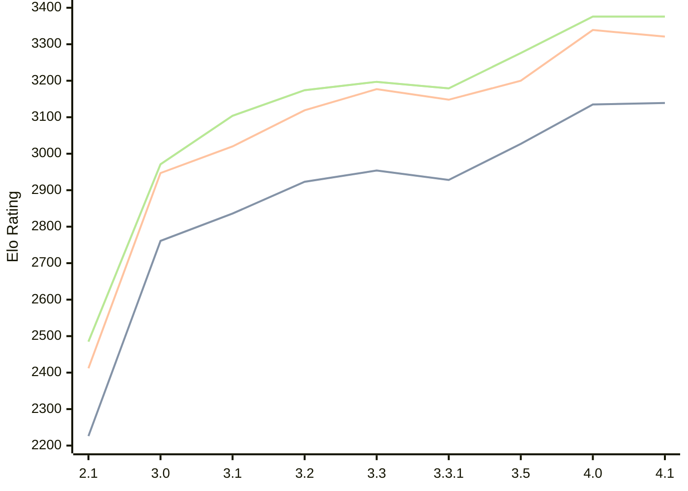

# Engine: Petrel

Author: Aleks Peshkov

Home: https://github.com/AleksPeshkov/petrel

## Elo Ratings

| Version | Published | STC 8.0+0.08s  | LTC 60.0+0.60s | VLTC 2m24s+1.12s | Comment |
| --- | --- | --- | --- | --- | --- |
| 4.1 | 2026-09-08 | 3139(+4) | 3321(-18) | 3376(0) |  |
| 4.0 | 2026-08-04 | 3135(+108) | 3339(+139) | 3376(+100) |  |
| 3.5 | 2026-06-02 | 3027(+99) | 3200(+52) | 3276(+97) |  |
| 3.3.1 | 2026-02-10 | 2928(-26) | 3148(-29) | 3179(-18) |  |
| 3.3 | 2026-02-09 | 2954(+31) | 3177(+58) | 3197(+23) |  |
| 3.2 | 2025-12-21 | 2923(+87) | 3119(+99) | 3174(+70) |  |
| 3.1 | 2025-11-28 | 2836(+75) | 3020(+73) | 3104(+133) |  |
| 3.0 | 2025-11-26 | 2761(+535) | 2947(+535) | 2971(+486) |  |
| 2.1 | 2025-10-13 | 2226 | 2412 | 2485 |  |
 | | | cElo (∆ prev) | cElo (∆ prev) | cElo (∆ prev) | 

<a href="https://github.com/computer-chess-index/cci/issues/new?template=submit-version.yml&title=[VERSION]+Petrel+<version>&body=###%20Engine%20name%0APetrel%0A%0A###%20Version%0A4.1" target="_blank">Submit new version</a>

 Test Conditions:

GUI/CLI: <a href=https://github.com/cutechess/cutechess target="_blank">Cute-Chess</a> 
Elo Calculation: <a href=https://www.remi-coulom.fr/Bayesian-Elo/ target="_blank">Bayesian-Elo</a> 
CPU: Intel(R) Core(TM) i5-7500T 2.70GHz 
Opening book: 8_moves_v3 
\* STC: 8.0+0.08s, LTC: 60.0+0.60s, VLTC: 2m24s+1.12s

 Lists:
Ratings: <a href=https://github.com/computer-chess-index/cci/blob/main/lists/CCIRatings.csv target="_blank">Complete list</a>

Generated: 2026-10-01 04:41:13

## Ratings Verlauf

```mermaid
%%{init: {"theme":"base","themeVariables":{"seriesColors:['#a3a3a3','#222221','#faa371']}}}%%
xychart-beta
  x-axis ["2.1", "3.0", "3.1", "3.2", "3.3", "3.3.1", "3.5", "4.0", "4.1"]
  y-axis "Elo Rating" 2200 --> 3400
  line "" [2226, 2761, 2836, 2923, 2954, 2928, 3027, 3135, 3139]
  line "STC (8.0+0.08s)" [2226, 2761, 2836, 2923, 2954, 2928, 3027, 3135, 3139]
  line "LTC (60.0+0.60s)" [2412, 2947, 3020, 3119, 3177, 3148, 3200, 3339, 3321]
  line "" [2485, 2971, 3104, 3174, 3197, 3179, 3276, 3376, 3376]
  line "VLTC (2m24s+1.12s)" [2485, 2971, 3104, 3174, 3197, 3179, 3276, 3376, 3376]
```

## Detailed Evaluation Results

| Version | Time Control | Elo  | Range +/- | Matches | Score | Average Opponent Elo | Draws |
| --- | --- | --- | --- | --- | --- | --- | --- |
| 4.1 | VLTC (2m24s+1.12s) | 3376 | 32 | 236 | 49% | 3384 | 75% |
| 4.1 | LTC (60.0+0.60s) | 3321 | 32 | 250 | 52% | 3309 | 70% |
| 4.1 | STC (8.0+0.08s) | 3139 | 31 | 276 | 53% | 3117 | 63% |
| --- | --- | --- | --- | --- | --- | --- | --- |
| 4.0 | VLTC (2m24s+1.12s) | 3376 | 27 | 338 | 50% | 3375 | 74% |
| 4.0 | LTC (60.0+0.60s) | 3339 | 28 | 322 | 49% | 3345 | 72% |
| 4.0 | STC (8.0+0.08s) | 3135 | 30 | 308 | 49% | 3143 | 57% |
| --- | --- | --- | --- | --- | --- | --- | --- |
| 3.5 | VLTC (2m24s+1.12s) | 3276 | 27 | 368 | 49% | 3283 | 65% |
| 3.5 | LTC (60.0+0.60s) | 3200 | 27 | 364 | 51% | 3189 | 61% |
| 3.5 | STC (8.0+0.08s) | 3027 | 28 | 364 | 49% | 3035 | 53% |
| --- | --- | --- | --- | --- | --- | --- | --- |
| 3.3.1 | VLTC (2m24s+1.12s) | 3179 | 35 | 228 | 52% | 3163 | 53% |
| 3.3.1 | LTC (60.0+0.60s) | 3148 | 42 | 158 | 53% | 3129 | 56% |
| 3.3.1 | STC (8.0+0.08s) | 2928 | 41 | 170 | 49% | 2940 | 49% |
| --- | --- | --- | --- | --- | --- | --- | --- |
| 3.3 | VLTC (2m24s+1.12s) | 3197 | 104 | 24 | 58% | 3133 | 58% |
| 3.3 | LTC (60.0+0.60s) | 3177 | 102 | 24 | 54% | 3140 | 67% |
| 3.3 | STC (8.0+0.08s) | 2954 | 110 | 24 | 50% | 2958 | 42% |
| --- | --- | --- | --- | --- | --- | --- | --- |
| 3.2 | VLTC (2m24s+1.12s) | 3174 | 35 | 226 | 49% | 3185 | 58% |
| 3.2 | LTC (60.0+0.60s) | 3119 | 33 | 260 | 52% | 3102 | 56% |
| 3.2 | STC (8.0+0.08s) | 2923 | 33 | 264 | 50% | 2925 | 46% |
| --- | --- | --- | --- | --- | --- | --- | --- |
| 3.1 | VLTC (2m24s+1.12s) | 3104 | 35 | 232 | 51% | 3097 | 53% |
| 3.1 | LTC (60.0+0.60s) | 3020 | 36 | 212 | 52% | 3002 | 54% |
| 3.1 | STC (8.0+0.08s) | 2836 | 37 | 224 | 48% | 2855 | 43% |
| --- | --- | --- | --- | --- | --- | --- | --- |
| 3.0 | VLTC (2m24s+1.12s) | 2971 | 51 | 128 | 57% | 2893 | 34% |
| 3.0 | LTC (60.0+0.60s) | 2947 | 43 | 184 | 59% | 2858 | 33% |
| 3.0 | STC (8.0+0.08s) | 2761 | 56 | 108 | 53% | 2719 | 29% |
| --- | --- | --- | --- | --- | --- | --- | --- |
| 2.1 | VLTC (2m24s+1.12s) | 2485 | 57 | 110 | 48% | 2516 | 25% |
| 2.1 | LTC (60.0+0.60s) | 2412 | 58 | 108 | 48% | 2431 | 17% |
| 2.1 | STC (8.0+0.08s) | 2226 | 62 | 88 | 51% | 2219 | 24% |
| --- | --- | --- | --- | --- | --- | --- | --- |