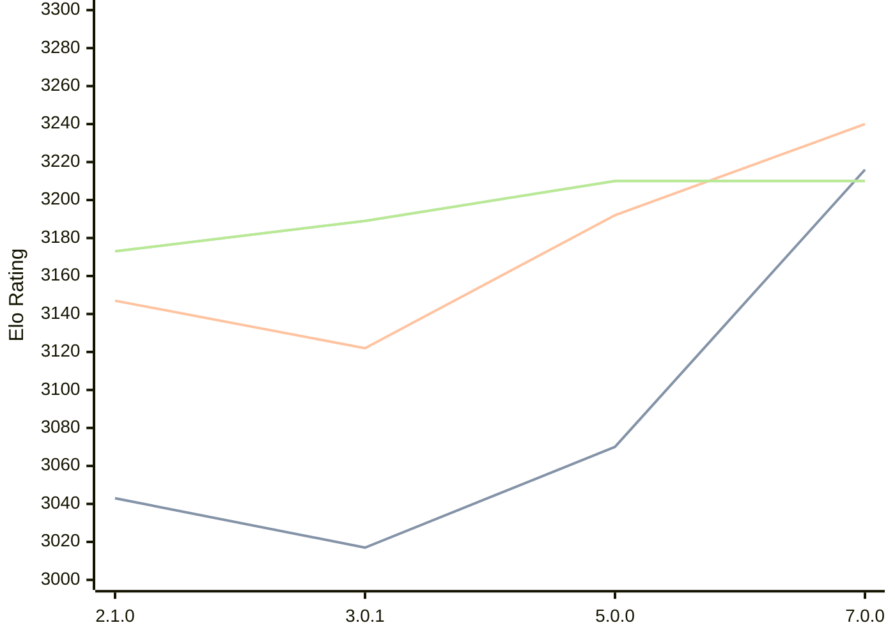

# Engine: PlentyChess

Author: Patrick Leonhardt

Home: https://github.com/Yoshie2000/PlentyChess

## Ratings nach Version

| Version | Published | STC 8.0+0.08s  | LTC 60.0+0.60s | VLTC 2m24s+1.12s | Comment |
| --- | --- | --- | --- | --- | --- |
| 7.0.0 | 2025-09-25 | 3216(+new) | 3240(+new) | 3210(-1) |  |
| 6.0.2 | 2025-06-06 |  |  | 3211(+1) |  |
| 5.0.0 | 2025-03-23 | 3070(+4) | 3192(+new) | 3210(+18) |  |
| 4.0.1 | 2025-01-18 | 3066(+new) |  | 3192(+new) |  |
| 4.0.0 | 2025-01-18 |  |  |  |  |
| 3.0.2 | 2024-11-26 |  |  |  |  |
| 3.0.1 | 2024-11-22 | 3017(+new) | 3122(+new) | 3189(+new) |  |
| 3.0.0 | 2024-11-21 |  |  |  |  |
| 2.1.0 | 2024-07-02 | 3043(+new) | 3147(+new) | 3173(+new) |  |
| 2.0.0 | 2024-06-12 |  |  |  |  |
| 1.0.0 | 2024-04-01 |  |  |  |  |
| 0.3.0 | 2024-02-04 |  |  |  |  |
| 0.2.1 | 2024-01-21 |  |  |  |  |
| 0.2.0 | 2024-01-20 |  |  |  |  |
 | | | cElo (∆ prev) | cElo (∆ prev) | cElo (∆ prev) | 

 Test Conditions:

GUI/CLI: <a href=https://github.com/cutechess/cutechess target="_blank">Cute-Chess</a> 
Elo Calculation: <a href=https://www.remi-coulom.fr/Bayesian-Elo/ target="_blank">Bayesian-Elo</a> 
CPU: Intel(R) Core(TM) i5-7500T 2.70GHz 
Opening book: 8_moves_v3 
\* STC: 8.0+0.08s, LTC: 60.0+0.60s, VLTC: 2m24s+1.12s

 Lists:
Ratings: <a href=https://github.com/computer-chess-index/cci/blob/main/lists/CCIRatings.csv target="_blank">Complete list</a>

Generated: 2026-02-24 07:38:09

## Ratings Verlauf

⬛ STC (8.0+0.08s) &nbsp;&nbsp; 🟧 LTC (60.0+0.60s) &nbsp;&nbsp; 🟩 VLTC (2m24s+1.12s)

