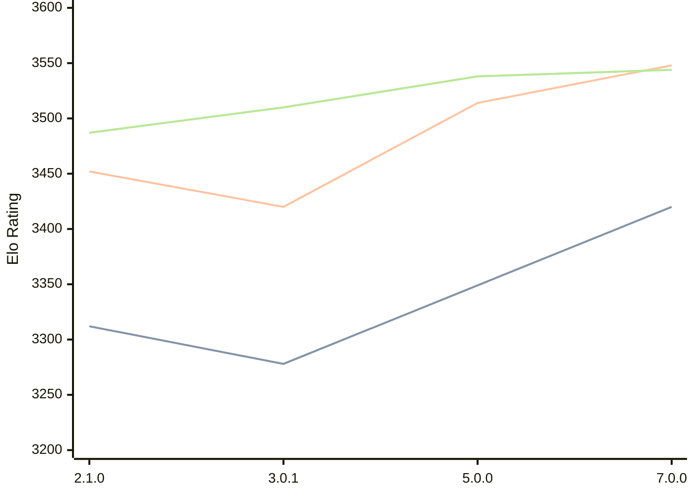

# Engine: PlentyChess

Author: Patrick Leonhardt

Home: https://github.com/Yoshie2000/PlentyChess

## Elo Ratings

| Version | Published | STC 8.0+0.08s  | LTC 60.0+0.60s | VLTC 2m24s+1.12s | Comment |
| --- | --- | --- | --- | --- | --- |
| 7.0.0 | 2025-09-25 | 3420(+new) | 3548(+new) | 3544(+6) |  |
| 6.0.2 | 2025-06-06 |  |  | 3538(0) |  |
| 5.0.0 | 2025-03-23 | 3349(+5) | 3514(+new) | 3538(+24) |  |
| 4.0.1 | 2025-01-18 | 3344(+new) |  | 3514(+new) |  |
| 4.0.0 | 2025-01-18 |  |  |  |  |
| 3.0.2 | 2024-11-26 |  |  |  |  |
| 3.0.1 | 2024-11-22 | 3278(+new) | 3420(+new) | 3510(+new) |  |
| 3.0.0 | 2024-11-21 |  |  |  |  |
| 2.1.0 | 2024-07-02 | 3312(+new) | 3452(+new) | 3487(+new) |  |
| 2.0.0 | 2024-06-12 |  |  |  |  |
| 1.0.0 | 2024-04-01 |  |  |  |  |
| 0.3.0 | 2024-02-04 |  |  |  |  |
| 0.2.1 | 2024-01-21 |  |  |  |  |
| 0.2.0 | 2024-01-20 |  |  |  |  |
| 0.1.0 | 2024-01-12 |  |  |  |  |
 | | | cElo (∆ prev) | cElo (∆ prev) | cElo (∆ prev) | 

<a href="https://github.com/computer-chess-index/cci/issues/new?template=submit-version.yml&title=[VERSION]+PlentyChess+<version>&body=###%20Engine%20name%0APlentyChess%0A%0A###%20Version%0A7.0.0" target="_blank">Submit new version</a>

 Test Conditions:

GUI/CLI: <a href=https://github.com/cutechess/cutechess target="_blank">Cute-Chess</a> 
Elo Calculation: <a href=https://www.remi-coulom.fr/Bayesian-Elo/ target="_blank">Bayesian-Elo</a> 
CPU: Intel(R) Core(TM) i5-7500T 2.70GHz 
Opening book: 8_moves_v3 
\* STC: 8.0+0.08s, LTC: 60.0+0.60s, VLTC: 2m24s+1.12s

 Lists:
Ratings: <a href=https://github.com/computer-chess-index/cci/blob/main/lists/CCIRatings.csv target="_blank">Complete list</a>

Generated: 2026-06-18 06:30:30

## Ratings Verlauf

## Ratings Verlauf

⬛ STC (8.0+0.08s) &nbsp;&nbsp; 🟧 LTC (60.0+0.60s) &nbsp;&nbsp; 🟩 VLTC (2m24s+1.12s)

dark mode: 🟩STC (8.0+0.08s) 🟧LTC (60.0+0.60s) ⬜VLTC (2m24s+1.12s)

## Detailed Evaluation Results

| Version | Time Control | Elo  | Range +/- | Matches | Score | Average Opponent Elo | Draws |
| --- | --- | --- | --- | --- | --- | --- | --- |
| 7.0.0 | VLTC (2m24s+1.12s) | 3544 | 24 | 384 | 51% | 3540 | 92% |
| 7.0.0 | LTC (60.0+0.60s) | 3548 | 45 | 110 | 50% | 3545 | 89% |
| 7.0.0 | STC (8.0+0.08s) | 3420 | 35 | 200 | 49% | 3421 | 77% |
| --- | --- | --- | --- | --- | --- | --- | --- |
| 6.0.2 | VLTC (2m24s+1.12s) | 3538 | 34 | 192 | 51% | 3536 | 92% |
| 5.0.0 | VLTC (2m24s+1.12s) | 3538 | 26 | 332 | 51% | 3529 | 87% |
| 5.0.0 | LTC (60.0+0.60s) | 3514 | 68 | 48 | 48% | 3528 | 92% |
| 5.0.0 | STC (8.0+0.08s) | 3349 | 208 | 4 | 50% | 3349 | 100% |
| --- | --- | --- | --- | --- | --- | --- | --- |
| 4.0.1 | VLTC (2m24s+1.12s) | 3514 | 20 | 600 | 50% | 3513 | 88% |
| 4.0.1 | STC (8.0+0.08s) | 3344 | 59 | 72 | 52% | 3328 | 71% |
| --- | --- | --- | --- | --- | --- | --- | --- |
| 3.0.1 | VLTC (2m24s+1.12s) | 3510 | 21 | 544 | 50% | 3507 | 86% |
| 3.0.1 | LTC (60.0+0.60s) | 3420 | 36 | 208 | 50% | 3413 | 59% |
| 3.0.1 | STC (8.0+0.08s) | 3278 | 33 | 248 | 47% | 3297 | 56% |
| --- | --- | --- | --- | --- | --- | --- | --- |
| 2.1.0 | VLTC (2m24s+1.12s) | 3487 | 23 | 460 | 52% | 3474 | 85% |
| 2.1.0 | LTC (60.0+0.60s) | 3452 | 63 | 64 | 63% | 3351 | 67% |
| 2.1.0 | STC (8.0+0.08s) | 3312 | 98 | 92 | 92% | 2514 | 15% |
| --- | --- | --- | --- | --- | --- | --- | --- |