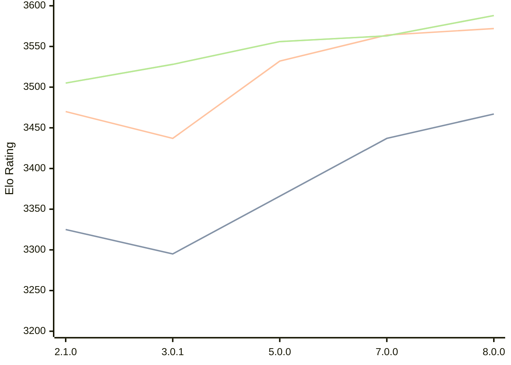

# Engine: PlentyChess

Author: Patrick Leonhardt

Home: https://github.com/Yoshie2000/PlentyChess

## Elo Ratings

| Version | Published | STC 8.0+0.08s  | LTC 60.0+0.60s | VLTC 2m24s+1.12s | Comment |
| --- | --- | --- | --- | --- | --- |
| 8.0.0 | 2026-06-27 | 3467(+30) | 3572(+8) | 3588(+25) |  |
| 7.0.0 | 2025-09-25 | 3437(+new) | 3564(+new) | 3563(+6) |  |
| 6.0.2 | 2025-06-06 |  |  | 3557(+1) |  |
| 5.0.0 | 2025-03-23 | 3366(+6) | 3532(+new) | 3556(+24) |  |
| 4.0.1 | 2025-01-18 | 3360(+65) |  | 3532(+4) |  |
| 3.0.1 | 2024-11-22 | 3295(-30) | 3437(-33) | 3528(+23) |  |
| 2.1.0 | 2024-07-02 | 3325 | 3470 | 3505 |  |
 | | | cElo (∆ prev) | cElo (∆ prev) | cElo (∆ prev) | 

<a href="https://github.com/computer-chess-index/cci/issues/new?template=submit-version.yml&title=[VERSION]+PlentyChess+<version>&body=###%20Engine%20name%0APlentyChess%0A%0A###%20Version%0A8.0.0" target="_blank">Submit new version</a>

 Test Conditions:

GUI/CLI: <a href=https://github.com/cutechess/cutechess target="_blank">Cute-Chess</a> 
Elo Calculation: <a href=https://www.remi-coulom.fr/Bayesian-Elo/ target="_blank">Bayesian-Elo</a> 
CPU: Intel(R) Core(TM) i5-7500T 2.70GHz 
Opening book: 8_moves_v3 
\* STC: 8.0+0.08s, LTC: 60.0+0.60s, VLTC: 2m24s+1.12s

 Lists:
Ratings: <a href=https://github.com/computer-chess-index/cci/blob/main/lists/CCIRatings.csv target="_blank">Complete list</a>

Generated: 2026-08-29 06:27:51

## Ratings Verlauf

## Detailed Evaluation Results

| Version | Time Control | Elo  | Range +/- | Matches | Score | Average Opponent Elo | Draws |
| --- | --- | --- | --- | --- | --- | --- | --- |
| 8.0.0 | VLTC (2m24s+1.12s) | 3588 | 41 | 136 | 52% | 3576 | 89% |
| 8.0.0 | LTC (60.0+0.60s) | 3572 | 39 | 148 | 50% | 3572 | 92% |
| 8.0.0 | STC (8.0+0.08s) | 3467 | 33 | 224 | 48% | 3479 | 79% |
| --- | --- | --- | --- | --- | --- | --- | --- |
| 7.0.0 | VLTC (2m24s+1.12s) | 3563 | 24 | 392 | 51% | 3557 | 92% |
| 7.0.0 | LTC (60.0+0.60s) | 3564 | 42 | 130 | 50% | 3563 | 89% |
| 7.0.0 | STC (8.0+0.08s) | 3437 | 35 | 204 | 49% | 3438 | 77% |
| --- | --- | --- | --- | --- | --- | --- | --- |
| 6.0.2 | VLTC (2m24s+1.12s) | 3557 | 34 | 192 | 51% | 3553 | 92% |
| 5.0.0 | VLTC (2m24s+1.12s) | 3556 | 26 | 332 | 51% | 3546 | 87% |
| 5.0.0 | LTC (60.0+0.60s) | 3532 | 68 | 48 | 48% | 3545 | 92% |
| 5.0.0 | STC (8.0+0.08s) | 3366 | 208 | 4 | 50% | 3366 | 100% |
| --- | --- | --- | --- | --- | --- | --- | --- |
| 4.0.1 | VLTC (2m24s+1.12s) | 3532 | 20 | 600 | 50% | 3530 | 88% |
| 4.0.1 | STC (8.0+0.08s) | 3360 | 59 | 72 | 52% | 3344 | 71% |
| --- | --- | --- | --- | --- | --- | --- | --- |
| 3.0.1 | VLTC (2m24s+1.12s) | 3528 | 21 | 544 | 50% | 3525 | 86% |
| 3.0.1 | LTC (60.0+0.60s) | 3437 | 36 | 208 | 50% | 3430 | 59% |
| 3.0.1 | STC (8.0+0.08s) | 3295 | 33 | 248 | 47% | 3313 | 56% |
| --- | --- | --- | --- | --- | --- | --- | --- |
| 2.1.0 | VLTC (2m24s+1.12s) | 3505 | 23 | 460 | 52% | 3491 | 85% |
| 2.1.0 | LTC (60.0+0.60s) | 3470 | 63 | 64 | 63% | 3367 | 67% |
| 2.1.0 | STC (8.0+0.08s) | 3325 | 98 | 92 | 92% | 2525 | 15% |
| --- | --- | --- | --- | --- | --- | --- | --- |