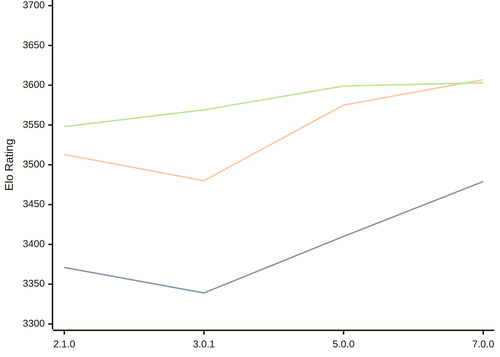

# Engine: PlentyChess

Author: Patrick Leonhardt

Home: https://github.com/Yoshie2000/PlentyChess

## Elo Ratings

| Version | Published | STC 8.0+0.08s  | LTC 60.0+0.60s | VLTC 2m24s+1.12s | Comment |
| --- | --- | --- | --- | --- | --- |
| 7.0.0 | 2025-09-25 | 3479(+new) | 3607(+new) | 3603(+4) |  |
| 6.0.2 | 2025-06-06 |  |  | 3599(0) |  |
| 5.0.0 | 2025-03-23 | 3410(+7) | 3575(+new) | 3599(+24) |  |
| 4.0.1 | 2025-01-18 | 3403(+new) |  | 3575(+new) |  |
| 4.0.0 | 2025-01-18 |  |  |  |  |
| 3.0.2 | 2024-11-26 |  |  |  |  |
| 3.0.1 | 2024-11-22 | 3339(+new) | 3480(+new) | 3569(+new) |  |
| 3.0.0 | 2024-11-21 |  |  |  |  |
| 2.1.0 | 2024-07-02 | 3371(+new) | 3513(+new) | 3548(+new) |  |
| 2.0.0 | 2024-06-12 |  |  |  |  |
| 1.0.0 | 2024-04-01 |  |  |  |  |
| 0.3.0 | 2024-02-04 |  |  |  |  |
| 0.2.1 | 2024-01-21 |  |  |  |  |
| 0.2.0 | 2024-01-20 |  |  |  |  |
| 0.1.0 | 2024-01-12 |  |  |  |  |
 | | | cElo (∆ prev) | cElo (∆ prev) | cElo (∆ prev) | 

<a href="https://github.com/computer-chess-index/cci/issues/new?template=submit-version.yml&title=[VERSION]+PlentyChess+<version>&body=###%20Engine%20name%0APlentyChess%0A%0A###%20Version%0A7.0.0" target="_blank">Submit new version</a>

 Test Conditions:

GUI/CLI: <a href=https://github.com/cutechess/cutechess target="_blank">Cute-Chess</a> 
Elo Calculation: <a href=https://www.remi-coulom.fr/Bayesian-Elo/ target="_blank">Bayesian-Elo</a> 
CPU: Intel(R) Core(TM) i5-7500T 2.70GHz 
Opening book: 8_moves_v3 
\* STC: 8.0+0.08s, LTC: 60.0+0.60s, VLTC: 2m24s+1.12s

 Lists:
Ratings: <a href=https://github.com/computer-chess-index/cci/blob/main/lists/CCIRatings.csv target="_blank">Complete list</a>

Generated: 2026-05-03 07:42:27

## Ratings Verlauf

⬛ STC (8.0+0.08s) &nbsp;&nbsp; 🟧 LTC (60.0+0.60s) &nbsp;&nbsp; 🟩 VLTC (2m24s+1.12s)

dark mode: 🟩STC (8.0+0.08s) 🟧LTC (60.0+0.60s) ⬜VLTC (2m24s+1.12s)

## Detailed Evaluation Results

| Version | Time Control | Elo  | Range +/- | Matches | Score | Average Opponent Elo | Draws |
| --- | --- | --- | --- | --- | --- | --- | --- |
| 7.0.0 | VLTC (2m24s+1.12s) | 3603 | 24 | 384 | 51% | 3599 | 92% |
| 7.0.0 | D1 | 930 | 32 | 312 | 51% | 918 | 39% |
| 7.0.0 | D10 | 2950 | 26 | 436 | 50% | 2951 | 46% |
| 7.0.0 | D11 | 3120 | 24 | 476 | 50% | 3119 | 56% |
| 7.0.0 | D12 | 3228 | 22 | 536 | 49% | 3231 | 61% |
| 7.0.0 | D13 | 3287 | 23 | 516 | 51% | 3282 | 63% |
| 7.0.0 | D14 | 3335 | 23 | 484 | 50% | 3330 | 68% |
| 7.0.0 | D15 | 3382 | 22 | 544 | 51% | 3372 | 70% |
| 7.0.0 | D16 | 3432 | 21 | 572 | 50% | 3429 | 75% |
| 7.0.0 | D17 | 3471 | 20 | 600 | 50% | 3472 | 78% |
| 7.0.0 | D18 | 3494 | 21 | 540 | 50% | 3491 | 81% |
| 7.0.0 | D19 | 3521 | 19 | 618 | 50% | 3521 | 84% |
| 7.0.0 | D2 | 1247 | 31 | 312 | 48% | 1268 | 40% |
| 7.0.0 | D20 | 3533 | 20 | 558 | 50% | 3537 | 85% |
| 7.0.0 | D21 | 3553 | 19 | 616 | 50% | 3553 | 88% |
| 7.0.0 | D22 | 3572 | 21 | 548 | 50% | 3572 | 85% |
| 7.0.0 | D23 | 3580 | 21 | 524 | 50% | 3576 | 88% |
| 7.0.0 | D24 | 3596 | 22 | 492 | 51% | 3592 | 87% |
| 7.0.0 | D25 | 3596 | 22 | 476 | 50% | 3595 | 91% |
| 7.0.0 | D26 | 3614 | 25 | 366 | 51% | 3607 | 87% |
| 7.0.0 | D27 | 3618 | 25 | 354 | 52% | 3606 | 92% |
| 7.0.0 | D28 | 3621 | 27 | 302 | 51% | 3613 | 93% |
| 7.0.0 | D29 | 3625 | 26 | 332 | 53% | 3606 | 89% |
| 7.0.0 | D3 | 1504 | 29 | 362 | 49% | 1515 | 43% |
| 7.0.0 | D4 | 1732 | 28 | 374 | 50% | 1732 | 45% |
| 7.0.0 | D5 | 1948 | 24 | 502 | 46% | 1991 | 47% |
| 7.0.0 | D6 | 2138 | 25 | 480 | 48% | 2159 | 43% |
| 7.0.0 | D7 | 2303 | 26 | 504 | 52% | 2277 | 29% |
| 7.0.0 | D8 | 2574 | 26 | 490 | 51% | 2554 | 31% |
| 7.0.0 | D9 | 2843 | 25 | 494 | 49% | 2836 | 41% |
| 7.0.0 | S10 | 3502 | 37 | 178 | 52% | 3484 | 77% |
| 7.0.0 | S40 | 3592 | 38 | 160 | 49% | 3596 | 88% |
| 7.0.0 | LTC (60.0+0.60s) | 3607 | 45 | 110 | 50% | 3606 | 89% |
| 7.0.0 | STC (8.0+0.08s) | 3479 | 36 | 188 | 49% | 3482 | 76% |
| --- | --- | --- | --- | --- | --- | --- | --- |
| 6.0.2 | VLTC (2m24s+1.12s) | 3599 | 34 | 192 | 51% | 3596 | 92% |
| 6.0.2 | D1 | 981 | 39 | 220 | 51% | 973 | 30% |
| 6.0.2 | D10 | 2974 | 32 | 276 | 49% | 2982 | 49% |
| 6.0.2 | D11 | 3097 | 32 | 260 | 51% | 3087 | 60% |
| 6.0.2 | D12 | 3217 | 31 | 276 | 48% | 3228 | 61% |
| 6.0.2 | D13 | 3254 | 30 | 276 | 48% | 3264 | 69% |
| 6.0.2 | D14 | 3353 | 32 | 250 | 50% | 3355 | 66% |
| 6.0.2 | D15 | 3397 | 28 | 320 | 52% | 3384 | 75% |
| 6.0.2 | D16 | 3413 | 30 | 262 | 50% | 3414 | 76% |
| 6.0.2 | D17 | 3465 | 30 | 276 | 50% | 3467 | 76% |
| 6.0.2 | D18 | 3490 | 30 | 272 | 51% | 3483 | 77% |
| 6.0.2 | D19 | 3503 | 30 | 256 | 51% | 3501 | 86% |
| 6.0.2 | D2 | 1413 | 37 | 232 | 49% | 1423 | 35% |
| 6.0.2 | D20 | 3528 | 31 | 244 | 50% | 3530 | 79% |
| 6.0.2 | D21 | 3537 | 32 | 228 | 50% | 3538 | 89% |
| 6.0.2 | D22 | 3557 | 31 | 244 | 50% | 3560 | 84% |
| 6.0.2 | D23 | 3568 | 30 | 260 | 50% | 3568 | 82% |
| 6.0.2 | D24 | 3584 | 32 | 228 | 51% | 3576 | 89% |
| 6.0.2 | D25 | 3599 | 33 | 196 | 51% | 3595 | 95% |
| 6.0.2 | D26 | 3606 | 32 | 220 | 51% | 3599 | 90% |
| 6.0.2 | D27 | 3598 | 34 | 196 | 50% | 3599 | 91% |
| 6.0.2 | D28 | 3615 | 41 | 132 | 52% | 3605 | 91% |
| 6.0.2 | D29 | 3621 | 42 | 128 | 51% | 3611 | 91% |
| 6.0.2 | D3 | 1681 | 38 | 216 | 48% | 1704 | 37% |
| 6.0.2 | D4 | 1855 | 39 | 224 | 50% | 1855 | 28% |
| 6.0.2 | D5 | 1951 | 36 | 264 | 53% | 1922 | 30% |
| 6.0.2 | D6 | 2125 | 37 | 224 | 49% | 2132 | 37% |
| 6.0.2 | D7 | 2394 | 39 | 216 | 48% | 2412 | 32% |
| 6.0.2 | D8 | 2705 | 35 | 248 | 50% | 2701 | 39% |
| 6.0.2 | D9 | 2815 | 36 | 232 | 49% | 2822 | 42% |
| 5.0.0 | VLTC (2m24s+1.12s) | 3599 | 26 | 332 | 51% | 3590 | 87% |
| 5.0.0 | D1 | 952 | 32 | 352 | 57% | 845 | 34% |
| 5.0.0 | D10 | 2919 | 28 | 372 | 51% | 2911 | 46% |
| 5.0.0 | D11 | 3038 | 27 | 388 | 49% | 3043 | 56% |
| 5.0.0 | D12 | 3164 | 26 | 388 | 50% | 3166 | 64% |
| 5.0.0 | D13 | 3237 | 27 | 380 | 50% | 3236 | 59% |
| 5.0.0 | D14 | 3303 | 26 | 384 | 50% | 3299 | 72% |
| 5.0.0 | D15 | 3371 | 25 | 400 | 50% | 3370 | 71% |
| 5.0.0 | D16 | 3399 | 23 | 440 | 50% | 3399 | 79% |
| 5.0.0 | D17 | 3449 | 24 | 412 | 50% | 3448 | 80% |
| 5.0.0 | D18 | 3472 | 25 | 396 | 50% | 3471 | 80% |
| 5.0.0 | D19 | 3494 | 24 | 400 | 50% | 3495 | 84% |
| 5.0.0 | D2 | 1335 | 31 | 360 | 48% | 1353 | 29% |
| 5.0.0 | D20 | 3511 | 24 | 404 | 50% | 3514 | 80% |
| 5.0.0 | D21 | 3548 | 23 | 428 | 50% | 3546 | 83% |
| 5.0.0 | D22 | 3548 | 23 | 424 | 51% | 3541 | 85% |
| 5.0.0 | D23 | 3567 | 24 | 412 | 50% | 3571 | 87% |
| 5.0.0 | D24 | 3573 | 24 | 400 | 50% | 3575 | 88% |
| 5.0.0 | D25 | 3584 | 24 | 388 | 51% | 3580 | 88% |
| 5.0.0 | D26 | 3595 | 26 | 336 | 51% | 3588 | 88% |
| 5.0.0 | D27 | 3605 | 28 | 292 | 52% | 3592 | 89% |
| 5.0.0 | D28 | 3606 | 30 | 260 | 52% | 3595 | 87% |
| 5.0.0 | D29 | 3617 | 31 | 240 | 53% | 3599 | 92% |
| 5.0.0 | D3 | 1563 | 31 | 364 | 52% | 1539 | 22% |
| 5.0.0 | D4 | 1771 | 30 | 372 | 53% | 1744 | 30% |
| 5.0.0 | D5 | 1906 | 30 | 356 | 49% | 1913 | 33% |
| 5.0.0 | D6 | 2103 | 30 | 368 | 50% | 2103 | 30% |
| 5.0.0 | D7 | 2353 | 30 | 364 | 51% | 2350 | 31% |
| 5.0.0 | D8 | 2556 | 29 | 388 | 52% | 2537 | 35% |
| 5.0.0 | D9 | 2768 | 28 | 368 | 50% | 2768 | 45% |
| 5.0.0 | S10 | 3455 | 129 | 12 | 50% | 3455 | 100% |
| 5.0.0 | S40 | 3580 | 170 | 8 | 56% | 3542 | 63% |
| 5.0.0 | LTC (60.0+0.60s) | 3575 | 68 | 48 | 48% | 3587 | 92% |
| 5.0.0 | STC (8.0+0.08s) | 3410 | 208 | 4 | 50% | 3410 | 100% |
| --- | --- | --- | --- | --- | --- | --- | --- |
| 4.0.1 | VLTC (2m24s+1.12s) | 3575 | 20 | 600 | 50% | 3573 | 88% |
| 4.0.1 | D1 | 1026 | 21 | 784 | 50% | 1027 | 31% |
| 4.0.1 | D10 | 2859 | 20 | 768 | 49% | 2870 | 43% |
| 4.0.1 | D11 | 3015 | 19 | 764 | 50% | 3013 | 51% |
| 4.0.1 | D12 | 3123 | 19 | 788 | 50% | 3124 | 59% |
| 4.0.1 | D13 | 3204 | 19 | 748 | 51% | 3191 | 64% |
| 4.0.1 | D14 | 3268 | 18 | 768 | 50% | 3266 | 66% |
| 4.0.1 | D15 | 3335 | 18 | 824 | 50% | 3335 | 70% |
| 4.0.1 | D16 | 3374 | 17 | 820 | 50% | 3374 | 72% |
| 4.0.1 | D17 | 3417 | 17 | 800 | 49% | 3421 | 78% |
| 4.0.1 | D18 | 3448 | 17 | 824 | 50% | 3451 | 81% |
| 4.0.1 | D19 | 3476 | 17 | 812 | 50% | 3476 | 78% |
| 4.0.1 | D2 | 1320 | 21 | 768 | 47% | 1353 | 28% |
| 4.0.1 | D20 | 3491 | 18 | 768 | 50% | 3491 | 81% |
| 4.0.1 | D21 | 3510 | 17 | 796 | 50% | 3507 | 81% |
| 4.0.1 | D22 | 3534 | 18 | 720 | 50% | 3536 | 85% |
| 4.0.1 | D23 | 3561 | 18 | 704 | 50% | 3560 | 86% |
| 4.0.1 | D24 | 3565 | 18 | 728 | 50% | 3564 | 85% |
| 4.0.1 | D25 | 3568 | 19 | 656 | 50% | 3568 | 88% |
| 4.0.1 | D26 | 3584 | 20 | 584 | 51% | 3576 | 90% |
| 4.0.1 | D27 | 3590 | 21 | 524 | 51% | 3582 | 91% |
| 4.0.1 | D28 | 3594 | 22 | 456 | 51% | 3586 | 90% |
| 4.0.1 | D29 | 3611 | 58 | 68 | 51% | 3606 | 84% |
| 4.0.1 | D3 | 1515 | 20 | 804 | 51% | 1508 | 36% |
| 4.0.1 | D4 | 1739 | 21 | 764 | 51% | 1732 | 32% |
| 4.0.1 | D5 | 1870 | 21 | 756 | 49% | 1875 | 33% |
| 4.0.1 | D6 | 2082 | 21 | 760 | 50% | 2083 | 33% |
| 4.0.1 | D7 | 2394 | 21 | 792 | 48% | 2415 | 32% |
| 4.0.1 | D8 | 2556 | 20 | 784 | 50% | 2552 | 40% |
| 4.0.1 | D9 | 2709 | 20 | 768 | 51% | 2701 | 41% |
| 4.0.1 | S10 | 3455 | 72 | 48 | 57% | 3401 | 73% |
| 4.0.1 | S40 | 3541 | 78 | 40 | 55% | 3505 | 75% |
| 4.0.1 | STC (8.0+0.08s) | 3403 | 59 | 72 | 52% | 3387 | 71% |
| --- | --- | --- | --- | --- | --- | --- | --- |
| 4.0.0 |  |  |  |  |  |  |  |
| 3.0.2 |  |  |  |  |  |  |  |
| 3.0.1 | VLTC (2m24s+1.12s) | 3569 | 21 | 544 | 50% | 3568 | 86% |
| 3.0.1 | D1 | 1170 | 22 | 736 | 50% | 1173 | 26% |
| 3.0.1 | D10 | 2925 | 22 | 656 | 50% | 2921 | 43% |
| 3.0.1 | D11 | 3056 | 21 | 656 | 49% | 3062 | 48% |
| 3.0.1 | D12 | 3127 | 20 | 664 | 49% | 3131 | 56% |
| 3.0.1 | D13 | 3217 | 20 | 696 | 50% | 3220 | 59% |
| 3.0.1 | D14 | 3268 | 19 | 704 | 50% | 3266 | 65% |
| 3.0.1 | D15 | 3310 | 19 | 728 | 50% | 3309 | 69% |
| 3.0.1 | D16 | 3371 | 19 | 728 | 50% | 3370 | 70% |
| 3.0.1 | D17 | 3407 | 19 | 712 | 50% | 3406 | 74% |
| 3.0.1 | D18 | 3444 | 19 | 704 | 50% | 3444 | 79% |
| 3.0.1 | D19 | 3472 | 19 | 656 | 50% | 3472 | 75% |
| 3.0.1 | D2 | 1443 | 23 | 672 | 51% | 1434 | 26% |
| 3.0.1 | D20 | 3487 | 19 | 656 | 50% | 3490 | 81% |
| 3.0.1 | D21 | 3498 | 19 | 632 | 51% | 3494 | 82% |
| 3.0.1 | D22 | 3518 | 19 | 624 | 50% | 3518 | 82% |
| 3.0.1 | D23 | 3534 | 19 | 624 | 50% | 3533 | 83% |
| 3.0.1 | D24 | 3546 | 20 | 600 | 51% | 3542 | 82% |
| 3.0.1 | D25 | 3540 | 19 | 608 | 50% | 3537 | 88% |
| 3.0.1 | D26 | 3567 | 20 | 560 | 50% | 3567 | 87% |
| 3.0.1 | D27 | 3575 | 21 | 512 | 51% | 3572 | 88% |
| 3.0.1 | D28 | 3582 | 22 | 472 | 51% | 3575 | 88% |
| 3.0.1 | D3 | 1661 | 23 | 648 | 48% | 1688 | 27% |
| 3.0.1 | D4 | 1872 | 23 | 640 | 51% | 1862 | 25% |
| 3.0.1 | D5 | 2021 | 23 | 672 | 49% | 2032 | 29% |
| 3.0.1 | D6 | 2126 | 23 | 664 | 51% | 2114 | 28% |
| 3.0.1 | D7 | 2468 | 22 | 664 | 49% | 2477 | 31% |
| 3.0.1 | D8 | 2606 | 22 | 672 | 50% | 2607 | 34% |
| 3.0.1 | D9 | 2762 | 22 | 664 | 50% | 2762 | 40% |
| 3.0.1 | S10 | 3298 | 94 | 32 | 36% | 3395 | 53% |
| 3.0.1 | S40 | 3425 | 34 | 256 | 51% | 3411 | 48% |
| 3.0.1 | LTC (60.0+0.60s) | 3480 | 36 | 208 | 50% | 3474 | 59% |
| 3.0.1 | STC (8.0+0.08s) | 3339 | 33 | 248 | 47% | 3356 | 56% |
| --- | --- | --- | --- | --- | --- | --- | --- |
| 3.0.0 |  |  |  |  |  |  |  |
| 2.1.0 | VLTC (2m24s+1.12s) | 3548 | 23 | 460 | 52% | 3533 | 85% |
| 2.1.0 | D1 | 1199 | 18 | 1120 | 50% | 1197 | 19% |
| 2.1.0 | D10 | 2870 | 15 | 1212 | 49% | 2881 | 49% |
| 2.1.0 | D11 | 3016 | 14 | 1379 | 49% | 3021 | 54% |
| 2.1.0 | D12 | 3120 | 14 | 1296 | 51% | 3112 | 59% |
| 2.1.0 | D13 | 3193 | 15 | 1164 | 50% | 3194 | 58% |
| 2.1.0 | D14 | 3255 | 14 | 1288 | 52% | 3212 | 65% |
| 2.1.0 | D15 | 3305 | 14 | 1368 | 51% | 3283 | 67% |
| 2.1.0 | D16 | 3352 | 14 | 1300 | 51% | 3326 | 71% |
| 2.1.0 | D17 | 3394 | 14 | 1256 | 50% | 3393 | 77% |
| 2.1.0 | D18 | 3422 | 14 | 1273 | 49% | 3428 | 79% |
| 2.1.0 | D19 | 3440 | 14 | 1226 | 50% | 3441 | 80% |
| 2.1.0 | D2 | 1612 | 16 | 1396 | 51% | 1600 | 19% |
| 2.1.0 | D20 | 3474 | 15 | 1072 | 50% | 3476 | 80% |
| 2.1.0 | D21 | 3486 | 15 | 1019 | 50% | 3486 | 82% |
| 2.1.0 | D22 | 3509 | 15 | 970 | 50% | 3507 | 85% |
| 2.1.0 | D23 | 3529 | 15 | 984 | 50% | 3530 | 87% |
| 2.1.0 | D24 | 3534 | 17 | 821 | 50% | 3537 | 87% |
| 2.1.0 | D25 | 3544 | 16 | 949 | 50% | 3545 | 86% |
| 2.1.0 | D26 | 3555 | 16 | 916 | 49% | 3557 | 88% |
| 2.1.0 | D27 | 3567 | 16 | 872 | 50% | 3567 | 89% |
| 2.1.0 | D28 | 3576 | 18 | 692 | 50% | 3576 | 90% |
| 2.1.0 | D3 | 1823 | 16 | 1368 | 51% | 1810 | 19% |
| 2.1.0 | D4 | 2003 | 17 | 1257 | 53% | 1976 | 26% |
| 2.1.0 | D5 | 2113 | 16 | 1304 | 53% | 2078 | 33% |
| 2.1.0 | D6 | 2229 | 17 | 1112 | 49% | 2238 | 30% |
| 2.1.0 | D7 | 2387 | 18 | 1064 | 49% | 2394 | 32% |
| 2.1.0 | D8 | 2579 | 16 | 1212 | 51% | 2566 | 39% |
| 2.1.0 | D9 | 2707 | 16 | 1236 | 49% | 2712 | 40% |
| 2.1.0 | S10 | 3414 | 249 | 8 | 94% | 2996 | 13% |
| 2.1.0 | S40 | 3395 | 96 | 28 | 39% | 3463 | 64% |
| 2.1.0 | LTC (60.0+0.60s) | 3513 | 63 | 64 | 63% | 3410 | 67% |
| 2.1.0 | STC (8.0+0.08s) | 3371 | 98 | 92 | 92% | 2568 | 15% |
| --- | --- | --- | --- | --- | --- | --- | --- |
| 2.0.0 |  |  |  |  |  |  |  |
| 1.0.0 |  |  |  |  |  |  |  |
| 0.3.0 |  |  |  |  |  |  |  |
| 0.2.1 |  |  |  |  |  |  |  |
| 0.2.0 |  |  |  |  |  |  |  |
| 0.1.0 |  |  |  |  |  |  |  |