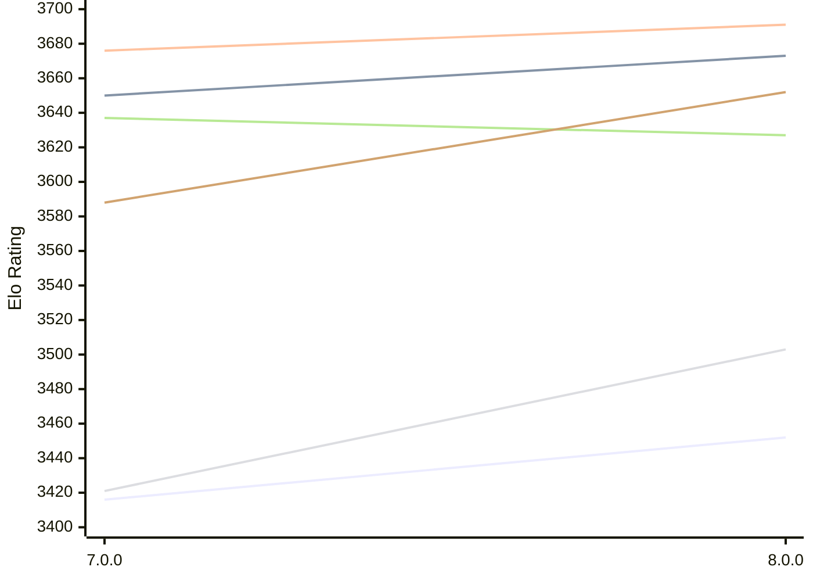
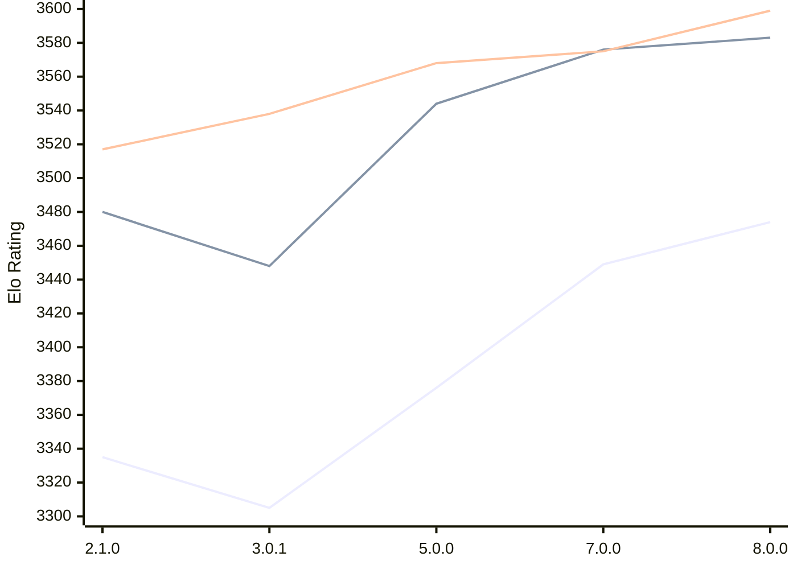

# Engine: PlentyChess

Author: Patrick Leonhardt

Home: https://github.com/Yoshie2000/PlentyChess

## Elo Ratings E1 (Ultra 7 265T (1.50 GHz) - E-Core)

| Version | Published | STC 8.0+0.08s  | LTC 60.0+0.60s | VLTC 2m24s+1.12s | Comment |
| --- | --- | --- | --- | --- | --- |
| 8.0.0 | 2026-06-27 | 3452(+36) | 3673(+23) | 3691(+15) |  |
| 7.0.0 | 2025-09-25 | 3416 | 3650 | 3676 |  |
 | | | cElo (∆ prev) | cElo (∆ prev) | cElo (∆ prev) | 

## Elo Ratings P1 (Ultra 7 265T (1.50 GHz) - P-Core)

| Version | Published | STC 8.0+0.08s  | LTC 60.0+0.60s | VLTC 2m24s+1.12s | Comment |
| --- | --- | --- | --- | --- | --- |
| 8.0.0 | 2026-06-27 | 3503(+82) | 3627(-10) | 3652(+64) |  |
| 7.0.0 | 2025-09-25 | 3421 | 3637 | 3588 |  |
 | | | cElo (∆ prev) | cElo (∆ prev) | cElo (∆ prev) | 

## Elo Ratings T1 (i5-7500T 2.70GHz)

| Version | Published | STC 8.0+0.08s  | LTC 60.0+0.60s | VLTC 2m24s+1.12s | Comment |
| --- | --- | --- | --- | --- | --- |
| 8.0.0 | 2026-06-27 | 3474(+25) | 3583(+7) | 3599(+24) |  |
| 7.0.0 | 2025-09-25 | 3449(+new) | 3576(+new) | 3575(+7) |  |
| 6.0.2 | 2025-06-06 |  |  | 3568(0) |  |
| 5.0.0 | 2025-03-23 | 3376(+5) | 3544(+new) | 3568(+24) |  |
| 4.0.1 | 2025-01-18 | 3371(+66) |  | 3544(+6) |  |
| 3.0.1 | 2024-11-22 | 3305(-30) | 3448(-32) | 3538(+21) |  |
| 2.1.0 | 2024-07-02 | 3335 | 3480 | 3517 |  |
 | | | cElo (∆ prev) | cElo (∆ prev) | cElo (∆ prev) | 

<a href="https://github.com/computer-chess-index/cci/issues/new?template=submit-version.yml&title=[VERSION]+PlentyChess+<version>&body=###%20Engine%20name%0APlentyChess%0A%0A###%20Version%0A8.0.0" target="_blank">Submit new version</a>

 Test Conditions:

GUI/CLI: <a href=https://github.com/cutechess/cutechess target="_blank">Cute-Chess</a> 
Elo Calculation: <a href=https://www.remi-coulom.fr/Bayesian-Elo/ target="_blank">Bayesian-Elo</a> 
CPU for P1: Intel(R) Core(TM) Ultra 7 265T (1.50 GHz) - P-Core 
CPU for E1: Intel(R) Core(TM) Ultra 7 265T (1.50 GHz) - E-Core 
CPU for T1: Intel(R) Core(TM) i5-7500T 2.70GHz 
Opening book: 8_moves_v3 
\* STC: 8.0+0.08s, LTC: 60.0+0.60s, VLTC: 2m24s+1.12s

 Lists:
Ratings: <a href=https://github.com/computer-chess-index/cci/blob/main/lists/CCIRatings.csv target="_blank">Complete list</a>

Generated: 2026-11-24 05:41:18

## Ratings Verlauf E1 / P1

```mermaid
%%{init: {"theme":"base","themeVariables":{"seriesColors:['#a3a3a3','#222221','#faa371']}}}%%
xychart-beta
  x-axis ["7.0.0", "8.0.0"]
  y-axis "Elo Rating" 3400 --> 3700
  line "E1: STC (8.0+0.08s)" [3416, 3452]
  line "E1: LTC (60.0+0.60s)" [3650, 3673]
  line "E1: VLTC (2m24s+1.12s)" [3676, 3691]
  line "P1: STC (8.0+0.08s)" [3421, 3503]
  line "P1: LTC (60.0+0.60s)" [3637, 3627]
  line "P1: VLTC (2m24s+1.12s)" [3588, 3652]
```

## Ratings Verlauf T1

```mermaid
%%{init: {"theme":"base","themeVariables":{"seriesColors:['#a3a3a3','#222221','#faa371']}}}%%
xychart-beta
  x-axis ["2.1.0", "3.0.1", "5.0.0", "7.0.0", "8.0.0"]
  y-axis "Elo Rating" 3300 --> 3600
  line "T1: STC (8.0+0.08s)" [3335, 3305, 3376, 3449, 3474]
  line "T1: LTC (60.0+0.60s)" [3480, 3448, 3544, 3576, 3583]
  line "T1: VLTC (2m24s+1.12s)" [3517, 3538, 3568, 3575, 3599]
```

## Detailed Evaluation Results

| Version | Time Control | Variant | Elo  | Range +/- | Matches | Score | Average Opponent Elo | Draws |
| --- | --- |--- | --- | --- | --- | --- | --- | --- |
| 8.0.0 | VLTC (2m24s+1.12s) | E1 | 3691 | 21 | 490 | 50% | 3694 | 90% |
|  |  | T1 | 3599 | 38 | 158 | 52% | 3588 | 91% |
|  |  | P1 | 3652 | 51 | 84 | 52% | 3640 | 92% |
|  | LTC (60.0+0.60s) | E1 | 3673 | 37 | 168 | 52% | 3650 | 83% |
|  |  | T1 | 3583 | 37 | 164 | 50% | 3584 | 93% |
|  |  | P1 | 3627 | 43 | 132 | 56% | 3569 | 81% |
|  | STC (8.0+0.08s) | E1 | 3452 | 34 | 248 | 56% | 3318 | 63% |
|  |  | T1 | 3474 | 31 | 244 | 48% | 3491 | 79% |
|  |  | P1 | 3503 | 49 | 122 | 63% | 3266 | 64% |
| --- | --- |--- | --- | --- | --- | --- | --- | --- |
| 7.0.0 | VLTC (2m24s+1.12s) | P1 | 3588 | 92 | 40 | 74% | 3247 | 53% |
|  |  | E1 | 3676 | 71 | 54 | 66% | 3483 | 69% |
|  |  | T1 | 3575 | 24 | 392 | 51% | 3569 | 92% |
|  | LTC (60.0+0.60s) | E1 | 3650 | 69 | 56 | 61% | 3519 | 71% |
|  |  | T1 | 3576 | 42 | 130 | 50% | 3573 | 89% |
|  |  | P1 | 3637 | 89 | 40 | 63% | 3445 | 50% |
|  | STC (8.0+0.08s) | E1 | 3416 | 76 | 44 | 51% | 3405 | 70% |
|  |  | T1 | 3449 | 35 | 204 | 49% | 3449 | 77% |
|  |  | P1 | 3421 | 86 | 34 | 56% | 3379 | 71% |
| --- | --- |--- | --- | --- | --- | --- | --- | --- |
| 6.0.2 | VLTC (2m24s+1.12s) | T1 | 3568 | 34 | 192 | 51% | 3565 | 92% |
| --- | --- |--- | --- | --- | --- | --- | --- | --- |
| 5.0.0 | VLTC (2m24s+1.12s) | T1 | 3568 | 26 | 332 | 51% | 3559 | 87% |
|  | LTC (60.0+0.60s) | T1 | 3544 | 68 | 48 | 48% | 3557 | 92% |
|  | STC (8.0+0.08s) | T1 | 3376 | 208 | 4 | 50% | 3376 | 100% |
| --- | --- |--- | --- | --- | --- | --- | --- | --- |
| 4.0.1 | VLTC (2m24s+1.12s) | T1 | 3544 | 20 | 600 | 50% | 3542 | 88% |
|  | STC (8.0+0.08s) | T1 | 3371 | 59 | 72 | 52% | 3355 | 71% |
| --- | --- |--- | --- | --- | --- | --- | --- | --- |
| 3.0.1 | VLTC (2m24s+1.12s) | T1 | 3538 | 21 | 544 | 50% | 3537 | 86% |
|  | LTC (60.0+0.60s) | T1 | 3448 | 36 | 208 | 50% | 3441 | 59% |
|  | STC (8.0+0.08s) | T1 | 3305 | 33 | 248 | 47% | 3324 | 56% |
| --- | --- |--- | --- | --- | --- | --- | --- | --- |
| 2.1.0 | VLTC (2m24s+1.12s) | T1 | 3517 | 23 | 460 | 52% | 3502 | 85% |
|  | LTC (60.0+0.60s) | T1 | 3480 | 63 | 64 | 63% | 3378 | 67% |
|  | STC (8.0+0.08s) | T1 | 3335 | 98 | 92 | 92% | 2533 | 15% |