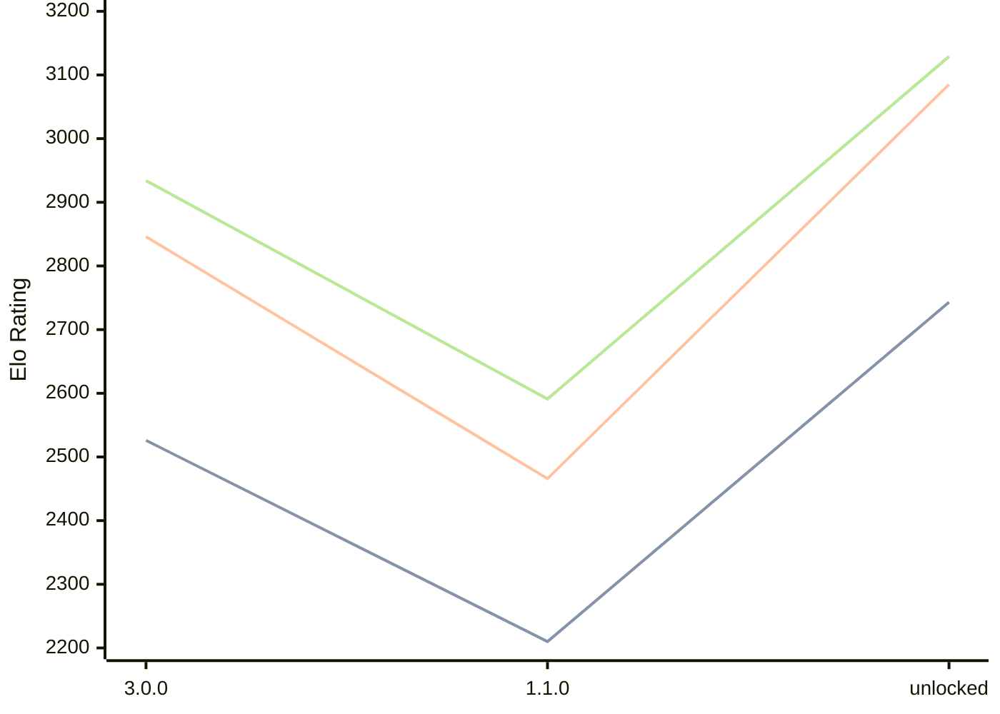

# Engine: Potential

Author: Eren Araz

Home: https://github.com/ProgramciDusunur/Potential

## Elo Ratings

| Version | Published | STC 8.0+0.08s  | LTC 60.0+0.60s | VLTC 2m24s+1.12s | Comment |
| --- | --- | --- | --- | --- | --- |
| unlocked | 2026-07-27 | 2743(+533) | 3085(+619) | 3129(+538) |  |
| 1.1.0 | 2026-05-16 | 2210(-316) | 2466(-380) | 2591(-343) |  |
| 3.0.0 | 2025-08-28 | 2526 | 2846 | 2934 |  |
 | | | cElo (∆ prev) | cElo (∆ prev) | cElo (∆ prev) | 

<a href="https://github.com/computer-chess-index/cci/issues/new?template=submit-version.yml&title=[VERSION]+Potential+<version>&body=###%20Engine%20name%0APotential%0A%0A###%20Version%0Aunlocked" target="_blank">Submit new version</a>

 Test Conditions:

GUI/CLI: <a href=https://github.com/cutechess/cutechess target="_blank">Cute-Chess</a> 
Elo Calculation: <a href=https://www.remi-coulom.fr/Bayesian-Elo/ target="_blank">Bayesian-Elo</a> 
CPU: Intel(R) Core(TM) i5-7500T 2.70GHz 
Opening book: 8_moves_v3 
\* STC: 8.0+0.08s, LTC: 60.0+0.60s, VLTC: 2m24s+1.12s

 Lists:
Ratings: <a href=https://github.com/computer-chess-index/cci/blob/main/lists/CCIRatings.csv target="_blank">Complete list</a>

Generated: 2026-08-16 06:27:39

## Ratings Verlauf

⬛ STC (8.0+0.08s) &nbsp;&nbsp; 🟧 LTC (60.0+0.60s) &nbsp;&nbsp; 🟩 VLTC (2m24s+1.12s)

dark mode: 🟩STC (8.0+0.08s) 🟧LTC (60.0+0.60s) ⬜VLTC (2m24s+1.12s)

## Detailed Evaluation Results

| Version | Time Control | Elo  | Range +/- | Matches | Score | Average Opponent Elo | Draws |
| --- | --- | --- | --- | --- | --- | --- | --- |
| unlocked | VLTC (2m24s+1.12s) | 3129 | 31 | 276 | 51% | 3120 | 57% |
| unlocked | LTC (60.0+0.60s) | 3085 | 29 | 360 | 53% | 3056 | 44% |
| unlocked | STC (8.0+0.08s) | 2743 | 32 | 308 | 52% | 2723 | 37% |
| --- | --- | --- | --- | --- | --- | --- | --- |
| 1.1.0 | VLTC (2m24s+1.12s) | 2591 | 29 | 416 | 48% | 2608 | 27% |
| 1.1.0 | LTC (60.0+0.60s) | 2466 | 28 | 416 | 50% | 2466 | 32% |
| 1.1.0 | STC (8.0+0.08s) | 2210 | 31 | 352 | 49% | 2207 | 26% |
| --- | --- | --- | --- | --- | --- | --- | --- |
| 3.0.0 | VLTC (2m24s+1.12s) | 2934 | 28 | 404 | 49% | 2943 | 34% |
| 3.0.0 | LTC (60.0+0.60s) | 2846 | 29 | 380 | 49% | 2854 | 34% |
| 3.0.0 | STC (8.0+0.08s) | 2526 | 27 | 452 | 49% | 2531 | 30% |
| --- | --- | --- | --- | --- | --- | --- | --- |