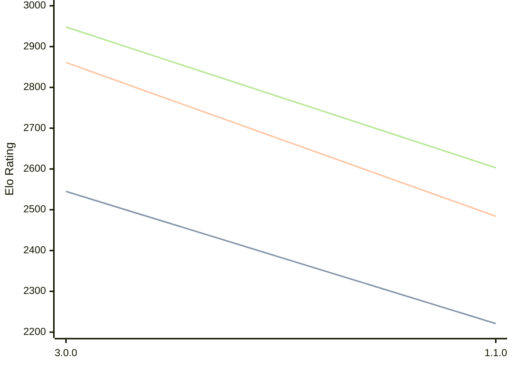

# Engine: Potential

Author: Eren Araz

Home: https://github.com/ProgramciDusunur/Potential

## Elo Ratings

| Version | Published | STC 8.0+0.08s  | LTC 60.0+0.60s | VLTC 2m24s+1.12s | Comment |
| --- | --- | --- | --- | --- | --- |
| 1.1.0 | 2026-05-16 | 2221(-324) | 2484(-377) | 2603(-345) |  |
| 3.0.0 | 2025-08-28 | 2545(+new) | 2861(+new) | 2948(+new) |  |
| 2.0.0 | 2025-04-08 |  |  |  |  |
| 1.0.0 | 2025-01-28 |  |  |  |  |
 | | | cElo (∆ prev) | cElo (∆ prev) | cElo (∆ prev) | 

<a href="https://github.com/computer-chess-index/cci/issues/new?template=submit-version.yml&title=[VERSION]+Potential+<version>&body=###%20Engine%20name%0APotential%0A%0A###%20Version%0A1.1.0" target="_blank">Submit new version</a>

 Test Conditions:

GUI/CLI: <a href=https://github.com/cutechess/cutechess target="_blank">Cute-Chess</a> 
Elo Calculation: <a href=https://www.remi-coulom.fr/Bayesian-Elo/ target="_blank">Bayesian-Elo</a> 
CPU: Intel(R) Core(TM) i5-7500T 2.70GHz 
Opening book: 8_moves_v3 
\* STC: 8.0+0.08s, LTC: 60.0+0.60s, VLTC: 2m24s+1.12s

 Lists:
Ratings: <a href=https://github.com/computer-chess-index/cci/blob/main/lists/CCIRatings.csv target="_blank">Complete list</a>

Generated: 2026-05-19 06:27:34

## Ratings Verlauf

⬛ STC (8.0+0.08s) &nbsp;&nbsp; 🟧 LTC (60.0+0.60s) &nbsp;&nbsp; 🟩 VLTC (2m24s+1.12s)

dark mode: 🟩STC (8.0+0.08s) 🟧LTC (60.0+0.60s) ⬜VLTC (2m24s+1.12s)

## Detailed Evaluation Results

| Version | Time Control | Elo  | Range +/- | Matches | Score | Average Opponent Elo | Draws |
| --- | --- | --- | --- | --- | --- | --- | --- |
| 1.1.0 | VLTC (2m24s+1.12s) | 2603 | 42 | 194 | 46% | 2645 | 28% |
| 1.1.0 | LTC (60.0+0.60s) | 2484 | 37 | 250 | 47% | 2510 | 30% |
| 1.1.0 | STC (8.0+0.08s) | 2221 | 40 | 220 | 49% | 2223 | 23% |
| --- | --- | --- | --- | --- | --- | --- | --- |
| 3.0.0 | VLTC (2m24s+1.12s) | 2948 | 28 | 404 | 49% | 2958 | 34% |
| 3.0.0 | LTC (60.0+0.60s) | 2861 | 29 | 380 | 49% | 2870 | 34% |
| 3.0.0 | STC (8.0+0.08s) | 2545 | 27 | 452 | 49% | 2550 | 30% |
| --- | --- | --- | --- | --- | --- | --- | --- |