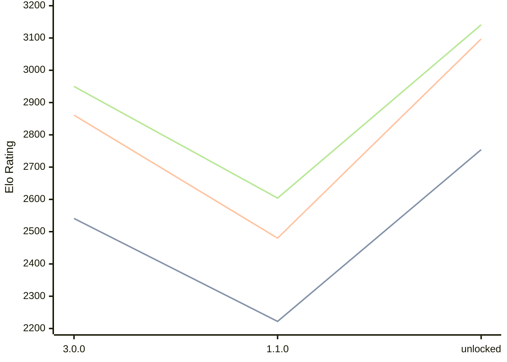

# Engine: Potential

Author: Eren Araz

Home: https://github.com/ProgramciDusunur/Potential

## Elo Ratings

| Version | Published | STC 8.0+0.08s  | LTC 60.0+0.60s | VLTC 2m24s+1.12s | Comment |
| --- | --- | --- | --- | --- | --- |
| unlocked | 2026-07-27 | 2754(+532) | 3097(+617) | 3141(+537) |  |
| 1.1.0 | 2026-05-16 | 2222(-319) | 2480(-381) | 2604(-346) |  |
| 3.0.0 | 2025-08-28 | 2541 | 2861 | 2950 |  |
 | | | cElo (∆ prev) | cElo (∆ prev) | cElo (∆ prev) | 

<a href="https://github.com/computer-chess-index/cci/issues/new?template=submit-version.yml&title=[VERSION]+Potential+<version>&body=###%20Engine%20name%0APotential%0A%0A###%20Version%0Aunlocked" target="_blank">Submit new version</a>

 Test Conditions:

GUI/CLI: <a href=https://github.com/cutechess/cutechess target="_blank">Cute-Chess</a> 
Elo Calculation: <a href=https://www.remi-coulom.fr/Bayesian-Elo/ target="_blank">Bayesian-Elo</a> 
CPU: Intel(R) Core(TM) i5-7500T 2.70GHz 
Opening book: 8_moves_v3 
\* STC: 8.0+0.08s, LTC: 60.0+0.60s, VLTC: 2m24s+1.12s

 Lists:
Ratings: <a href=https://github.com/computer-chess-index/cci/blob/main/lists/CCIRatings.csv target="_blank">Complete list</a>

Generated: 2026-09-22 04:40:50

## Ratings Verlauf

## Detailed Evaluation Results

| Version | Time Control | Elo  | Range +/- | Matches | Score | Average Opponent Elo | Draws |
| --- | --- | --- | --- | --- | --- | --- | --- |
| unlocked | VLTC (2m24s+1.12s) | 3141 | 28 | 348 | 51% | 3136 | 56% |
| unlocked | LTC (60.0+0.60s) | 3097 | 27 | 412 | 52% | 3075 | 46% |
| unlocked | STC (8.0+0.08s) | 2754 | 30 | 340 | 52% | 2735 | 37% |
| --- | --- | --- | --- | --- | --- | --- | --- |
| 1.1.0 | VLTC (2m24s+1.12s) | 2604 | 29 | 416 | 48% | 2622 | 27% |
| 1.1.0 | LTC (60.0+0.60s) | 2480 | 28 | 416 | 50% | 2480 | 32% |
| 1.1.0 | STC (8.0+0.08s) | 2222 | 31 | 352 | 49% | 2221 | 26% |
| --- | --- | --- | --- | --- | --- | --- | --- |
| 3.0.0 | VLTC (2m24s+1.12s) | 2950 | 28 | 404 | 49% | 2958 | 34% |
| 3.0.0 | LTC (60.0+0.60s) | 2861 | 29 | 380 | 49% | 2869 | 34% |
| 3.0.0 | STC (8.0+0.08s) | 2541 | 27 | 452 | 49% | 2545 | 30% |
| --- | --- | --- | --- | --- | --- | --- | --- |