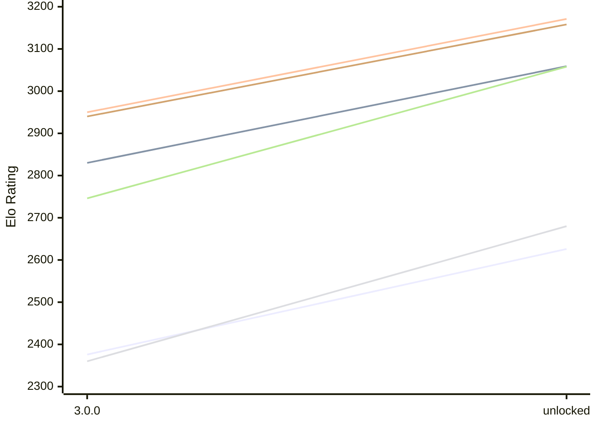
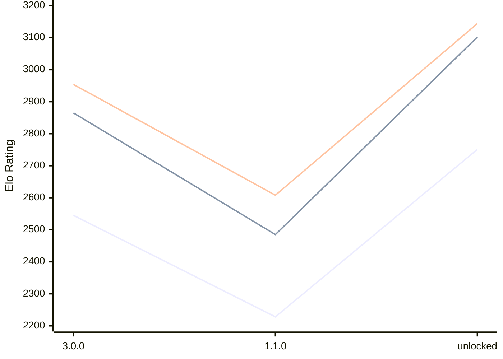

# Engine: Potential

Author: Eren Araz

Home: https://github.com/ProgramciDusunur/Potential

## Elo Ratings E1 (Ultra 7 265T (1.50 GHz) - E-Core)

| Version | Published | STC 8.0+0.08s  | LTC 60.0+0.60s | VLTC 2m24s+1.12s | Comment |
| --- | --- | --- | --- | --- | --- |
| unlocked | 2026-07-27 | 2626(+250) | 3059(+229) | 3171(+221) |  |
| 3.0.0 | 2025-08-28 | 2376 | 2830 | 2950 |  |
 | | | cElo (∆ prev) | cElo (∆ prev) | cElo (∆ prev) | 

## Elo Ratings P1 (Ultra 7 265T (1.50 GHz) - P-Core)

| Version | Published | STC 8.0+0.08s  | LTC 60.0+0.60s | VLTC 2m24s+1.12s | Comment |
| --- | --- | --- | --- | --- | --- |
| unlocked | 2026-07-27 | 2680(+320) | 3058(+312) | 3158(+218) |  |
| 3.0.0 | 2025-08-28 | 2360 | 2746 | 2940 |  |
 | | | cElo (∆ prev) | cElo (∆ prev) | cElo (∆ prev) | 

## Elo Ratings T1 (i5-7500T 2.70GHz)

| Version | Published | STC 8.0+0.08s  | LTC 60.0+0.60s | VLTC 2m24s+1.12s | Comment |
| --- | --- | --- | --- | --- | --- |
| unlocked | 2026-07-27 | 2751(+523) | 3102(+617) | 3144(+536) |  |
| 1.1.0 | 2026-05-16 | 2228(-317) | 2485(-380) | 2608(-346) |  |
| 3.0.0 | 2025-08-28 | 2545 | 2865 | 2954 |  |
 | | | cElo (∆ prev) | cElo (∆ prev) | cElo (∆ prev) | 

<a href="https://github.com/computer-chess-index/cci/issues/new?template=submit-version.yml&title=[VERSION]+Potential+<version>&body=###%20Engine%20name%0APotential%0A%0A###%20Version%0Aunlocked" target="_blank">Submit new version</a>

 Test Conditions:

GUI/CLI: <a href=https://github.com/cutechess/cutechess target="_blank">Cute-Chess</a> 
Elo Calculation: <a href=https://www.remi-coulom.fr/Bayesian-Elo/ target="_blank">Bayesian-Elo</a> 
CPU for P1: Intel(R) Core(TM) Ultra 7 265T (1.50 GHz) - P-Core 
CPU for E1: Intel(R) Core(TM) Ultra 7 265T (1.50 GHz) - E-Core 
CPU for T1: Intel(R) Core(TM) i5-7500T 2.70GHz 
Opening book: 8_moves_v3 
\* STC: 8.0+0.08s, LTC: 60.0+0.60s, VLTC: 2m24s+1.12s

 Lists:
Ratings: <a href=https://github.com/computer-chess-index/cci/blob/main/lists/CCIRatings.csv target="_blank">Complete list</a>

Generated: 2026-11-22 05:41:13

## Ratings Verlauf E1 / P1

```mermaid
%%{init: {"theme":"base","themeVariables":{"seriesColors:['#a3a3a3','#222221','#faa371']}}}%%
xychart-beta
  x-axis ["3.0.0", "unlocked"]
  y-axis "Elo Rating" 2300 --> 3200
  line "E1: STC (8.0+0.08s)" [2376, 2626]
  line "E1: LTC (60.0+0.60s)" [2830, 3059]
  line "E1: VLTC (2m24s+1.12s)" [2950, 3171]
  line "P1: STC (8.0+0.08s)" [2360, 2680]
  line "P1: LTC (60.0+0.60s)" [2746, 3058]
  line "P1: VLTC (2m24s+1.12s)" [2940, 3158]
```

## Ratings Verlauf T1

```mermaid
%%{init: {"theme":"base","themeVariables":{"seriesColors:['#a3a3a3','#222221','#faa371']}}}%%
xychart-beta
  x-axis ["3.0.0", "1.1.0", "unlocked"]
  y-axis "Elo Rating" 2200 --> 3200
  line "T1: STC (8.0+0.08s)" [2545, 2228, 2751]
  line "T1: LTC (60.0+0.60s)" [2865, 2485, 3102]
  line "T1: VLTC (2m24s+1.12s)" [2954, 2608, 3144]
```

## Detailed Evaluation Results

| Version | Time Control | Variant | Elo  | Range +/- | Matches | Score | Average Opponent Elo | Draws |
| --- | --- |--- | --- | --- | --- | --- | --- | --- |
| unlocked | VLTC (2m24s+1.12s) | T1 | 3144 | 28 | 356 | 50% | 3141 | 56% |
|  |  | P1 | 3158 | 27 | 380 | 49% | 3170 | 54% |
|  |  | E1 | 3171 | 26 | 442 | 50% | 3168 | 48% |
|  | LTC (60.0+0.60s) | T1 | 3102 | 27 | 416 | 52% | 3081 | 47% |
|  |  | P1 | 3058 | 34 | 242 | 49% | 3069 | 50% |
|  |  | E1 | 3059 | 25 | 460 | 46% | 3092 | 45% |
|  | STC (8.0+0.08s) | T1 | 2751 | 30 | 350 | 51% | 2741 | 36% |
|  |  | P1 | 2680 | 30 | 358 | 53% | 2655 | 32% |
|  |  | E1 | 2626 | 28 | 422 | 45% | 2649 | 30% |
| --- | --- |--- | --- | --- | --- | --- | --- | --- |
| 1.1.0 | VLTC (2m24s+1.12s) | T1 | 2608 | 29 | 416 | 48% | 2626 | 27% |
|  | LTC (60.0+0.60s) | T1 | 2485 | 28 | 416 | 50% | 2485 | 32% |
|  | STC (8.0+0.08s) | T1 | 2228 | 31 | 352 | 49% | 2225 | 26% |
| --- | --- |--- | --- | --- | --- | --- | --- | --- |
| 3.0.0 | VLTC (2m24s+1.12s) | T1 | 2954 | 28 | 404 | 49% | 2962 | 34% |
|  |  | P1 | 2940 | 61 | 84 | 48% | 2954 | 37% |
|  |  | E1 | 2950 | 77 | 56 | 44% | 3012 | 30% |
|  | LTC (60.0+0.60s) | T1 | 2865 | 29 | 380 | 49% | 2873 | 34% |
|  |  | P1 | 2746 | 63 | 94 | 61% | 2572 | 29% |
|  |  | E1 | 2830 | 62 | 96 | 49% | 2861 | 25% |
|  | STC (8.0+0.08s) | T1 | 2545 | 27 | 452 | 49% | 2549 | 30% |
|  |  | P1 | 2360 | 64 | 96 | 44% | 2453 | 21% |
|  |  | E1 | 2376 | 59 | 120 | 35% | 2573 | 20% |