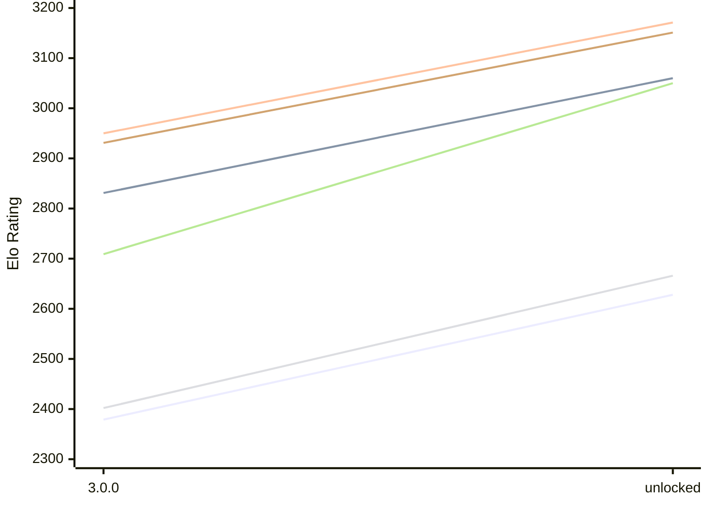
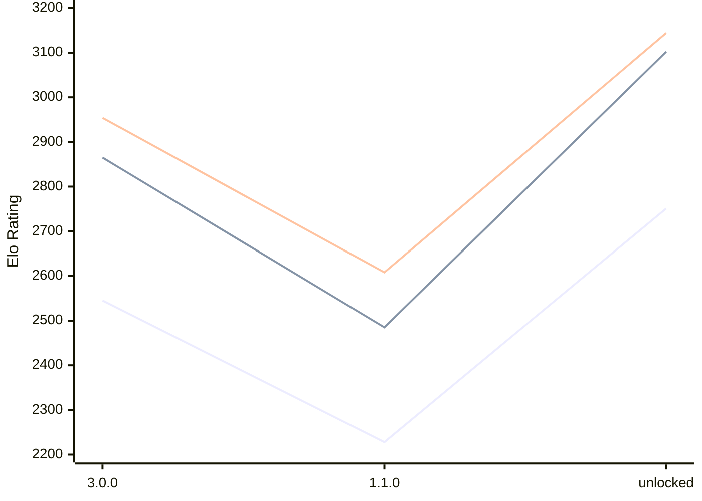

# Engine: Potential

Author: Eren Araz

Home: https://github.com/ProgramciDusunur/Potential

## Elo Ratings E1 (Ultra 7 265T (1.50 GHz) - E-Core)

| Version | Published | STC 8.0+0.08s  | LTC 60.0+0.60s | VLTC 2m24s+1.12s | Comment |
| --- | --- | --- | --- | --- | --- |
| unlocked | 2026-07-27 | 2628(+249) | 3060(+229) | 3171(+221) |  |
| 3.0.0 | 2025-08-28 | 2379 | 2831 | 2950 |  |
 | | | cElo (∆ prev) | cElo (∆ prev) | cElo (∆ prev) | 

## Elo Ratings P1 (Ultra 7 265T (1.50 GHz) - P-Core)

| Version | Published | STC 8.0+0.08s  | LTC 60.0+0.60s | VLTC 2m24s+1.12s | Comment |
| --- | --- | --- | --- | --- | --- |
| unlocked | 2026-07-27 | 2666(+264) | 3050(+341) | 3151(+220) |  |
| 3.0.0 | 2025-08-28 | 2402 | 2709 | 2931 |  |
 | | | cElo (∆ prev) | cElo (∆ prev) | cElo (∆ prev) | 

## Elo Ratings T1 (i5-7500T 2.70GHz)

| Version | Published | STC 8.0+0.08s  | LTC 60.0+0.60s | VLTC 2m24s+1.12s | Comment |
| --- | --- | --- | --- | --- | --- |
| unlocked | 2026-07-27 | 2751(+523) | 3102(+617) | 3144(+536) |  |
| 1.1.0 | 2026-05-16 | 2228(-317) | 2485(-380) | 2608(-346) |  |
| 3.0.0 | 2025-08-28 | 2545 | 2865 | 2954 |  |
 | | | cElo (∆ prev) | cElo (∆ prev) | cElo (∆ prev) | 

<a href="https://github.com/computer-chess-index/cci/issues/new?template=submit-version.yml&title=[VERSION]+Potential+<version>&body=###%20Engine%20name%0APotential%0A%0A###%20Version%0Aunlocked" target="_blank">Submit new version</a>

 Test Conditions:

GUI/CLI: <a href=https://github.com/cutechess/cutechess target="_blank">Cute-Chess</a> 
Elo Calculation: <a href=https://www.remi-coulom.fr/Bayesian-Elo/ target="_blank">Bayesian-Elo</a> 
CPU for P1: Intel(R) Core(TM) Ultra 7 265T (1.50 GHz) - P-Core 
CPU for E1: Intel(R) Core(TM) Ultra 7 265T (1.50 GHz) - E-Core 
CPU for T1: Intel(R) Core(TM) i5-7500T 2.70GHz 
Opening book: 8_moves_v3 
\* STC: 8.0+0.08s, LTC: 60.0+0.60s, VLTC: 2m24s+1.12s

 Lists:
Ratings: <a href=https://github.com/computer-chess-index/cci/blob/main/lists/CCIRatings.csv target="_blank">Complete list</a>

Generated: 2026-11-20 05:41:10

## Ratings Verlauf E1 / P1

```mermaid
%%{init: {"theme":"base","themeVariables":{"seriesColors:['#a3a3a3','#222221','#faa371']}}}%%
xychart-beta
  x-axis ["3.0.0", "unlocked"]
  y-axis "Elo Rating" 2300 --> 3200
  line "E1: STC (8.0+0.08s)" [2379, 2628]
  line "E1: LTC (60.0+0.60s)" [2831, 3060]
  line "E1: VLTC (2m24s+1.12s)" [2950, 3171]
  line "P1: STC (8.0+0.08s)" [2402, 2666]
  line "P1: LTC (60.0+0.60s)" [2709, 3050]
  line "P1: VLTC (2m24s+1.12s)" [2931, 3151]
```

## Ratings Verlauf T1

```mermaid
%%{init: {"theme":"base","themeVariables":{"seriesColors:['#a3a3a3','#222221','#faa371']}}}%%
xychart-beta
  x-axis ["3.0.0", "1.1.0", "unlocked"]
  y-axis "Elo Rating" 2200 --> 3200
  line "T1: STC (8.0+0.08s)" [2545, 2228, 2751]
  line "T1: LTC (60.0+0.60s)" [2865, 2485, 3102]
  line "T1: VLTC (2m24s+1.12s)" [2954, 2608, 3144]
```

## Detailed Evaluation Results

| Version | Time Control | Variant | Elo  | Range +/- | Matches | Score | Average Opponent Elo | Draws |
| --- | --- |--- | --- | --- | --- | --- | --- | --- |
| unlocked | VLTC (2m24s+1.12s) | P1 | 3151 | 27 | 380 | 49% | 3163 | 54% |
|  |  | E1 | 3171 | 26 | 442 | 50% | 3168 | 48% |
|  |  | T1 | 3144 | 28 | 356 | 50% | 3141 | 56% |
|  | LTC (60.0+0.60s) | P1 | 3050 | 34 | 242 | 49% | 3059 | 50% |
|  |  | E1 | 3060 | 25 | 456 | 46% | 3093 | 46% |
|  |  | T1 | 3102 | 27 | 416 | 52% | 3081 | 47% |
|  | STC (8.0+0.08s) | E1 | 2628 | 29 | 410 | 46% | 2650 | 30% |
|  |  | T1 | 2751 | 30 | 350 | 51% | 2741 | 36% |
|  |  | P1 | 2666 | 31 | 338 | 52% | 2649 | 33% |
| --- | --- |--- | --- | --- | --- | --- | --- | --- |
| 1.1.0 | VLTC (2m24s+1.12s) | T1 | 2608 | 29 | 416 | 48% | 2626 | 27% |
|  | LTC (60.0+0.60s) | T1 | 2485 | 28 | 416 | 50% | 2485 | 32% |
|  | STC (8.0+0.08s) | T1 | 2228 | 31 | 352 | 49% | 2225 | 26% |
| --- | --- |--- | --- | --- | --- | --- | --- | --- |
| 3.0.0 | VLTC (2m24s+1.12s) | E1 | 2950 | 77 | 56 | 44% | 3012 | 30% |
|  |  | T1 | 2954 | 28 | 404 | 49% | 2962 | 34% |
|  |  | P1 | 2931 | 68 | 68 | 48% | 2948 | 34% |
|  | LTC (60.0+0.60s) | E1 | 2831 | 62 | 96 | 49% | 2862 | 25% |
|  |  | T1 | 2865 | 29 | 380 | 49% | 2873 | 34% |
|  |  | P1 | 2709 | 69 | 80 | 60% | 2541 | 28% |
|  | STC (8.0+0.08s) | T1 | 2545 | 27 | 452 | 49% | 2549 | 30% |
|  |  | P1 | 2402 | 75 | 72 | 46% | 2473 | 19% |
|  |  | E1 | 2379 | 59 | 120 | 35% | 2576 | 20% |