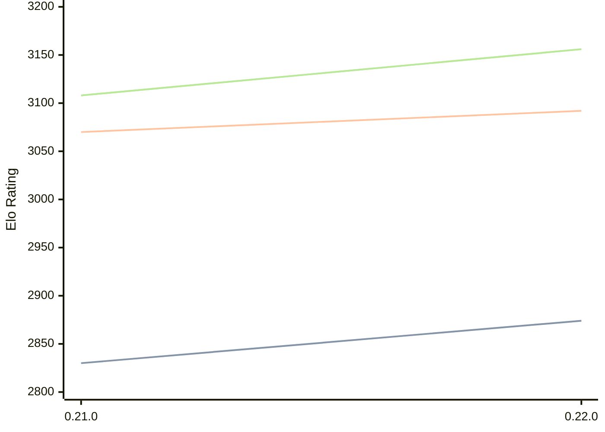

# Engine: Princhess

Author: Lana Samson

Home: https://github.com/princesslana/princhess

## Elo Ratings

| Version | Published | STC 8.0+0.08s  | LTC 60.0+0.60s | VLTC 2m24s+1.12s | Comment |
| --- | --- | --- | --- | --- | --- |
| 0.22.0 | 2026-08-16 | 2874(+44) | 3092(+22) | 3156(+48) |  |
| 0.21.0 | 2025-10-13 | 2830 | 3070 | 3108 |  |
 | | | cElo (∆ prev) | cElo (∆ prev) | cElo (∆ prev) | 

<a href="https://github.com/computer-chess-index/cci/issues/new?template=submit-version.yml&title=[VERSION]+Princhess+<version>&body=###%20Engine%20name%0APrinchess%0A%0A###%20Version%0A0.22.0" target="_blank">Submit new version</a>

 Test Conditions:

GUI/CLI: <a href=https://github.com/cutechess/cutechess target="_blank">Cute-Chess</a> 
Elo Calculation: <a href=https://www.remi-coulom.fr/Bayesian-Elo/ target="_blank">Bayesian-Elo</a> 
CPU: Intel(R) Core(TM) i5-7500T 2.70GHz 
Opening book: 8_moves_v3 
\* STC: 8.0+0.08s, LTC: 60.0+0.60s, VLTC: 2m24s+1.12s

 Lists:
Ratings: <a href=https://github.com/computer-chess-index/cci/blob/main/lists/CCIRatings.csv target="_blank">Complete list</a>

Generated: 2026-08-19 06:28:01

## Ratings Verlauf

⬛ STC (8.0+0.08s) &nbsp;&nbsp; 🟧 LTC (60.0+0.60s) &nbsp;&nbsp; 🟩 VLTC (2m24s+1.12s)

dark mode: 🟩STC (8.0+0.08s) 🟧LTC (60.0+0.60s) ⬜VLTC (2m24s+1.12s)

## Detailed Evaluation Results

| Version | Time Control | Elo  | Range +/- | Matches | Score | Average Opponent Elo | Draws |
| --- | --- | --- | --- | --- | --- | --- | --- |
| 0.22.0 | VLTC (2m24s+1.12s) | 3156 | 38 | 188 | 50% | 3154 | 58% |
| 0.22.0 | LTC (60.0+0.60s) | 3092 | 40 | 168 | 51% | 3087 | 56% |
| 0.22.0 | STC (8.0+0.08s) | 2874 | 42 | 176 | 51% | 2870 | 40% |
| --- | --- | --- | --- | --- | --- | --- | --- |
| 0.21.0 | VLTC (2m24s+1.12s) | 3108 | 24 | 504 | 50% | 3109 | 51% |
| 0.21.0 | LTC (60.0+0.60s) | 3070 | 23 | 542 | 50% | 3066 | 50% |
| 0.21.0 | STC (8.0+0.08s) | 2830 | 21 | 728 | 51% | 2820 | 38% |
| --- | --- | --- | --- | --- | --- | --- | --- |