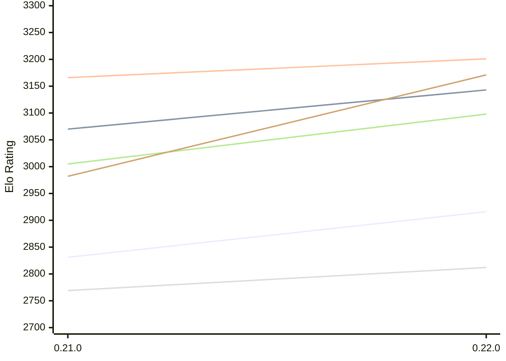
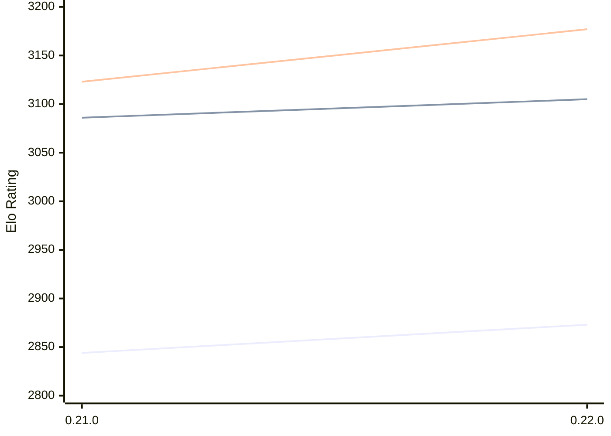

# Engine: Princhess

Author: Lana Samson

Home: https://github.com/princesslana/princhess

## Elo Ratings E1 (Ultra 7 265T (1.50 GHz) - E-Core)

| Version | Published | STC 8.0+0.08s  | LTC 60.0+0.60s | VLTC 2m24s+1.12s | Comment |
| --- | --- | --- | --- | --- | --- |
| 0.22.0 | 2026-08-16 | 2916(+85) | 3143(+73) | 3201(+35) |  |
| 0.21.0 | 2025-10-13 | 2831 | 3070 | 3166 |  |
 | | | cElo (∆ prev) | cElo (∆ prev) | cElo (∆ prev) | 

## Elo Ratings P1 (Ultra 7 265T (1.50 GHz) - P-Core)

| Version | Published | STC 8.0+0.08s  | LTC 60.0+0.60s | VLTC 2m24s+1.12s | Comment |
| --- | --- | --- | --- | --- | --- |
| 0.22.0 | 2026-08-16 | 2812(+43) | 3098(+93) | 3171(+189) |  |
| 0.21.0 | 2025-10-13 | 2769 | 3005 | 2982 |  |
 | | | cElo (∆ prev) | cElo (∆ prev) | cElo (∆ prev) | 

## Elo Ratings T1 (i5-7500T 2.70GHz)

| Version | Published | STC 8.0+0.08s  | LTC 60.0+0.60s | VLTC 2m24s+1.12s | Comment |
| --- | --- | --- | --- | --- | --- |
| 0.22.0 | 2026-08-16 | 2873(+29) | 3105(+19) | 3177(+54) |  |
| 0.21.0 | 2025-10-13 | 2844 | 3086 | 3123 |  |
 | | | cElo (∆ prev) | cElo (∆ prev) | cElo (∆ prev) | 

<a href="https://github.com/computer-chess-index/cci/issues/new?template=submit-version.yml&title=[VERSION]+Princhess+<version>&body=###%20Engine%20name%0APrinchess%0A%0A###%20Version%0A0.22.0" target="_blank">Submit new version</a>

 Test Conditions:

GUI/CLI: <a href=https://github.com/cutechess/cutechess target="_blank">Cute-Chess</a> 
Elo Calculation: <a href=https://www.remi-coulom.fr/Bayesian-Elo/ target="_blank">Bayesian-Elo</a> 
CPU for P1: Intel(R) Core(TM) Ultra 7 265T (1.50 GHz) - P-Core 
CPU for E1: Intel(R) Core(TM) Ultra 7 265T (1.50 GHz) - E-Core 
CPU for T1: Intel(R) Core(TM) i5-7500T 2.70GHz 
Opening book: 8_moves_v3 
\* STC: 8.0+0.08s, LTC: 60.0+0.60s, VLTC: 2m24s+1.12s

 Lists:
Ratings: <a href=https://github.com/computer-chess-index/cci/blob/main/lists/CCIRatings.csv target="_blank">Complete list</a>

Generated: 2026-11-14 05:40:58

## Ratings Verlauf E1 / P1

```mermaid
%%{init: {"theme":"base","themeVariables":{"seriesColors:['#a3a3a3','#222221','#faa371']}}}%%
xychart-beta
  x-axis ["0.21.0", "0.22.0"]
  y-axis "Elo Rating" 2700 --> 3300
  line "E1: STC (8.0+0.08s)" [2831, 2916]
  line "E1: LTC (60.0+0.60s)" [3070, 3143]
  line "E1: VLTC (2m24s+1.12s)" [3166, 3201]
  line "P1: STC (8.0+0.08s)" [2769, 2812]
  line "P1: LTC (60.0+0.60s)" [3005, 3098]
  line "P1: VLTC (2m24s+1.12s)" [2982, 3171]
```

## Ratings Verlauf T1

```mermaid
%%{init: {"theme":"base","themeVariables":{"seriesColors:['#a3a3a3','#222221','#faa371']}}}%%
xychart-beta
  x-axis ["0.21.0", "0.22.0"]
  y-axis "Elo Rating" 2800 --> 3200
  line "T1: STC (8.0+0.08s)" [2844, 2873]
  line "T1: LTC (60.0+0.60s)" [3086, 3105]
  line "T1: VLTC (2m24s+1.12s)" [3123, 3177]
```

## Detailed Evaluation Results

| Version | Time Control | Variant | Elo  | Range +/- | Matches | Score | Average Opponent Elo | Draws |
| --- | --- |--- | --- | --- | --- | --- | --- | --- |
| 0.22.0 | VLTC (2m24s+1.12s) | T1 | 3177 | 33 | 256 | 50% | 3174 | 56% |
|  |  | P1 | 3171 | 29 | 330 | 50% | 3170 | 57% |
|  |  | E1 | 3201 | 26 | 410 | 50% | 3200 | 53% |
|  | LTC (60.0+0.60s) | T1 | 3105 | 30 | 308 | 50% | 3106 | 54% |
|  |  | P1 | 3098 | 33 | 268 | 49% | 3113 | 51% |
|  |  | E1 | 3143 | 26 | 410 | 51% | 3135 | 51% |
|  | STC (8.0+0.08s) | T1 | 2873 | 32 | 296 | 49% | 2885 | 41% |
|  |  | P1 | 2812 | 33 | 282 | 49% | 2820 | 44% |
|  |  | E1 | 2916 | 28 | 390 | 50% | 2912 | 42% |
| --- | --- |--- | --- | --- | --- | --- | --- | --- |
| 0.21.0 | VLTC (2m24s+1.12s) | T1 | 3123 | 24 | 504 | 50% | 3124 | 51% |
|  |  | P1 | 2982 | 115 | 28 | 50% | 2854 | 29% |
|  |  | E1 | 3166 | 92 | 44 | 69% | 2923 | 30% |
|  | LTC (60.0+0.60s) | P1 | 3005 | 120 | 32 | 59% | 2757 | 13% |
|  |  | E1 | 3070 | 89 | 44 | 61% | 2944 | 36% |
|  |  | T1 | 3086 | 23 | 542 | 50% | 3082 | 50% |
|  | STC (8.0+0.08s) | P1 | 2769 | 98 | 36 | 57% | 2579 | 36% |
|  |  | E1 | 2831 | 81 | 56 | 52% | 2820 | 32% |
|  |  | T1 | 2844 | 21 | 728 | 51% | 2834 | 38% |