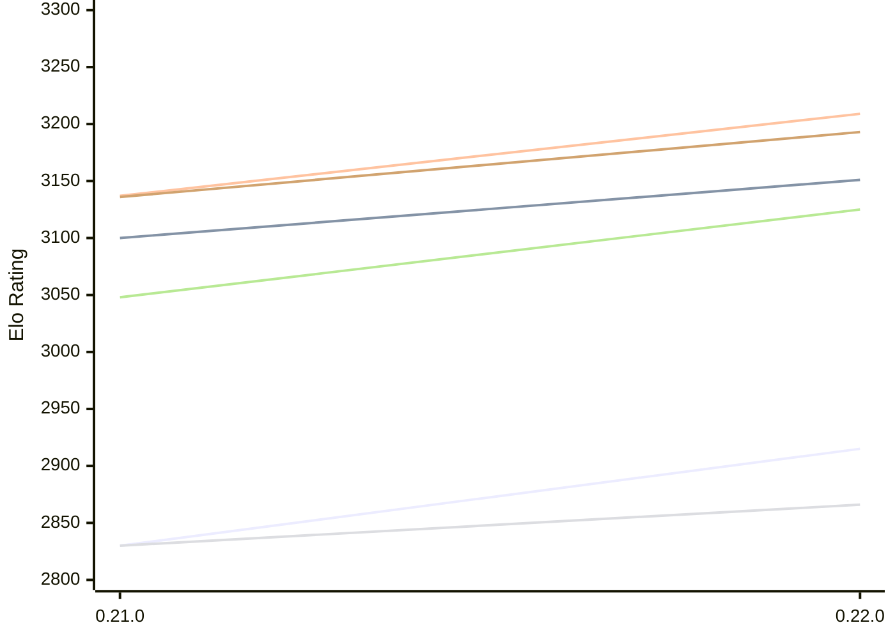
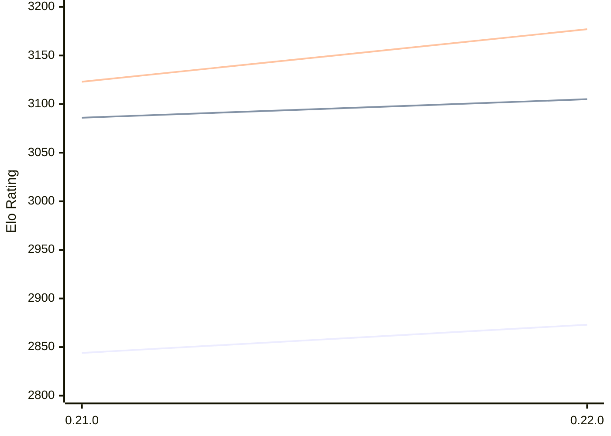

# Engine: Princhess

Author: Lana Samson

Home: https://github.com/princesslana/princhess

## Elo Ratings E1 (Ultra 7 265T (1.50 GHz) - E-Core)

| Version | Published | STC 8.0+0.08s  | LTC 60.0+0.60s | VLTC 2m24s+1.12s | Comment |
| --- | --- | --- | --- | --- | --- |
| 0.22.0 | 2026-08-16 | 2915(+85) | 3151(+51) | 3209(+72) |  |
| 0.21.0 | 2025-10-13 | 2830 | 3100 | 3137 |  |
 | | | cElo (∆ prev) | cElo (∆ prev) | cElo (∆ prev) | 

## Elo Ratings P1 (Ultra 7 265T (1.50 GHz) - P-Core)

| Version | Published | STC 8.0+0.08s  | LTC 60.0+0.60s | VLTC 2m24s+1.12s | Comment |
| --- | --- | --- | --- | --- | --- |
| 0.22.0 | 2026-08-16 | 2866(+36) | 3125(+77) | 3193(+57) |  |
| 0.21.0 | 2025-10-13 | 2830 | 3048 | 3136 |  |
 | | | cElo (∆ prev) | cElo (∆ prev) | cElo (∆ prev) | 

## Elo Ratings T1 (i5-7500T 2.70GHz)

| Version | Published | STC 8.0+0.08s  | LTC 60.0+0.60s | VLTC 2m24s+1.12s | Comment |
| --- | --- | --- | --- | --- | --- |
| 0.22.0 | 2026-08-16 | 2873(+29) | 3105(+19) | 3177(+54) |  |
| 0.21.0 | 2025-10-13 | 2844 | 3086 | 3123 |  |
 | | | cElo (∆ prev) | cElo (∆ prev) | cElo (∆ prev) | 

<a href="https://github.com/computer-chess-index/cci/issues/new?template=submit-version.yml&title=[VERSION]+Princhess+<version>&body=###%20Engine%20name%0APrinchess%0A%0A###%20Version%0A0.22.0" target="_blank">Submit new version</a>

 Test Conditions:

GUI/CLI: <a href=https://github.com/cutechess/cutechess target="_blank">Cute-Chess</a> 
Elo Calculation: <a href=https://www.remi-coulom.fr/Bayesian-Elo/ target="_blank">Bayesian-Elo</a> 
CPU for P1: Intel(R) Core(TM) Ultra 7 265T (1.50 GHz) - P-Core 
CPU for E1: Intel(R) Core(TM) Ultra 7 265T (1.50 GHz) - E-Core 
CPU for T1: Intel(R) Core(TM) i5-7500T 2.70GHz 
Opening book: 8_moves_v3 
\* STC: 8.0+0.08s, LTC: 60.0+0.60s, VLTC: 2m24s+1.12s

 Lists:
Ratings: <a href=https://github.com/computer-chess-index/cci/blob/main/lists/CCIRatings.csv target="_blank">Complete list</a>

Generated: 2026-11-24 05:41:30

## Ratings Verlauf E1 / P1

```mermaid
%%{init: {"theme":"base","themeVariables":{"seriesColors:['#a3a3a3','#222221','#faa371']}}}%%
xychart-beta
  x-axis ["0.21.0", "0.22.0"]
  y-axis "Elo Rating" 2800 --> 3300
  line "E1: STC (8.0+0.08s)" [2830, 2915]
  line "E1: LTC (60.0+0.60s)" [3100, 3151]
  line "E1: VLTC (2m24s+1.12s)" [3137, 3209]
  line "P1: STC (8.0+0.08s)" [2830, 2866]
  line "P1: LTC (60.0+0.60s)" [3048, 3125]
  line "P1: VLTC (2m24s+1.12s)" [3136, 3193]
```

## Ratings Verlauf T1

```mermaid
%%{init: {"theme":"base","themeVariables":{"seriesColors:['#a3a3a3','#222221','#faa371']}}}%%
xychart-beta
  x-axis ["0.21.0", "0.22.0"]
  y-axis "Elo Rating" 2800 --> 3200
  line "T1: STC (8.0+0.08s)" [2844, 2873]
  line "T1: LTC (60.0+0.60s)" [3086, 3105]
  line "T1: VLTC (2m24s+1.12s)" [3123, 3177]
```

## Detailed Evaluation Results

| Version | Time Control | Variant | Elo  | Range +/- | Matches | Score | Average Opponent Elo | Draws |
| --- | --- |--- | --- | --- | --- | --- | --- | --- |
| 0.22.0 | VLTC (2m24s+1.12s) | T1 | 3177 | 33 | 256 | 50% | 3174 | 56% |
|  |  | P1 | 3193 | 28 | 346 | 51% | 3185 | 57% |
|  |  | E1 | 3209 | 25 | 434 | 50% | 3209 | 53% |
|  | LTC (60.0+0.60s) | T1 | 3105 | 30 | 308 | 50% | 3106 | 54% |
|  |  | P1 | 3125 | 31 | 300 | 49% | 3139 | 52% |
|  |  | E1 | 3151 | 25 | 438 | 51% | 3141 | 52% |
|  | STC (8.0+0.08s) | T1 | 2873 | 32 | 296 | 49% | 2885 | 41% |
|  |  | P1 | 2866 | 30 | 336 | 50% | 2863 | 44% |
|  |  | E1 | 2915 | 26 | 450 | 49% | 2921 | 40% |
| --- | --- |--- | --- | --- | --- | --- | --- | --- |
| 0.21.0 | VLTC (2m24s+1.12s) | T1 | 3123 | 24 | 504 | 50% | 3124 | 51% |
|  |  | P1 | 3136 | 64 | 76 | 56% | 3031 | 46% |
|  |  | E1 | 3137 | 56 | 102 | 56% | 3046 | 40% |
|  | LTC (60.0+0.60s) | T1 | 3086 | 23 | 542 | 50% | 3082 | 50% |
|  |  | P1 | 3048 | 67 | 78 | 55% | 2921 | 31% |
|  |  | E1 | 3100 | 54 | 108 | 56% | 3035 | 41% |
|  | STC (8.0+0.08s) | T1 | 2844 | 21 | 728 | 51% | 2834 | 38% |
|  |  | P1 | 2830 | 60 | 88 | 55% | 2731 | 38% |
|  |  | E1 | 2830 | 58 | 106 | 51% | 2826 | 29% |