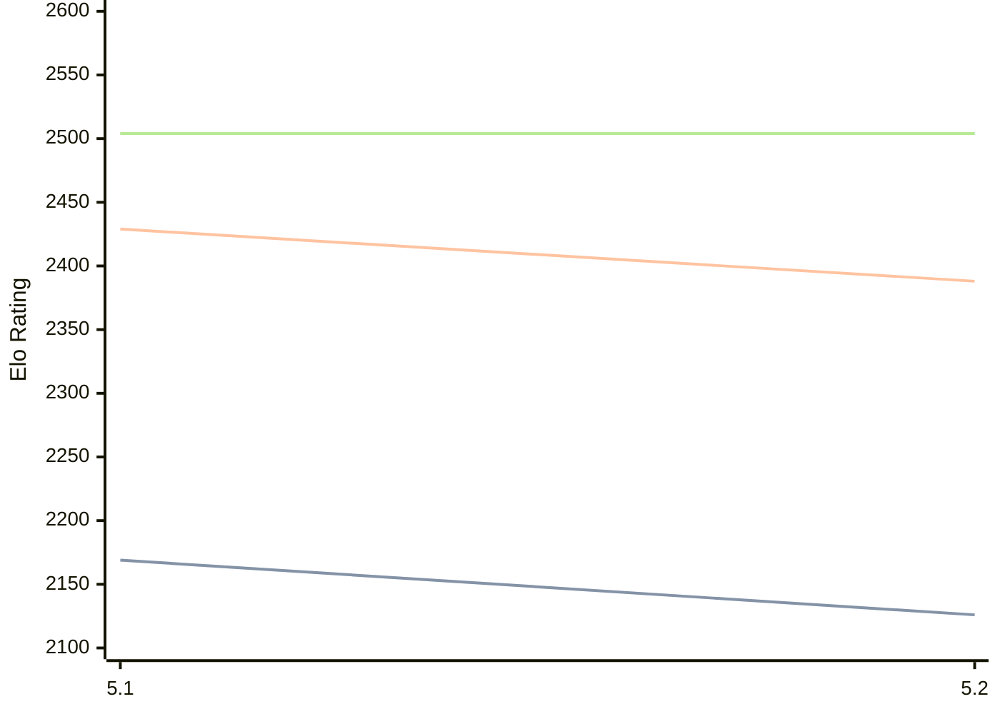

# Engine: Prophet

Author: James Swafford

Home: https://github.com/jswaff/prophet

## Elo Ratings

| Version | Published | STC 8.0+0.08s  | LTC 60.0+0.60s | VLTC 2m24s+1.12s | Comment |
| --- | --- | --- | --- | --- | --- |
| 5.2 | 2026-05-16 | 2126(-43) | 2388(-41) | 2504(0) |  |
| 5.1 | 2025-09-16 | 2169 | 2429 | 2504 |  |
 | | | cElo (∆ prev) | cElo (∆ prev) | cElo (∆ prev) | 

<a href="https://github.com/computer-chess-index/cci/issues/new?template=submit-version.yml&title=[VERSION]+Prophet+<version>&body=###%20Engine%20name%0AProphet%0A%0A###%20Version%0A5.2" target="_blank">Submit new version</a>

 Test Conditions:

GUI/CLI: <a href=https://github.com/cutechess/cutechess target="_blank">Cute-Chess</a> 
Elo Calculation: <a href=https://www.remi-coulom.fr/Bayesian-Elo/ target="_blank">Bayesian-Elo</a> 
CPU: Intel(R) Core(TM) i5-7500T 2.70GHz 
Opening book: 8_moves_v3 
\* STC: 8.0+0.08s, LTC: 60.0+0.60s, VLTC: 2m24s+1.12s

 Lists:
Ratings: <a href=https://github.com/computer-chess-index/cci/blob/main/lists/CCIRatings.csv target="_blank">Complete list</a>

Generated: 2026-09-24 04:41:09

## Ratings Verlauf

## Detailed Evaluation Results

| Version | Time Control | Elo  | Range +/- | Matches | Score | Average Opponent Elo | Draws |
| --- | --- | --- | --- | --- | --- | --- | --- |
| 5.2 | VLTC (2m24s+1.12s) | 2504 | 28 | 438 | 49% | 2515 | 26% |
| 5.2 | LTC (60.0+0.60s) | 2388 | 28 | 428 | 49% | 2400 | 29% |
| 5.2 | STC (8.0+0.08s) | 2126 | 30 | 400 | 52% | 2110 | 22% |
| --- | --- | --- | --- | --- | --- | --- | --- |
| 5.1 | VLTC (2m24s+1.12s) | 2504 | 30 | 380 | 48% | 2535 | 26% |
| 5.1 | LTC (60.0+0.60s) | 2429 | 28 | 416 | 49% | 2444 | 30% |
| 5.1 | STC (8.0+0.08s) | 2169 | 27 | 482 | 51% | 2164 | 28% |
| --- | --- | --- | --- | --- | --- | --- | --- |