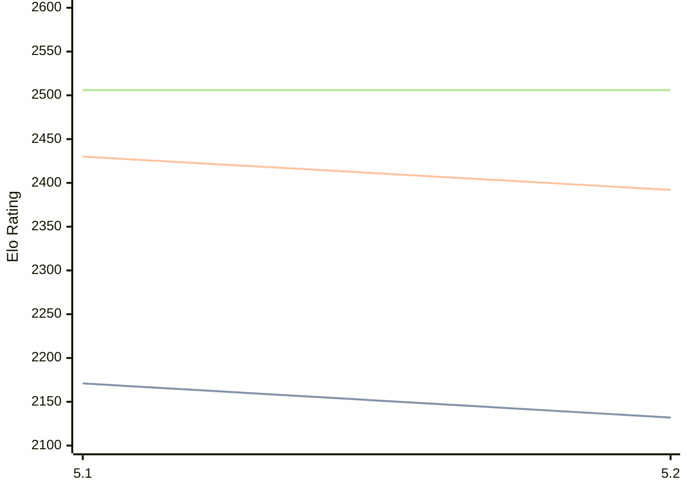

# Engine: Prophet

Author: James Swafford

Home: https://github.com/jswaff/prophet

## Elo Ratings E1

| Version | Published | STC 8.0+0.08s  | LTC 60.0+0.60s | VLTC 2m24s+1.12s | Comment |
| --- | --- | --- | --- | --- | --- |
| 5.2 | 2026-05-16 | 1982 | 2353 | 2372 |  |
 | | | cElo (∆ prev) | cElo (∆ prev) | cElo (∆ prev) | 

## Elo Ratings P1

| Version | Published | STC 8.0+0.08s  | LTC 60.0+0.60s | VLTC 2m24s+1.12s | Comment |
| --- | --- | --- | --- | --- | --- |
| 5.2 | 2026-05-16 | 2196 | 2427 | 2627 |  |
 | | | cElo (∆ prev) | cElo (∆ prev) | cElo (∆ prev) | 

## Elo Ratings T1

| Version | Published | STC 8.0+0.08s  | LTC 60.0+0.60s | VLTC 2m24s+1.12s | Comment |
| --- | --- | --- | --- | --- | --- |
| 5.2 | 2026-05-16 | 2132(-39) | 2392(-38) | 2506(0) |  |
| 5.1 | 2025-09-16 | 2171 | 2430 | 2506 |  |
 | | | cElo (∆ prev) | cElo (∆ prev) | cElo (∆ prev) | 

<a href="https://github.com/computer-chess-index/cci/issues/new?template=submit-version.yml&title=[VERSION]+Prophet+<version>&body=###%20Engine%20name%0AProphet%0A%0A###%20Version%0A5.2" target="_blank">Submit new version</a>

 Test Conditions:

GUI/CLI: <a href=https://github.com/cutechess/cutechess target="_blank">Cute-Chess</a> 
Elo Calculation: <a href=https://www.remi-coulom.fr/Bayesian-Elo/ target="_blank">Bayesian-Elo</a> 
CPU for P1: Intel(R) Core(TM) Ultra 7 265T (1.50 GHz) - P-Core 
CPU for E1: Intel(R) Core(TM) Ultra 7 265T (1.50 GHz) - E-Core 
CPU for T1: Intel(R) Core(TM) i5-7500T 2.70GHz 
Opening book: 8_moves_v3 
\* STC: 8.0+0.08s, LTC: 60.0+0.60s, VLTC: 2m24s+1.12s

 Lists:
Ratings: <a href=https://github.com/computer-chess-index/cci/blob/main/lists/CCIRatings.csv target="_blank">Complete list</a>

Generated: 2026-10-10 04:41:21

## Ratings Verlauf

```mermaid
%%{init: {"theme":"base","themeVariables":{"seriesColors:['#a3a3a3','#222221','#faa371']}}}%%
xychart-beta
  x-axis ["5.1", "5.2"]
  y-axis "Elo Rating" 2100 --> 2600
  line "" [2171, 2132]
  line "STC (8.0+0.08s)" [2171, 2132]
  line "LTC (60.0+0.60s)" [2430, 2392]
  line "" [2506, 2506]
  line "VLTC (2m24s+1.12s)" [2506, 2506]
```

## Detailed Evaluation Results

| Version | Time Control | Elo  | Range +/- | Matches | Score | Average Opponent Elo | Draws |
| --- | --- | --- | --- | --- | --- | --- | --- |
| 5.2 | VLTC (2m24s+1.12s) | 2372 | 44 | 174 | 49% | 2392 | 34% |
| 5.2 | VLTC (2m24s+1.12s) | 2506 | 28 | 438 | 49% | 2516 | 26% |
| 5.2 | VLTC (2m24s+1.12s) | 2627 | 50 | 158 | 53% | 2569 | 19% |
| 5.2 | LTC (60.0+0.60s) | 2353 | 38 | 222 | 48% | 2372 | 36% |
| 5.2 | LTC (60.0+0.60s) | 2392 | 28 | 432 | 49% | 2402 | 29% |
| 5.2 | LTC (60.0+0.60s) | 2427 | 44 | 204 | 58% | 2269 | 24% |
| 5.2 | STC (8.0+0.08s) | 2132 | 30 | 404 | 52% | 2113 | 22% |
| --- | --- | --- | --- | --- | --- | --- | --- |
| 5.2 | STC (8.0+0.08s) | 2196 | 51 | 128 | 52% | 2180 | 28% |
| --- | --- | --- | --- | --- | --- | --- | --- |
| 5.2 | STC (8.0+0.08s) | 1982 | 39 | 232 | 46% | 2032 | 24% |
| --- | --- | --- | --- | --- | --- | --- | --- |
| 5.1 | VLTC (2m24s+1.12s) | 2506 | 30 | 380 | 48% | 2537 | 26% |
| 5.1 | LTC (60.0+0.60s) | 2430 | 28 | 416 | 49% | 2445 | 30% |
| 5.1 | STC (8.0+0.08s) | 2171 | 27 | 482 | 51% | 2165 | 28% |
| --- | --- | --- | --- | --- | --- | --- | --- |