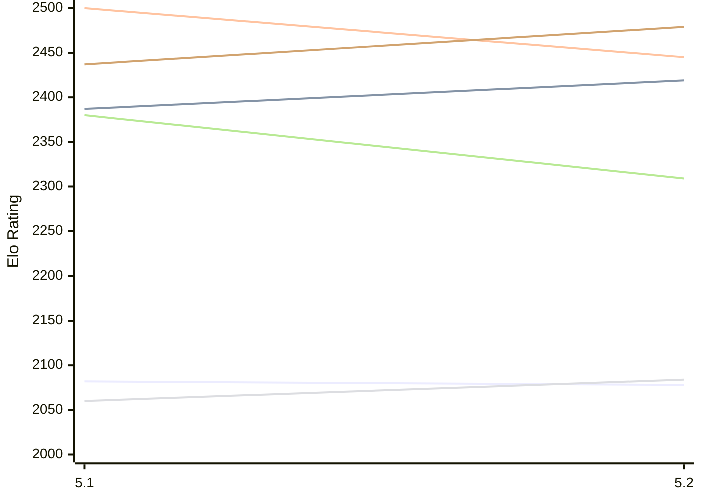
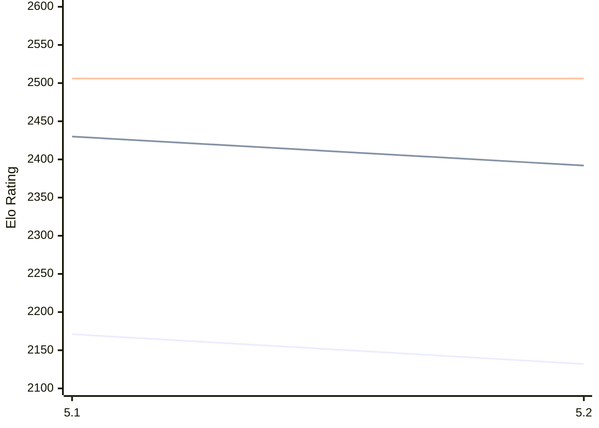

# Engine: Prophet

Author: James Swafford

Home: https://github.com/jswaff/prophet

## Elo Ratings E1 (Ultra 7 265T (1.50 GHz) - E-Core)

| Version | Published | STC 8.0+0.08s  | LTC 60.0+0.60s | VLTC 2m24s+1.12s | Comment |
| --- | --- | --- | --- | --- | --- |
| 5.2 | 2026-05-16 | 2078(-4) | 2419(+32) | 2445(-55) |  |
| 5.1 | 2025-09-16 | 2082 | 2387 | 2500 |  |
 | | | cElo (∆ prev) | cElo (∆ prev) | cElo (∆ prev) | 

## Elo Ratings P1 (Ultra 7 265T (1.50 GHz) - P-Core)

| Version | Published | STC 8.0+0.08s  | LTC 60.0+0.60s | VLTC 2m24s+1.12s | Comment |
| --- | --- | --- | --- | --- | --- |
| 5.2 | 2026-05-16 | 2084(+24) | 2309(-71) | 2479(+42) |  |
| 5.1 | 2025-09-16 | 2060 | 2380 | 2437 |  |
 | | | cElo (∆ prev) | cElo (∆ prev) | cElo (∆ prev) | 

## Elo Ratings T1 (i5-7500T 2.70GHz)

| Version | Published | STC 8.0+0.08s  | LTC 60.0+0.60s | VLTC 2m24s+1.12s | Comment |
| --- | --- | --- | --- | --- | --- |
| 5.2 | 2026-05-16 | 2132(-39) | 2392(-38) | 2506(0) |  |
| 5.1 | 2025-09-16 | 2171 | 2430 | 2506 |  |
 | | | cElo (∆ prev) | cElo (∆ prev) | cElo (∆ prev) | 

<a href="https://github.com/computer-chess-index/cci/issues/new?template=submit-version.yml&title=[VERSION]+Prophet+<version>&body=###%20Engine%20name%0AProphet%0A%0A###%20Version%0A5.2" target="_blank">Submit new version</a>

 Test Conditions:

GUI/CLI: <a href=https://github.com/cutechess/cutechess target="_blank">Cute-Chess</a> 
Elo Calculation: <a href=https://www.remi-coulom.fr/Bayesian-Elo/ target="_blank">Bayesian-Elo</a> 
CPU for P1: Intel(R) Core(TM) Ultra 7 265T (1.50 GHz) - P-Core 
CPU for E1: Intel(R) Core(TM) Ultra 7 265T (1.50 GHz) - E-Core 
CPU for T1: Intel(R) Core(TM) i5-7500T 2.70GHz 
Opening book: 8_moves_v3 
\* STC: 8.0+0.08s, LTC: 60.0+0.60s, VLTC: 2m24s+1.12s

 Lists:
Ratings: <a href=https://github.com/computer-chess-index/cci/blob/main/lists/CCIRatings.csv target="_blank">Complete list</a>

Generated: 2026-11-28 05:41:42

## Ratings Verlauf E1 / P1

```mermaid
%%{init: {"theme":"base","themeVariables":{"seriesColors:['#a3a3a3','#222221','#faa371']}}}%%
xychart-beta
  x-axis ["5.1", "5.2"]
  y-axis "Elo Rating" 2000 --> 2500
  line "E1: STC (8.0+0.08s)" [2082, 2078]
  line "E1: LTC (60.0+0.60s)" [2387, 2419]
  line "E1: VLTC (2m24s+1.12s)" [2500, 2445]
  line "P1: STC (8.0+0.08s)" [2060, 2084]
  line "P1: LTC (60.0+0.60s)" [2380, 2309]
  line "P1: VLTC (2m24s+1.12s)" [2437, 2479]
```

## Ratings Verlauf T1

```mermaid
%%{init: {"theme":"base","themeVariables":{"seriesColors:['#a3a3a3','#222221','#faa371']}}}%%
xychart-beta
  x-axis ["5.1", "5.2"]
  y-axis "Elo Rating" 2100 --> 2600
  line "T1: STC (8.0+0.08s)" [2171, 2132]
  line "T1: LTC (60.0+0.60s)" [2430, 2392]
  line "T1: VLTC (2m24s+1.12s)" [2506, 2506]
```

## Detailed Evaluation Results

| Version | Time Control | Variant | Elo  | Range +/- | Matches | Score | Average Opponent Elo | Draws |
| --- | --- |--- | --- | --- | --- | --- | --- | --- |
| 5.2 | VLTC (2m24s+1.12s) | E1 | 2445 | 33 | 306 | 49% | 2465 | 33% |
|  |  | T1 | 2506 | 28 | 438 | 49% | 2516 | 26% |
|  |  | P1 | 2479 | 37 | 274 | 49% | 2485 | 21% |
|  | LTC (60.0+0.60s) | T1 | 2392 | 28 | 432 | 49% | 2402 | 29% |
|  |  | P1 | 2309 | 33 | 344 | 54% | 2226 | 24% |
|  |  | E1 | 2419 | 30 | 382 | 46% | 2453 | 28% |
|  | STC (8.0+0.08s) | T1 | 2132 | 30 | 404 | 52% | 2113 | 22% |
|  |  | P1 | 2084 | 35 | 288 | 48% | 2122 | 23% |
|  |  | E1 | 2078 | 30 | 394 | 49% | 2088 | 22% |
| --- | --- |--- | --- | --- | --- | --- | --- | --- |
| 5.1 | VLTC (2m24s+1.12s) | T1 | 2506 | 30 | 380 | 48% | 2537 | 26% |
|  |  | P1 | 2437 | 64 | 96 | 45% | 2460 | 21% |
|  |  | E1 | 2500 | 52 | 126 | 44% | 2573 | 31% |
|  | LTC (60.0+0.60s) | T1 | 2430 | 28 | 416 | 49% | 2445 | 30% |
|  |  | P1 | 2380 | 59 | 112 | 47% | 2408 | 21% |
|  |  | E1 | 2387 | 50 | 150 | 52% | 2379 | 18% |
|  | STC (8.0+0.08s) | T1 | 2171 | 27 | 482 | 51% | 2165 | 28% |
|  |  | P1 | 2060 | 54 | 128 | 46% | 2134 | 18% |
|  |  | E1 | 2082 | 46 | 172 | 49% | 2130 | 28% |