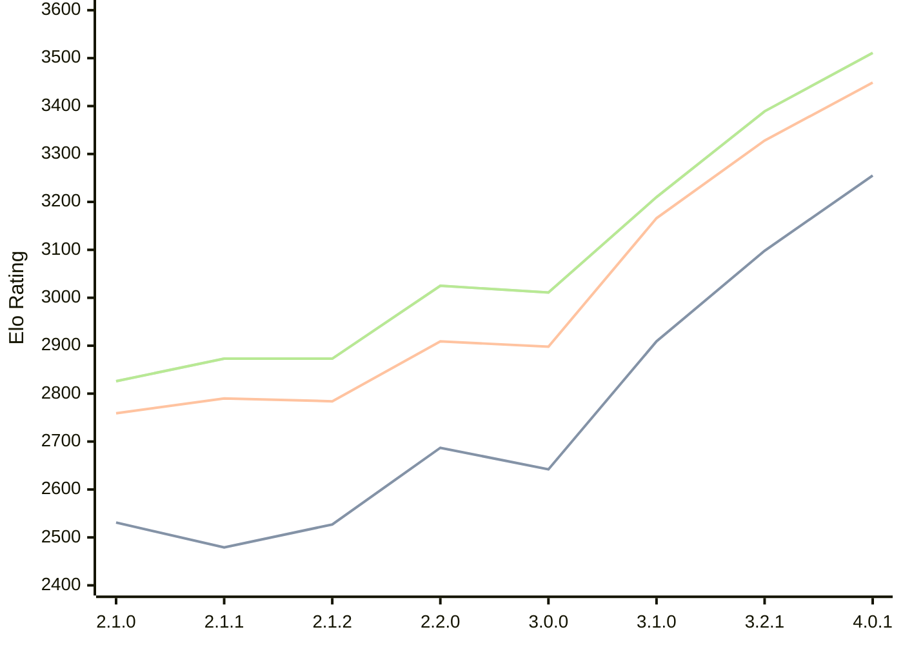

# Engine: Prune

Author: Thomas Girolami

Home: https://github.com/tgirolami09/Prune

## Elo Ratings

| Version | Published | STC 8.0+0.08s  | LTC 60.0+0.60s | VLTC 2m24s+1.12s | Comment |
| --- | --- | --- | --- | --- | --- |
| 4.0.1 | 2026-07-07 | 3255(+new) | 3449(+new) | 3511(+new) |  |
| 4.0.0 | 2026-06-27 |  |  |  |  |
| 3.2.1 | 2026-02-24 | 3098(+new) | 3328(+new) | 3389(+new) |  |
| 3.2.0 | 2026-02-22 |  |  |  | Skipped for 3.2.1 |
| 3.1.0 | 2026-01-10 | 2909(+267) | 3166(+268) | 3210(+199) |  |
| 3.0.0 | 2025-12-06 | 2642(-45) | 2898(-11) | 3011(-14) |  |
| 2.2.0 | 2025-11-20 | 2687(+160) | 2909(+125) | 3025(+152) |  |
| 2.1.2 | 2025-11-06 | 2527(+48) | 2784(-6) | 2873(0) |  |
| 2.1.1 | 2025-11-05 | 2479(-52) | 2790(+31) | 2873(+47) |  |
| 2.1.0 | 2025-11-02 | 2531 | 2759 | 2826 |  |
 | | | cElo (∆ prev) | cElo (∆ prev) | cElo (∆ prev) | 

<a href="https://github.com/computer-chess-index/cci/issues/new?template=submit-version.yml&title=[VERSION]+Prune+<version>&body=###%20Engine%20name%0APrune%0A%0A###%20Version%0A4.0.1" target="_blank">Submit new version</a>

 Test Conditions:

GUI/CLI: <a href=https://github.com/cutechess/cutechess target="_blank">Cute-Chess</a> 
Elo Calculation: <a href=https://www.remi-coulom.fr/Bayesian-Elo/ target="_blank">Bayesian-Elo</a> 
CPU: Intel(R) Core(TM) i5-7500T 2.70GHz 
Opening book: 8_moves_v3 
\* STC: 8.0+0.08s, LTC: 60.0+0.60s, VLTC: 2m24s+1.12s

 Lists:
Ratings: <a href=https://github.com/computer-chess-index/cci/blob/main/lists/CCIRatings.csv target="_blank">Complete list</a>

Generated: 2026-09-13 04:40:49

## Ratings Verlauf

## Detailed Evaluation Results

| Version | Time Control | Elo  | Range +/- | Matches | Score | Average Opponent Elo | Draws |
| --- | --- | --- | --- | --- | --- | --- | --- |
| 4.0.1 | VLTC (2m24s+1.12s) | 3511 | 25 | 380 | 50% | 3511 | 85% |
| 4.0.1 | LTC (60.0+0.60s) | 3449 | 24 | 410 | 51% | 3444 | 75% |
| 4.0.1 | STC (8.0+0.08s) | 3255 | 28 | 324 | 51% | 3251 | 64% |
| --- | --- | --- | --- | --- | --- | --- | --- |
| 3.2.1 | VLTC (2m24s+1.12s) | 3389 | 24 | 410 | 50% | 3386 | 75% |
| 3.2.1 | LTC (60.0+0.60s) | 3328 | 25 | 398 | 52% | 3314 | 70% |
| 3.2.1 | STC (8.0+0.08s) | 3098 | 24 | 482 | 51% | 3081 | 62% |
| --- | --- | --- | --- | --- | --- | --- | --- |
| 3.1.0 | VLTC (2m24s+1.12s) | 3210 | 32 | 284 | 51% | 3205 | 50% |
| 3.1.0 | LTC (60.0+0.60s) | 3166 | 31 | 288 | 52% | 3154 | 53% |
| 3.1.0 | STC (8.0+0.08s) | 2909 | 33 | 276 | 51% | 2890 | 44% |
| --- | --- | --- | --- | --- | --- | --- | --- |
| 3.0.0 | VLTC (2m24s+1.12s) | 3011 | 35 | 236 | 48% | 3025 | 46% |
| 3.0.0 | LTC (60.0+0.60s) | 2898 | 36 | 236 | 52% | 2885 | 42% |
| 3.0.0 | STC (8.0+0.08s) | 2642 | 39 | 212 | 47% | 2669 | 37% |
| --- | --- | --- | --- | --- | --- | --- | --- |
| 2.2.0 | VLTC (2m24s+1.12s) | 3025 | 72 | 56 | 57% | 2971 | 46% |
| 2.2.0 | LTC (60.0+0.60s) | 2909 | 66 | 72 | 49% | 2925 | 36% |
| 2.2.0 | STC (8.0+0.08s) | 2687 | 90 | 40 | 55% | 2645 | 30% |
| --- | --- | --- | --- | --- | --- | --- | --- |
| 2.1.2 | VLTC (2m24s+1.12s) | 2873 | 54 | 108 | 49% | 2886 | 37% |
| 2.1.2 | LTC (60.0+0.60s) | 2784 | 54 | 108 | 45% | 2844 | 43% |
| 2.1.2 | STC (8.0+0.08s) | 2527 | 55 | 118 | 40% | 2642 | 30% |
| --- | --- | --- | --- | --- | --- | --- | --- |
| 2.1.1 | VLTC (2m24s+1.12s) | 2873 | 95 | 32 | 50% | 2871 | 44% |
| 2.1.1 | LTC (60.0+0.60s) | 2790 | 64 | 72 | 47% | 2815 | 44% |
| 2.1.1 | STC (8.0+0.08s) | 2479 | 60 | 92 | 48% | 2493 | 25% |
| --- | --- | --- | --- | --- | --- | --- | --- |
| 2.1.0 | VLTC (2m24s+1.12s) | 2826 | 53 | 108 | 50% | 2822 | 42% |
| 2.1.0 | LTC (60.0+0.60s) | 2759 | 51 | 112 | 51% | 2751 | 45% |
| 2.1.0 | STC (8.0+0.08s) | 2531 | 53 | 116 | 46% | 2591 | 34% |
| --- | --- | --- | --- | --- | --- | --- | --- |