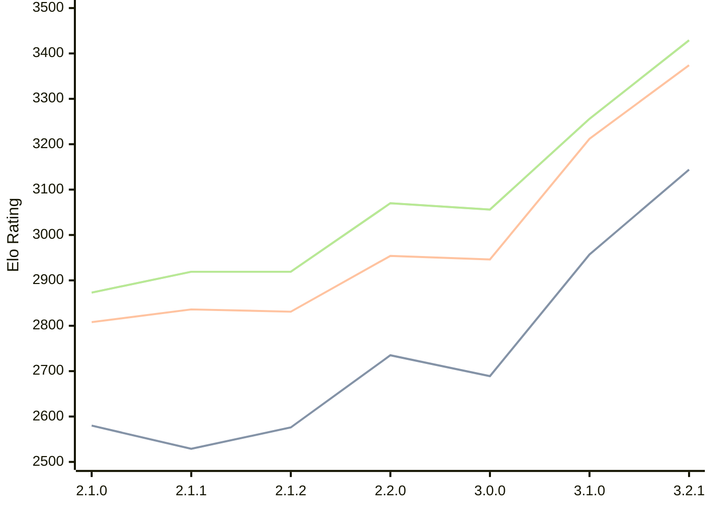

# Engine: Prune

Author: Thomas Girolami

Home: https://github.com/tgirolami09/Prune

## Elo Ratings

| Version | Published | STC 8.0+0.08s  | LTC 60.0+0.60s | VLTC 2m24s+1.12s | Comment |
| --- | --- | --- | --- | --- | --- |
| 3.2.1 | 2026-02-24 | 3144(+new) | 3374(+new) | 3429(+new) |  |
| 3.2.0 | 2026-02-22 |  |  |  | Skipped for 3.2.1 |
| 3.1.0 | 2026-01-10 | 2957(+268) | 3212(+266) | 3256(+200) |  |
| 3.0.0 | 2025-12-06 | 2689(-46) | 2946(-8) | 3056(-14) |  |
| 2.2.0 | 2025-11-20 | 2735(+159) | 2954(+123) | 3070(+151) |  |
| 2.1.2 | 2025-11-06 | 2576(+47) | 2831(-5) | 2919(0) |  |
| 2.1.1 | 2025-11-05 | 2529(-51) | 2836(+28) | 2919(+46) |  |
| 2.1.0 | 2025-11-02 | 2580(+new) | 2808(+new) | 2873(+new) |  |
| 2.0.1 | 2025-10-21 |  |  |  |  |
| 2.0.0 | 2025-10-19 |  |  |  |  |
| 1.0.1 | 2025-10-15 |  |  |  |  |
| 1.0.0 | 2025-10-05 |  |  |  |  |
 | | | cElo (∆ prev) | cElo (∆ prev) | cElo (∆ prev) | 

<a href="https://github.com/computer-chess-index/cci/issues/new?template=submit-version.yml&title=[VERSION]+Prune+<version>&body=###%20Engine%20name%0APrune%0A%0A###%20Version%0A3.2.1" target="_blank">Submit new version</a>

 Test Conditions:

GUI/CLI: <a href=https://github.com/cutechess/cutechess target="_blank">Cute-Chess</a> 
Elo Calculation: <a href=https://www.remi-coulom.fr/Bayesian-Elo/ target="_blank">Bayesian-Elo</a> 
CPU: Intel(R) Core(TM) i5-7500T 2.70GHz 
Opening book: 8_moves_v3 
\* STC: 8.0+0.08s, LTC: 60.0+0.60s, VLTC: 2m24s+1.12s

 Lists:
Ratings: <a href=https://github.com/computer-chess-index/cci/blob/main/lists/CCIRatings.csv target="_blank">Complete list</a>

Generated: 2026-05-12 06:28:01

## Ratings Verlauf

⬛ STC (8.0+0.08s) &nbsp;&nbsp; 🟧 LTC (60.0+0.60s) &nbsp;&nbsp; 🟩 VLTC (2m24s+1.12s)

dark mode: 🟩STC (8.0+0.08s) 🟧LTC (60.0+0.60s) ⬜VLTC (2m24s+1.12s)

## Detailed Evaluation Results

| Version | Time Control | Elo  | Range +/- | Matches | Score | Average Opponent Elo | Draws |
| --- | --- | --- | --- | --- | --- | --- | --- |
| 3.2.1 | VLTC (2m24s+1.12s) | 3429 | 25 | 398 | 50% | 3428 | 76% |
| 3.2.1 | LTC (60.0+0.60s) | 3374 | 26 | 382 | 52% | 3357 | 70% |
| 3.2.1 | STC (8.0+0.08s) | 3144 | 26 | 398 | 51% | 3128 | 64% |
| --- | --- | --- | --- | --- | --- | --- | --- |
| 3.1.0 | VLTC (2m24s+1.12s) | 3256 | 32 | 284 | 51% | 3251 | 50% |
| 3.1.0 | LTC (60.0+0.60s) | 3212 | 31 | 288 | 52% | 3200 | 53% |
| 3.1.0 | STC (8.0+0.08s) | 2957 | 33 | 276 | 51% | 2936 | 44% |
| --- | --- | --- | --- | --- | --- | --- | --- |
| 3.0.0 | VLTC (2m24s+1.12s) | 3056 | 35 | 236 | 48% | 3073 | 46% |
| 3.0.0 | LTC (60.0+0.60s) | 2946 | 36 | 236 | 52% | 2932 | 42% |
| 3.0.0 | STC (8.0+0.08s) | 2689 | 39 | 212 | 47% | 2718 | 37% |
| --- | --- | --- | --- | --- | --- | --- | --- |
| 2.2.0 | VLTC (2m24s+1.12s) | 3070 | 72 | 56 | 57% | 3016 | 46% |
| 2.2.0 | LTC (60.0+0.60s) | 2954 | 66 | 72 | 49% | 2970 | 36% |
| 2.2.0 | STC (8.0+0.08s) | 2735 | 90 | 40 | 55% | 2693 | 30% |
| --- | --- | --- | --- | --- | --- | --- | --- |
| 2.1.2 | VLTC (2m24s+1.12s) | 2919 | 54 | 108 | 49% | 2932 | 37% |
| 2.1.2 | LTC (60.0+0.60s) | 2831 | 54 | 108 | 45% | 2890 | 43% |
| 2.1.2 | STC (8.0+0.08s) | 2576 | 55 | 118 | 40% | 2691 | 30% |
| --- | --- | --- | --- | --- | --- | --- | --- |
| 2.1.1 | VLTC (2m24s+1.12s) | 2919 | 95 | 32 | 50% | 2917 | 44% |
| 2.1.1 | LTC (60.0+0.60s) | 2836 | 64 | 72 | 47% | 2861 | 44% |
| 2.1.1 | STC (8.0+0.08s) | 2529 | 60 | 92 | 48% | 2543 | 25% |
| --- | --- | --- | --- | --- | --- | --- | --- |
| 2.1.0 | VLTC (2m24s+1.12s) | 2873 | 53 | 108 | 50% | 2869 | 42% |
| 2.1.0 | LTC (60.0+0.60s) | 2808 | 51 | 112 | 51% | 2800 | 45% |
| 2.1.0 | STC (8.0+0.08s) | 2580 | 53 | 116 | 46% | 2639 | 34% |
| --- | --- | --- | --- | --- | --- | --- | --- |