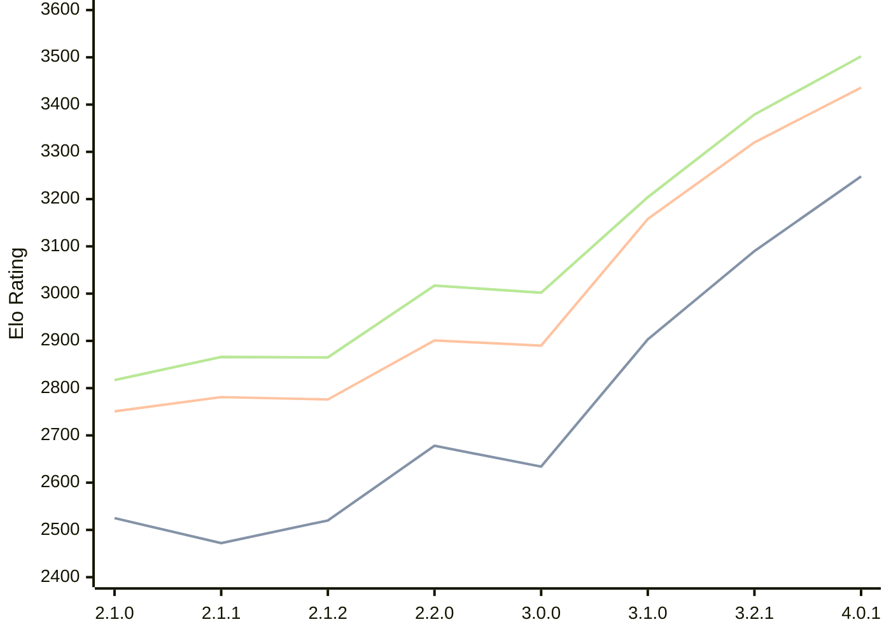

# Engine: Prune

Author: Thomas Girolami

Home: https://github.com/tgirolami09/Prune

## Elo Ratings

| Version | Published | STC 8.0+0.08s  | LTC 60.0+0.60s | VLTC 2m24s+1.12s | Comment |
| --- | --- | --- | --- | --- | --- |
| 4.0.1 | 2026-07-07 | 3248(+new) | 3436(+new) | 3502(+new) |  |
| 4.0.0 | 2026-06-27 |  |  |  |  |
| 3.2.1 | 2026-02-24 | 3090(+new) | 3320(+new) | 3379(+new) |  |
| 3.2.0 | 2026-02-22 |  |  |  | Skipped for 3.2.1 |
| 3.1.0 | 2026-01-10 | 2903(+269) | 3158(+268) | 3204(+202) |  |
| 3.0.0 | 2025-12-06 | 2634(-44) | 2890(-11) | 3002(-15) |  |
| 2.2.0 | 2025-11-20 | 2678(+158) | 2901(+125) | 3017(+152) |  |
| 2.1.2 | 2025-11-06 | 2520(+48) | 2776(-5) | 2865(-1) |  |
| 2.1.1 | 2025-11-05 | 2472(-53) | 2781(+30) | 2866(+49) |  |
| 2.1.0 | 2025-11-02 | 2525 | 2751 | 2817 |  |
 | | | cElo (∆ prev) | cElo (∆ prev) | cElo (∆ prev) | 

<a href="https://github.com/computer-chess-index/cci/issues/new?template=submit-version.yml&title=[VERSION]+Prune+<version>&body=###%20Engine%20name%0APrune%0A%0A###%20Version%0A4.0.1" target="_blank">Submit new version</a>

 Test Conditions:

GUI/CLI: <a href=https://github.com/cutechess/cutechess target="_blank">Cute-Chess</a> 
Elo Calculation: <a href=https://www.remi-coulom.fr/Bayesian-Elo/ target="_blank">Bayesian-Elo</a> 
CPU: Intel(R) Core(TM) i5-7500T 2.70GHz 
Opening book: 8_moves_v3 
\* STC: 8.0+0.08s, LTC: 60.0+0.60s, VLTC: 2m24s+1.12s

 Lists:
Ratings: <a href=https://github.com/computer-chess-index/cci/blob/main/lists/CCIRatings.csv target="_blank">Complete list</a>

Generated: 2026-08-21 06:29:13

## Ratings Verlauf

⬛ STC (8.0+0.08s) &nbsp;&nbsp; 🟧 LTC (60.0+0.60s) &nbsp;&nbsp; 🟩 VLTC (2m24s+1.12s)

dark mode: 🟩STC (8.0+0.08s) 🟧LTC (60.0+0.60s) ⬜VLTC (2m24s+1.12s)

## Detailed Evaluation Results

| Version | Time Control | Elo  | Range +/- | Matches | Score | Average Opponent Elo | Draws |
| --- | --- | --- | --- | --- | --- | --- | --- |
| 4.0.1 | VLTC (2m24s+1.12s) | 3502 | 28 | 304 | 50% | 3502 | 85% |
| 4.0.1 | LTC (60.0+0.60s) | 3436 | 26 | 354 | 50% | 3432 | 75% |
| 4.0.1 | STC (8.0+0.08s) | 3248 | 31 | 276 | 51% | 3244 | 64% |
| --- | --- | --- | --- | --- | --- | --- | --- |
| 3.2.1 | VLTC (2m24s+1.12s) | 3379 | 24 | 410 | 50% | 3378 | 75% |
| 3.2.1 | LTC (60.0+0.60s) | 3320 | 25 | 398 | 52% | 3306 | 70% |
| 3.2.1 | STC (8.0+0.08s) | 3090 | 24 | 482 | 51% | 3074 | 62% |
| --- | --- | --- | --- | --- | --- | --- | --- |
| 3.1.0 | VLTC (2m24s+1.12s) | 3204 | 32 | 284 | 51% | 3198 | 50% |
| 3.1.0 | LTC (60.0+0.60s) | 3158 | 31 | 288 | 52% | 3146 | 53% |
| 3.1.0 | STC (8.0+0.08s) | 2903 | 33 | 276 | 51% | 2884 | 44% |
| --- | --- | --- | --- | --- | --- | --- | --- |
| 3.0.0 | VLTC (2m24s+1.12s) | 3002 | 35 | 236 | 48% | 3017 | 46% |
| 3.0.0 | LTC (60.0+0.60s) | 2890 | 36 | 236 | 52% | 2878 | 42% |
| 3.0.0 | STC (8.0+0.08s) | 2634 | 39 | 212 | 47% | 2662 | 37% |
| --- | --- | --- | --- | --- | --- | --- | --- |
| 2.2.0 | VLTC (2m24s+1.12s) | 3017 | 72 | 56 | 57% | 2962 | 46% |
| 2.2.0 | LTC (60.0+0.60s) | 2901 | 66 | 72 | 49% | 2917 | 36% |
| 2.2.0 | STC (8.0+0.08s) | 2678 | 90 | 40 | 55% | 2637 | 30% |
| --- | --- | --- | --- | --- | --- | --- | --- |
| 2.1.2 | VLTC (2m24s+1.12s) | 2865 | 54 | 108 | 49% | 2878 | 37% |
| 2.1.2 | LTC (60.0+0.60s) | 2776 | 54 | 108 | 45% | 2836 | 43% |
| 2.1.2 | STC (8.0+0.08s) | 2520 | 55 | 118 | 40% | 2634 | 30% |
| --- | --- | --- | --- | --- | --- | --- | --- |
| 2.1.1 | VLTC (2m24s+1.12s) | 2866 | 95 | 32 | 50% | 2863 | 44% |
| 2.1.1 | LTC (60.0+0.60s) | 2781 | 64 | 72 | 47% | 2807 | 44% |
| 2.1.1 | STC (8.0+0.08s) | 2472 | 60 | 92 | 48% | 2487 | 25% |
| --- | --- | --- | --- | --- | --- | --- | --- |
| 2.1.0 | VLTC (2m24s+1.12s) | 2817 | 53 | 108 | 50% | 2813 | 42% |
| 2.1.0 | LTC (60.0+0.60s) | 2751 | 51 | 112 | 51% | 2743 | 45% |
| 2.1.0 | STC (8.0+0.08s) | 2525 | 53 | 116 | 46% | 2583 | 34% |
| --- | --- | --- | --- | --- | --- | --- | --- |