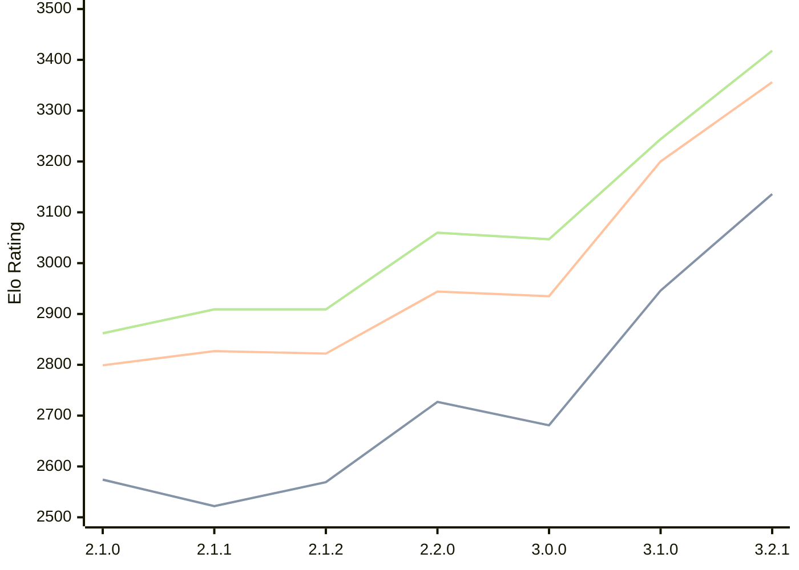

# Engine: Prune

Author: Thomas Girolami

Home: https://github.com/tgirolami09/Prune

## Ratings nach Version

| Version | Published | STC 8.0+0.08s  | LTC 60.0+0.60s | VLTC 2m24s+1.12s | Comment |
| --- | --- | --- | --- | --- | --- |
| 3.2.1 | 2026-02-24 | 3136(+new) | 3356(+new) | 3418(+new) |  |
| 3.2.0 | 2026-02-22 |  |  |  | Skipped for 3.2.1 |
| 3.1.0 | 2026-01-10 | 2946(+265) | 3200(+265) | 3244(+197) |  |
| 3.0.0 | 2025-12-06 | 2681(-46) | 2935(-9) | 3047(-13) |  |
| 2.2.0 | 2025-11-20 | 2727(+158) | 2944(+122) | 3060(+151) |  |
| 2.1.2 | 2025-11-06 | 2569(+47) | 2822(-5) | 2909(0) |  |
| 2.1.1 | 2025-11-05 | 2522(-52) | 2827(+28) | 2909(+47) |  |
| 2.1.0 | 2025-11-02 | 2574(+new) | 2799(+new) | 2862(+new) |  |
| 2.0.1 | 2025-10-21 |  |  |  |  |
| 2.0.0 | 2025-10-19 |  |  |  |  |
| 1.0.1 | 2025-10-15 |  |  |  |  |
| 1.0.0 | 2025-10-05 |  |  |  |  |
 | | | cElo (∆ prev) | cElo (∆ prev) | cElo (∆ prev) | 

 Test Conditions:

GUI/CLI: <a href=https://github.com/cutechess/cutechess target="_blank">Cute-Chess</a> 
Elo Calculation: <a href=https://www.remi-coulom.fr/Bayesian-Elo/ target="_blank">Bayesian-Elo</a> 
CPU: Intel(R) Core(TM) i5-7500T 2.70GHz 
Opening book: 8_moves_v3 
\* STC: 8.0+0.08s, LTC: 60.0+0.60s, VLTC: 2m24s+1.12s

 Lists:
Ratings: <a href=https://github.com/computer-chess-index/cci/blob/main/lists/CCIRatings.csv target="_blank">Complete list</a>

Generated: 2026-03-15 06:25:09

## Ratings Verlauf

⬛ STC (8.0+0.08s) &nbsp;&nbsp; 🟧 LTC (60.0+0.60s) &nbsp;&nbsp; 🟩 VLTC (2m24s+1.12s)

