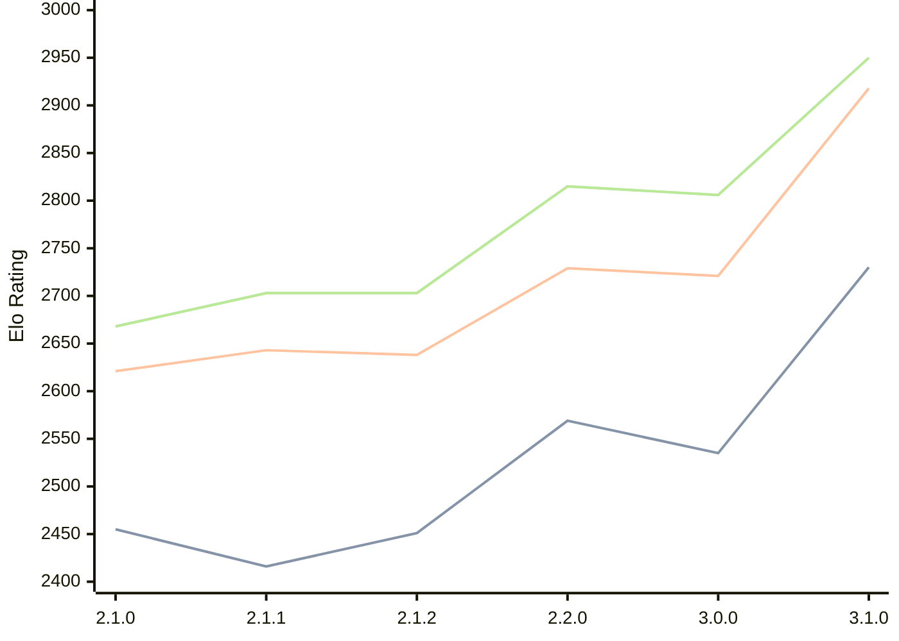

# Engine: Prune

Author: Thomas Girolami

Home: https://github.com/tgirolami09/Prune

## Ratings nach Version

| Version | Published | STC 8.0+0.08s  | LTC 60.0+0.60s | VLTC 2m24s+1.12s | Comment |
| --- | --- | --- | --- | --- | --- |
| 3.2.0 | 2026-02-22 |  |  |  |  |
| 3.1.0 | 2026-01-10 | 2730(+195) | 2918(+197) | 2950(+144) |  |
| 3.0.0 | 2025-12-06 | 2535(-34) | 2721(-8) | 2806(-9) |  |
| 2.2.0 | 2025-11-20 | 2569(+118) | 2729(+91) | 2815(+112) |  |
| 2.1.2 | 2025-11-06 | 2451(+35) | 2638(-5) | 2703(0) |  |
| 2.1.1 | 2025-11-05 | 2416(-39) | 2643(+22) | 2703(+35) |  |
| 2.1.0 | 2025-11-02 | 2455(+new) | 2621(+new) | 2668(+new) |  |
| 2.0.1 | 2025-10-21 |  |  |  |  |
| 2.0.0 | 2025-10-19 |  |  |  |  |
| 1.0.1 | 2025-10-15 |  |  |  |  |
 | | | cElo (∆ prev) | cElo (∆ prev) | cElo (∆ prev) | 

 Test Conditions:

GUI/CLI: <a href=https://github.com/cutechess/cutechess target="_blank">Cute-Chess</a> 
Elo Calculation: <a href=https://www.remi-coulom.fr/Bayesian-Elo/ target="_blank">Bayesian-Elo</a> 
CPU: Intel(R) Core(TM) i5-7500T 2.70GHz 
Opening book: 8_moves_v3 
\* STC: 8.0+0.08s, LTC: 60.0+0.60s, VLTC: 2m24s+1.12s

 Lists:
Ratings: <a href=https://github.com/computer-chess-index/cci/blob/main/lists/CCIRatings.csv target="_blank">Complete list</a>

Generated: 2026-02-23 06:25:47

## Ratings Verlauf

⬛ STC (8.0+0.08s) &nbsp;&nbsp; 🟧 LTC (60.0+0.60s) &nbsp;&nbsp; 🟩 VLTC (2m24s+1.12s)

