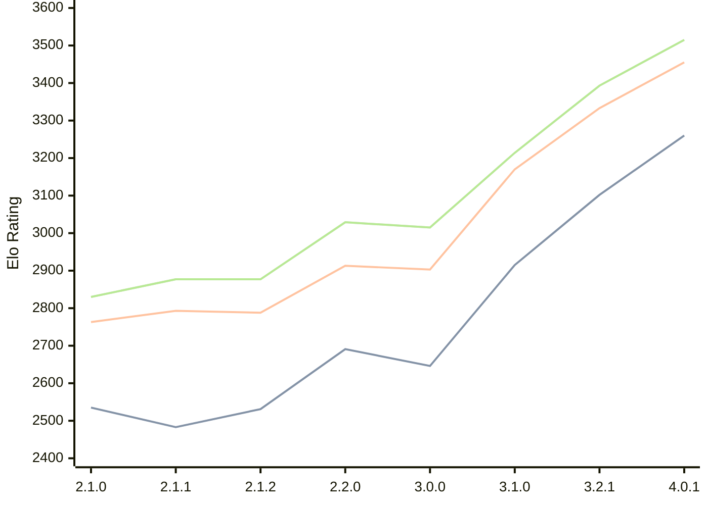

# Engine: Prune

Author: Thomas Girolami

Home: https://github.com/tgirolami09/Prune

## Elo Ratings

| Version | Published | STC 8.0+0.08s  | LTC 60.0+0.60s | VLTC 2m24s+1.12s | Comment |
| --- | --- | --- | --- | --- | --- |
| 4.0.1 | 2026-07-07 | 3260(+new) | 3455(+new) | 3515(+new) |  |
| 4.0.0 | 2026-06-27 |  |  |  |  |
| 3.2.1 | 2026-02-24 | 3102(+new) | 3333(+new) | 3393(+new) |  |
| 3.2.0 | 2026-02-22 |  |  |  | Skipped for 3.2.1 |
| 3.1.0 | 2026-01-10 | 2915(+269) | 3170(+267) | 3214(+199) |  |
| 3.0.0 | 2025-12-06 | 2646(-45) | 2903(-10) | 3015(-14) |  |
| 2.2.0 | 2025-11-20 | 2691(+160) | 2913(+125) | 3029(+152) |  |
| 2.1.2 | 2025-11-06 | 2531(+48) | 2788(-5) | 2877(0) |  |
| 2.1.1 | 2025-11-05 | 2483(-52) | 2793(+30) | 2877(+47) |  |
| 2.1.0 | 2025-11-02 | 2535 | 2763 | 2830 |  |
 | | | cElo (∆ prev) | cElo (∆ prev) | cElo (∆ prev) | 

<a href="https://github.com/computer-chess-index/cci/issues/new?template=submit-version.yml&title=[VERSION]+Prune+<version>&body=###%20Engine%20name%0APrune%0A%0A###%20Version%0A4.0.1" target="_blank">Submit new version</a>

 Test Conditions:

GUI/CLI: <a href=https://github.com/cutechess/cutechess target="_blank">Cute-Chess</a> 
Elo Calculation: <a href=https://www.remi-coulom.fr/Bayesian-Elo/ target="_blank">Bayesian-Elo</a> 
CPU: Intel(R) Core(TM) i5-7500T 2.70GHz 
Opening book: 8_moves_v3 
\* STC: 8.0+0.08s, LTC: 60.0+0.60s, VLTC: 2m24s+1.12s

 Lists:
Ratings: <a href=https://github.com/computer-chess-index/cci/blob/main/lists/CCIRatings.csv target="_blank">Complete list</a>

Generated: 2026-09-26 04:41:05

## Ratings Verlauf

## Detailed Evaluation Results

| Version | Time Control | Elo  | Range +/- | Matches | Score | Average Opponent Elo | Draws |
| --- | --- | --- | --- | --- | --- | --- | --- |
| 4.0.1 | VLTC (2m24s+1.12s) | 3515 | 24 | 396 | 50% | 3517 | 85% |
| 4.0.1 | LTC (60.0+0.60s) | 3455 | 24 | 414 | 51% | 3449 | 75% |
| 4.0.1 | STC (8.0+0.08s) | 3260 | 28 | 328 | 51% | 3255 | 64% |
| --- | --- | --- | --- | --- | --- | --- | --- |
| 3.2.1 | VLTC (2m24s+1.12s) | 3393 | 24 | 410 | 50% | 3391 | 75% |
| 3.2.1 | LTC (60.0+0.60s) | 3333 | 25 | 398 | 52% | 3320 | 70% |
| 3.2.1 | STC (8.0+0.08s) | 3102 | 24 | 482 | 51% | 3086 | 62% |
| --- | --- | --- | --- | --- | --- | --- | --- |
| 3.1.0 | VLTC (2m24s+1.12s) | 3214 | 32 | 284 | 51% | 3210 | 50% |
| 3.1.0 | LTC (60.0+0.60s) | 3170 | 31 | 288 | 52% | 3158 | 53% |
| 3.1.0 | STC (8.0+0.08s) | 2915 | 33 | 276 | 51% | 2896 | 44% |
| --- | --- | --- | --- | --- | --- | --- | --- |
| 3.0.0 | VLTC (2m24s+1.12s) | 3015 | 35 | 236 | 48% | 3031 | 46% |
| 3.0.0 | LTC (60.0+0.60s) | 2903 | 36 | 236 | 52% | 2889 | 42% |
| 3.0.0 | STC (8.0+0.08s) | 2646 | 39 | 212 | 47% | 2673 | 37% |
| --- | --- | --- | --- | --- | --- | --- | --- |
| 2.2.0 | VLTC (2m24s+1.12s) | 3029 | 72 | 56 | 57% | 2975 | 46% |
| 2.2.0 | LTC (60.0+0.60s) | 2913 | 66 | 72 | 49% | 2930 | 36% |
| 2.2.0 | STC (8.0+0.08s) | 2691 | 90 | 40 | 55% | 2649 | 30% |
| --- | --- | --- | --- | --- | --- | --- | --- |
| 2.1.2 | VLTC (2m24s+1.12s) | 2877 | 54 | 108 | 49% | 2892 | 37% |
| 2.1.2 | LTC (60.0+0.60s) | 2788 | 54 | 108 | 45% | 2849 | 43% |
| 2.1.2 | STC (8.0+0.08s) | 2531 | 55 | 118 | 40% | 2646 | 30% |
| --- | --- | --- | --- | --- | --- | --- | --- |
| 2.1.1 | VLTC (2m24s+1.12s) | 2877 | 95 | 32 | 50% | 2876 | 44% |
| 2.1.1 | LTC (60.0+0.60s) | 2793 | 64 | 72 | 47% | 2819 | 44% |
| 2.1.1 | STC (8.0+0.08s) | 2483 | 60 | 92 | 48% | 2498 | 25% |
| --- | --- | --- | --- | --- | --- | --- | --- |
| 2.1.0 | VLTC (2m24s+1.12s) | 2830 | 53 | 108 | 50% | 2826 | 42% |
| 2.1.0 | LTC (60.0+0.60s) | 2763 | 51 | 112 | 51% | 2755 | 45% |
| 2.1.0 | STC (8.0+0.08s) | 2535 | 53 | 116 | 46% | 2595 | 34% |
| --- | --- | --- | --- | --- | --- | --- | --- |