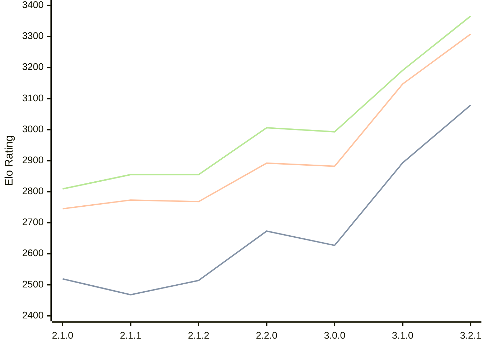

# Engine: Prune

Author: Thomas Girolami

Home: https://github.com/tgirolami09/Prune

## Elo Ratings

| Version | Published | STC 8.0+0.08s  | LTC 60.0+0.60s | VLTC 2m24s+1.12s | Comment |
| --- | --- | --- | --- | --- | --- |
| 3.2.1 | 2026-02-24 | 3079(+new) | 3308(+new) | 3366(+new) |  |
| 3.2.0 | 2026-02-22 |  |  |  | Skipped for 3.2.1 |
| 3.1.0 | 2026-01-10 | 2893(+266) | 3147(+265) | 3191(+198) |  |
| 3.0.0 | 2025-12-06 | 2627(-46) | 2882(-10) | 2993(-13) |  |
| 2.2.0 | 2025-11-20 | 2673(+159) | 2892(+124) | 3006(+151) |  |
| 2.1.2 | 2025-11-06 | 2514(+46) | 2768(-5) | 2855(0) |  |
| 2.1.1 | 2025-11-05 | 2468(-51) | 2773(+28) | 2855(+46) |  |
| 2.1.0 | 2025-11-02 | 2519(+new) | 2745(+new) | 2809(+new) |  |
| 2.0.1 | 2025-10-21 |  |  |  |  |
| 2.0.0 | 2025-10-19 |  |  |  |  |
| 1.0.1 | 2025-10-15 |  |  |  |  |
| 1.0.0 | 2025-10-05 |  |  |  |  |
 | | | cElo (∆ prev) | cElo (∆ prev) | cElo (∆ prev) | 

<a href="https://github.com/computer-chess-index/cci/issues/new?template=submit-version.yml&title=[VERSION]+Prune+<version>&body=###%20Engine%20name%0APrune%0A%0A###%20Version%0A3.2.1" target="_blank">Submit new version</a>

 Test Conditions:

GUI/CLI: <a href=https://github.com/cutechess/cutechess target="_blank">Cute-Chess</a> 
Elo Calculation: <a href=https://www.remi-coulom.fr/Bayesian-Elo/ target="_blank">Bayesian-Elo</a> 
CPU: Intel(R) Core(TM) i5-7500T 2.70GHz 
Opening book: 8_moves_v3 
\* STC: 8.0+0.08s, LTC: 60.0+0.60s, VLTC: 2m24s+1.12s

 Lists:
Ratings: <a href=https://github.com/computer-chess-index/cci/blob/main/lists/CCIRatings.csv target="_blank">Complete list</a>

Generated: 2026-06-08 06:27:11

## Ratings Verlauf

⬛ STC (8.0+0.08s) &nbsp;&nbsp; 🟧 LTC (60.0+0.60s) &nbsp;&nbsp; 🟩 VLTC (2m24s+1.12s)

dark mode: 🟩STC (8.0+0.08s) 🟧LTC (60.0+0.60s) ⬜VLTC (2m24s+1.12s)

## Detailed Evaluation Results

| Version | Time Control | Elo  | Range +/- | Matches | Score | Average Opponent Elo | Draws |
| --- | --- | --- | --- | --- | --- | --- | --- |
| 3.2.1 | VLTC (2m24s+1.12s) | 3366 | 25 | 402 | 50% | 3364 | 76% |
| 3.2.1 | LTC (60.0+0.60s) | 3308 | 25 | 390 | 52% | 3293 | 70% |
| 3.2.1 | STC (8.0+0.08s) | 3079 | 25 | 430 | 51% | 3063 | 63% |
| --- | --- | --- | --- | --- | --- | --- | --- |
| 3.1.0 | VLTC (2m24s+1.12s) | 3191 | 32 | 284 | 51% | 3186 | 50% |
| 3.1.0 | LTC (60.0+0.60s) | 3147 | 31 | 288 | 52% | 3135 | 53% |
| 3.1.0 | STC (8.0+0.08s) | 2893 | 33 | 276 | 51% | 2874 | 44% |
| --- | --- | --- | --- | --- | --- | --- | --- |
| 3.0.0 | VLTC (2m24s+1.12s) | 2993 | 35 | 236 | 48% | 3008 | 46% |
| 3.0.0 | LTC (60.0+0.60s) | 2882 | 36 | 236 | 52% | 2869 | 42% |
| 3.0.0 | STC (8.0+0.08s) | 2627 | 39 | 212 | 47% | 2655 | 37% |
| --- | --- | --- | --- | --- | --- | --- | --- |
| 2.2.0 | VLTC (2m24s+1.12s) | 3006 | 72 | 56 | 57% | 2952 | 46% |
| 2.2.0 | LTC (60.0+0.60s) | 2892 | 66 | 72 | 49% | 2907 | 36% |
| 2.2.0 | STC (8.0+0.08s) | 2673 | 90 | 40 | 55% | 2631 | 30% |
| --- | --- | --- | --- | --- | --- | --- | --- |
| 2.1.2 | VLTC (2m24s+1.12s) | 2855 | 54 | 108 | 49% | 2869 | 37% |
| 2.1.2 | LTC (60.0+0.60s) | 2768 | 54 | 108 | 45% | 2827 | 43% |
| 2.1.2 | STC (8.0+0.08s) | 2514 | 55 | 118 | 40% | 2628 | 30% |
| --- | --- | --- | --- | --- | --- | --- | --- |
| 2.1.1 | VLTC (2m24s+1.12s) | 2855 | 95 | 32 | 50% | 2854 | 44% |
| 2.1.1 | LTC (60.0+0.60s) | 2773 | 64 | 72 | 47% | 2797 | 44% |
| 2.1.1 | STC (8.0+0.08s) | 2468 | 60 | 92 | 48% | 2483 | 25% |
| --- | --- | --- | --- | --- | --- | --- | --- |
| 2.1.0 | VLTC (2m24s+1.12s) | 2809 | 53 | 108 | 50% | 2805 | 42% |
| 2.1.0 | LTC (60.0+0.60s) | 2745 | 51 | 112 | 51% | 2736 | 45% |
| 2.1.0 | STC (8.0+0.08s) | 2519 | 53 | 116 | 46% | 2579 | 34% |
| --- | --- | --- | --- | --- | --- | --- | --- |