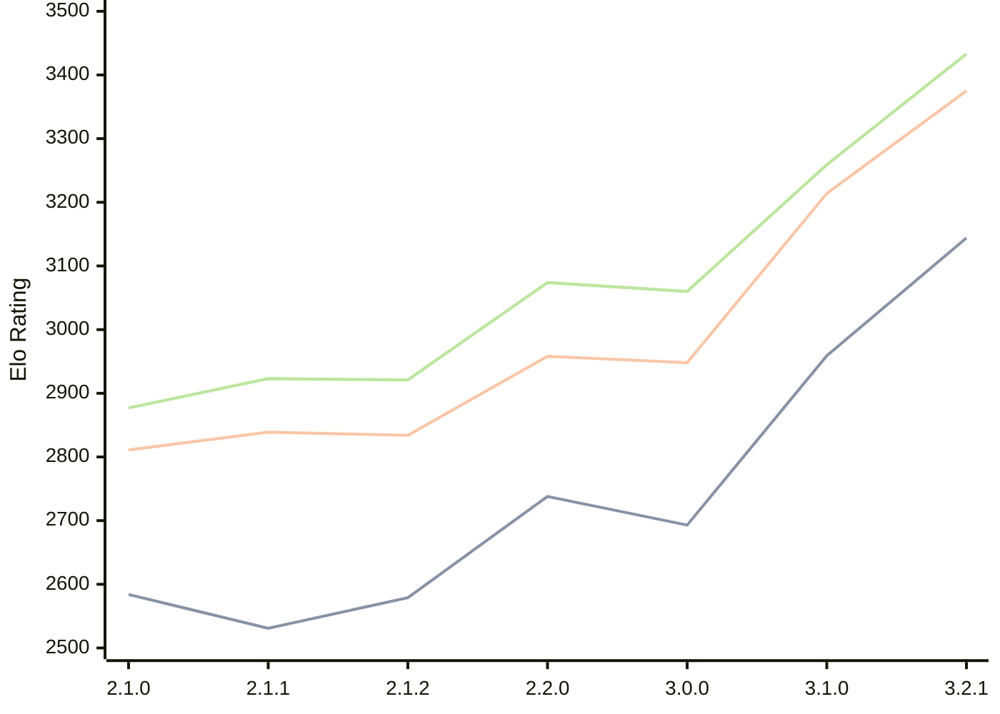

# Engine: Prune

Author: Thomas Girolami

Home: https://github.com/tgirolami09/Prune

## Elo Ratings

| Version | Published | STC 8.0+0.08s  | LTC 60.0+0.60s | VLTC 2m24s+1.12s | Comment |
| --- | --- | --- | --- | --- | --- |
| 3.2.1 | 2026-02-24 | 3144(+new) | 3375(+new) | 3433(+new) |  |
| 3.2.0 | 2026-02-22 |  |  |  | Skipped for 3.2.1 |
| 3.1.0 | 2026-01-10 | 2959(+266) | 3214(+266) | 3259(+199) |  |
| 3.0.0 | 2025-12-06 | 2693(-45) | 2948(-10) | 3060(-14) |  |
| 2.2.0 | 2025-11-20 | 2738(+159) | 2958(+124) | 3074(+153) |  |
| 2.1.2 | 2025-11-06 | 2579(+48) | 2834(-5) | 2921(-2) |  |
| 2.1.1 | 2025-11-05 | 2531(-53) | 2839(+28) | 2923(+46) |  |
| 2.1.0 | 2025-11-02 | 2584(+new) | 2811(+new) | 2877(+new) |  |
| 2.0.1 | 2025-10-21 |  |  |  |  |
| 2.0.0 | 2025-10-19 |  |  |  |  |
| 1.0.1 | 2025-10-15 |  |  |  |  |
| 1.0.0 | 2025-10-05 |  |  |  |  |
 | | | cElo (∆ prev) | cElo (∆ prev) | cElo (∆ prev) | 

<a href="https://github.com/computer-chess-index/cci/issues/new?template=submit-version.yml&title=[VERSION]+Prune+<version>&body=###%20Engine%20name%0APrune%0A%0A###%20Version%0A3.2.1" target="_blank">Submit new version</a>

 Test Conditions:

GUI/CLI: <a href=https://github.com/cutechess/cutechess target="_blank">Cute-Chess</a> 
Elo Calculation: <a href=https://www.remi-coulom.fr/Bayesian-Elo/ target="_blank">Bayesian-Elo</a> 
CPU: Intel(R) Core(TM) i5-7500T 2.70GHz 
Opening book: 8_moves_v3 
\* STC: 8.0+0.08s, LTC: 60.0+0.60s, VLTC: 2m24s+1.12s

 Lists:
Ratings: <a href=https://github.com/computer-chess-index/cci/blob/main/lists/CCIRatings.csv target="_blank">Complete list</a>

Generated: 2026-05-17 06:27:17

## Ratings Verlauf

⬛ STC (8.0+0.08s) &nbsp;&nbsp; 🟧 LTC (60.0+0.60s) &nbsp;&nbsp; 🟩 VLTC (2m24s+1.12s)

dark mode: 🟩STC (8.0+0.08s) 🟧LTC (60.0+0.60s) ⬜VLTC (2m24s+1.12s)

## Detailed Evaluation Results

| Version | Time Control | Elo  | Range +/- | Matches | Score | Average Opponent Elo | Draws |
| --- | --- | --- | --- | --- | --- | --- | --- |
| 3.2.1 | VLTC (2m24s+1.12s) | 3433 | 25 | 398 | 50% | 3432 | 76% |
| 3.2.1 | LTC (60.0+0.60s) | 3375 | 25 | 390 | 52% | 3360 | 70% |
| 3.2.1 | STC (8.0+0.08s) | 3144 | 26 | 406 | 51% | 3131 | 63% |
| --- | --- | --- | --- | --- | --- | --- | --- |
| 3.1.0 | VLTC (2m24s+1.12s) | 3259 | 32 | 284 | 51% | 3254 | 50% |
| 3.1.0 | LTC (60.0+0.60s) | 3214 | 31 | 288 | 52% | 3204 | 53% |
| 3.1.0 | STC (8.0+0.08s) | 2959 | 33 | 276 | 51% | 2940 | 44% |
| --- | --- | --- | --- | --- | --- | --- | --- |
| 3.0.0 | VLTC (2m24s+1.12s) | 3060 | 35 | 236 | 48% | 3075 | 46% |
| 3.0.0 | LTC (60.0+0.60s) | 2948 | 36 | 236 | 52% | 2935 | 42% |
| 3.0.0 | STC (8.0+0.08s) | 2693 | 39 | 212 | 47% | 2720 | 37% |
| --- | --- | --- | --- | --- | --- | --- | --- |
| 2.2.0 | VLTC (2m24s+1.12s) | 3074 | 72 | 56 | 57% | 3019 | 46% |
| 2.2.0 | LTC (60.0+0.60s) | 2958 | 66 | 72 | 49% | 2974 | 36% |
| 2.2.0 | STC (8.0+0.08s) | 2738 | 90 | 40 | 55% | 2696 | 30% |
| --- | --- | --- | --- | --- | --- | --- | --- |
| 2.1.2 | VLTC (2m24s+1.12s) | 2921 | 54 | 108 | 49% | 2936 | 37% |
| 2.1.2 | LTC (60.0+0.60s) | 2834 | 54 | 108 | 45% | 2894 | 43% |
| 2.1.2 | STC (8.0+0.08s) | 2579 | 55 | 118 | 40% | 2693 | 30% |
| --- | --- | --- | --- | --- | --- | --- | --- |
| 2.1.1 | VLTC (2m24s+1.12s) | 2923 | 95 | 32 | 50% | 2921 | 44% |
| 2.1.1 | LTC (60.0+0.60s) | 2839 | 64 | 72 | 47% | 2863 | 44% |
| 2.1.1 | STC (8.0+0.08s) | 2531 | 60 | 92 | 48% | 2546 | 25% |
| --- | --- | --- | --- | --- | --- | --- | --- |
| 2.1.0 | VLTC (2m24s+1.12s) | 2877 | 53 | 108 | 50% | 2871 | 42% |
| 2.1.0 | LTC (60.0+0.60s) | 2811 | 51 | 112 | 51% | 2804 | 45% |
| 2.1.0 | STC (8.0+0.08s) | 2584 | 53 | 116 | 46% | 2642 | 34% |
| --- | --- | --- | --- | --- | --- | --- | --- |