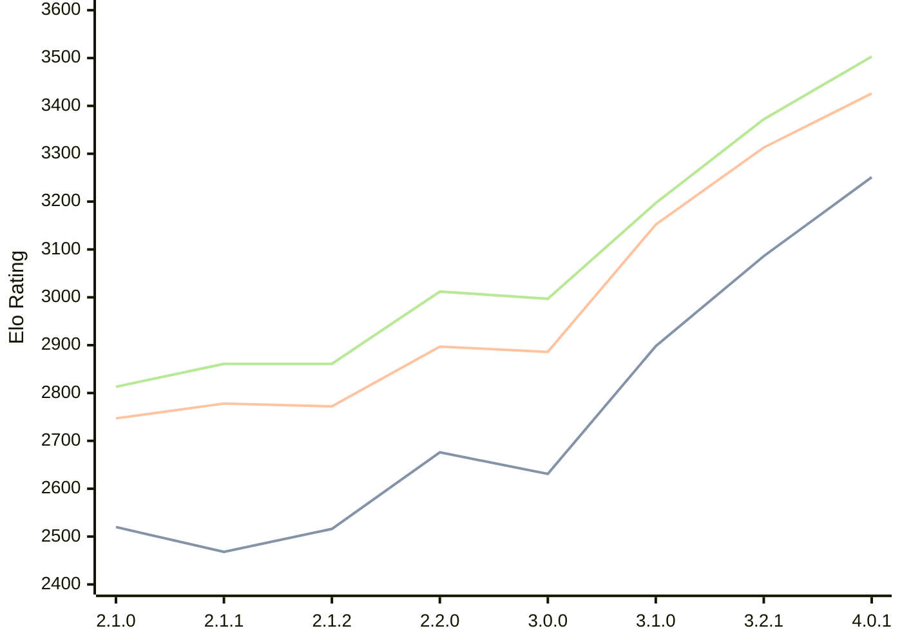

# Engine: Prune

Author: Thomas Girolami

Home: https://github.com/tgirolami09/Prune

## Elo Ratings

| Version | Published | STC 8.0+0.08s  | LTC 60.0+0.60s | VLTC 2m24s+1.12s | Comment |
| --- | --- | --- | --- | --- | --- |
| 4.0.1 | 2026-07-07 | 3251(+new) | 3426(+new) | 3503(+new) |  |
| 4.0.0 | 2026-06-27 |  |  |  |  |
| 3.2.1 | 2026-02-24 | 3086(+new) | 3313(+new) | 3372(+new) |  |
| 3.2.0 | 2026-02-22 |  |  |  | Skipped for 3.2.1 |
| 3.1.0 | 2026-01-10 | 2898(+267) | 3152(+266) | 3197(+200) |  |
| 3.0.0 | 2025-12-06 | 2631(-45) | 2886(-11) | 2997(-15) |  |
| 2.2.0 | 2025-11-20 | 2676(+160) | 2897(+125) | 3012(+151) |  |
| 2.1.2 | 2025-11-06 | 2516(+48) | 2772(-6) | 2861(0) |  |
| 2.1.1 | 2025-11-05 | 2468(-52) | 2778(+31) | 2861(+48) |  |
| 2.1.0 | 2025-11-02 | 2520(+new) | 2747(+new) | 2813(+new) |  |
| 2.0.1 | 2025-10-21 |  |  |  |  |
| 2.0.0 | 2025-10-19 |  |  |  |  |
| 1.0.1 | 2025-10-15 |  |  |  |  |
| 1.0.0 | 2025-10-05 |  |  |  |  |
 | | | cElo (∆ prev) | cElo (∆ prev) | cElo (∆ prev) | 

<a href="https://github.com/computer-chess-index/cci/issues/new?template=submit-version.yml&title=[VERSION]+Prune+<version>&body=###%20Engine%20name%0APrune%0A%0A###%20Version%0A4.0.1" target="_blank">Submit new version</a>

 Test Conditions:

GUI/CLI: <a href=https://github.com/cutechess/cutechess target="_blank">Cute-Chess</a> 
Elo Calculation: <a href=https://www.remi-coulom.fr/Bayesian-Elo/ target="_blank">Bayesian-Elo</a> 
CPU: Intel(R) Core(TM) i5-7500T 2.70GHz 
Opening book: 8_moves_v3 
\* STC: 8.0+0.08s, LTC: 60.0+0.60s, VLTC: 2m24s+1.12s

 Lists:
Ratings: <a href=https://github.com/computer-chess-index/cci/blob/main/lists/CCIRatings.csv target="_blank">Complete list</a>

Generated: 2026-07-25 06:27:58

## Ratings Verlauf

⬛ STC (8.0+0.08s) &nbsp;&nbsp; 🟧 LTC (60.0+0.60s) &nbsp;&nbsp; 🟩 VLTC (2m24s+1.12s)

dark mode: 🟩STC (8.0+0.08s) 🟧LTC (60.0+0.60s) ⬜VLTC (2m24s+1.12s)

## Detailed Evaluation Results

| Version | Time Control | Elo  | Range +/- | Matches | Score | Average Opponent Elo | Draws |
| --- | --- | --- | --- | --- | --- | --- | --- |
| 4.0.1 | VLTC (2m24s+1.12s) | 3503 | 32 | 228 | 52% | 3492 | 85% |
| 4.0.1 | LTC (60.0+0.60s) | 3426 | 28 | 306 | 50% | 3426 | 74% |
| 4.0.1 | STC (8.0+0.08s) | 3251 | 35 | 212 | 52% | 3239 | 63% |
| --- | --- | --- | --- | --- | --- | --- | --- |
| 3.2.1 | VLTC (2m24s+1.12s) | 3372 | 24 | 410 | 50% | 3371 | 75% |
| 3.2.1 | LTC (60.0+0.60s) | 3313 | 25 | 398 | 52% | 3299 | 70% |
| 3.2.1 | STC (8.0+0.08s) | 3086 | 24 | 482 | 51% | 3069 | 62% |
| --- | --- | --- | --- | --- | --- | --- | --- |
| 3.1.0 | VLTC (2m24s+1.12s) | 3197 | 32 | 284 | 51% | 3191 | 50% |
| 3.1.0 | LTC (60.0+0.60s) | 3152 | 31 | 288 | 52% | 3140 | 53% |
| 3.1.0 | STC (8.0+0.08s) | 2898 | 33 | 276 | 51% | 2880 | 44% |
| --- | --- | --- | --- | --- | --- | --- | --- |
| 3.0.0 | VLTC (2m24s+1.12s) | 2997 | 35 | 236 | 48% | 3013 | 46% |
| 3.0.0 | LTC (60.0+0.60s) | 2886 | 36 | 236 | 52% | 2874 | 42% |
| 3.0.0 | STC (8.0+0.08s) | 2631 | 39 | 212 | 47% | 2658 | 37% |
| --- | --- | --- | --- | --- | --- | --- | --- |
| 2.2.0 | VLTC (2m24s+1.12s) | 3012 | 72 | 56 | 57% | 2958 | 46% |
| 2.2.0 | LTC (60.0+0.60s) | 2897 | 66 | 72 | 49% | 2912 | 36% |
| 2.2.0 | STC (8.0+0.08s) | 2676 | 90 | 40 | 55% | 2634 | 30% |
| --- | --- | --- | --- | --- | --- | --- | --- |
| 2.1.2 | VLTC (2m24s+1.12s) | 2861 | 54 | 108 | 49% | 2874 | 37% |
| 2.1.2 | LTC (60.0+0.60s) | 2772 | 54 | 108 | 45% | 2832 | 43% |
| 2.1.2 | STC (8.0+0.08s) | 2516 | 55 | 118 | 40% | 2630 | 30% |
| --- | --- | --- | --- | --- | --- | --- | --- |
| 2.1.1 | VLTC (2m24s+1.12s) | 2861 | 95 | 32 | 50% | 2859 | 44% |
| 2.1.1 | LTC (60.0+0.60s) | 2778 | 64 | 72 | 47% | 2803 | 44% |
| 2.1.1 | STC (8.0+0.08s) | 2468 | 60 | 92 | 48% | 2483 | 25% |
| --- | --- | --- | --- | --- | --- | --- | --- |
| 2.1.0 | VLTC (2m24s+1.12s) | 2813 | 53 | 108 | 50% | 2809 | 42% |
| 2.1.0 | LTC (60.0+0.60s) | 2747 | 51 | 112 | 51% | 2741 | 45% |
| 2.1.0 | STC (8.0+0.08s) | 2520 | 53 | 116 | 46% | 2580 | 34% |
| --- | --- | --- | --- | --- | --- | --- | --- |