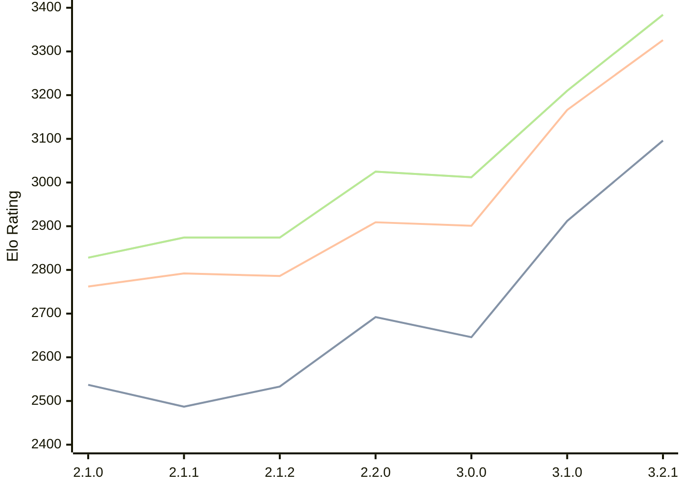

# Engine: Prune

Author: Thomas Girolami

Home: https://github.com/tgirolami09/Prune

## Elo Ratings

| Version | Published | STC 8.0+0.08s  | LTC 60.0+0.60s | VLTC 2m24s+1.12s | Comment |
| --- | --- | --- | --- | --- | --- |
| 3.2.1 | 2026-02-24 | 3096(+new) | 3326(+new) | 3384(+new) |  |
| 3.2.0 | 2026-02-22 |  |  |  | Skipped for 3.2.1 |
| 3.1.0 | 2026-01-10 | 2912(+266) | 3166(+265) | 3210(+198) |  |
| 3.0.0 | 2025-12-06 | 2646(-46) | 2901(-8) | 3012(-13) |  |
| 2.2.0 | 2025-11-20 | 2692(+159) | 2909(+123) | 3025(+151) |  |
| 2.1.2 | 2025-11-06 | 2533(+46) | 2786(-6) | 2874(0) |  |
| 2.1.1 | 2025-11-05 | 2487(-50) | 2792(+30) | 2874(+46) |  |
| 2.1.0 | 2025-11-02 | 2537(+new) | 2762(+new) | 2828(+new) |  |
| 2.0.1 | 2025-10-21 |  |  |  |  |
| 2.0.0 | 2025-10-19 |  |  |  |  |
| 1.0.1 | 2025-10-15 |  |  |  |  |
| 1.0.0 | 2025-10-05 |  |  |  |  |
 | | | cElo (∆ prev) | cElo (∆ prev) | cElo (∆ prev) | 

<a href="https://github.com/computer-chess-index/cci/issues/new?template=submit-version.yml&title=[VERSION]+Prune+<version>&body=###%20Engine%20name%0APrune%0A%0A###%20Version%0A3.2.1" target="_blank">Submit new version</a>

 Test Conditions:

GUI/CLI: <a href=https://github.com/cutechess/cutechess target="_blank">Cute-Chess</a> 
Elo Calculation: <a href=https://www.remi-coulom.fr/Bayesian-Elo/ target="_blank">Bayesian-Elo</a> 
CPU: Intel(R) Core(TM) i5-7500T 2.70GHz 
Opening book: 8_moves_v3 
\* STC: 8.0+0.08s, LTC: 60.0+0.60s, VLTC: 2m24s+1.12s

 Lists:
Ratings: <a href=https://github.com/computer-chess-index/cci/blob/main/lists/CCIRatings.csv target="_blank">Complete list</a>

Generated: 2026-05-19 06:27:53

## Ratings Verlauf

⬛ STC (8.0+0.08s) &nbsp;&nbsp; 🟧 LTC (60.0+0.60s) &nbsp;&nbsp; 🟩 VLTC (2m24s+1.12s)

dark mode: 🟩STC (8.0+0.08s) 🟧LTC (60.0+0.60s) ⬜VLTC (2m24s+1.12s)

## Detailed Evaluation Results

| Version | Time Control | Elo  | Range +/- | Matches | Score | Average Opponent Elo | Draws |
| --- | --- | --- | --- | --- | --- | --- | --- |
| 3.2.1 | VLTC (2m24s+1.12s) | 3384 | 25 | 398 | 50% | 3383 | 76% |
| 3.2.1 | LTC (60.0+0.60s) | 3326 | 25 | 390 | 52% | 3312 | 70% |
| 3.2.1 | STC (8.0+0.08s) | 3096 | 25 | 410 | 51% | 3082 | 63% |
| --- | --- | --- | --- | --- | --- | --- | --- |
| 3.1.0 | VLTC (2m24s+1.12s) | 3210 | 32 | 284 | 51% | 3205 | 50% |
| 3.1.0 | LTC (60.0+0.60s) | 3166 | 31 | 288 | 52% | 3155 | 53% |
| 3.1.0 | STC (8.0+0.08s) | 2912 | 33 | 276 | 51% | 2893 | 44% |
| --- | --- | --- | --- | --- | --- | --- | --- |
| 3.0.0 | VLTC (2m24s+1.12s) | 3012 | 35 | 236 | 48% | 3027 | 46% |
| 3.0.0 | LTC (60.0+0.60s) | 2901 | 36 | 236 | 52% | 2888 | 42% |
| 3.0.0 | STC (8.0+0.08s) | 2646 | 39 | 212 | 47% | 2673 | 37% |
| --- | --- | --- | --- | --- | --- | --- | --- |
| 2.2.0 | VLTC (2m24s+1.12s) | 3025 | 72 | 56 | 57% | 2971 | 46% |
| 2.2.0 | LTC (60.0+0.60s) | 2909 | 66 | 72 | 49% | 2925 | 36% |
| 2.2.0 | STC (8.0+0.08s) | 2692 | 90 | 40 | 55% | 2650 | 30% |
| --- | --- | --- | --- | --- | --- | --- | --- |
| 2.1.2 | VLTC (2m24s+1.12s) | 2874 | 54 | 108 | 49% | 2888 | 37% |
| 2.1.2 | LTC (60.0+0.60s) | 2786 | 54 | 108 | 45% | 2846 | 43% |
| 2.1.2 | STC (8.0+0.08s) | 2533 | 55 | 118 | 40% | 2646 | 30% |
| --- | --- | --- | --- | --- | --- | --- | --- |
| 2.1.1 | VLTC (2m24s+1.12s) | 2874 | 95 | 32 | 50% | 2873 | 44% |
| 2.1.1 | LTC (60.0+0.60s) | 2792 | 64 | 72 | 47% | 2816 | 44% |
| 2.1.1 | STC (8.0+0.08s) | 2487 | 60 | 92 | 48% | 2502 | 25% |
| --- | --- | --- | --- | --- | --- | --- | --- |
| 2.1.0 | VLTC (2m24s+1.12s) | 2828 | 53 | 108 | 50% | 2823 | 42% |
| 2.1.0 | LTC (60.0+0.60s) | 2762 | 51 | 112 | 51% | 2755 | 45% |
| 2.1.0 | STC (8.0+0.08s) | 2537 | 53 | 116 | 46% | 2596 | 34% |
| --- | --- | --- | --- | --- | --- | --- | --- |