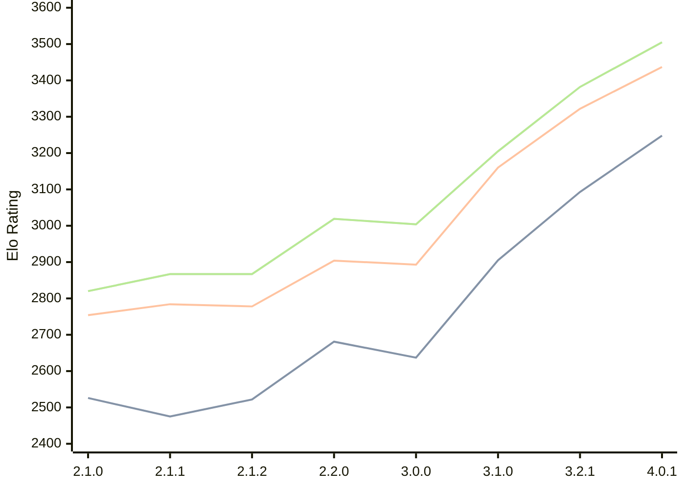

# Engine: Prune

Author: Thomas Girolami

Home: https://github.com/tgirolami09/Prune

## Elo Ratings

| Version | Published | STC 8.0+0.08s  | LTC 60.0+0.60s | VLTC 2m24s+1.12s | Comment |
| --- | --- | --- | --- | --- | --- |
| 4.0.1 | 2026-07-07 | 3248(+new) | 3437(+new) | 3505(+new) |  |
| 4.0.0 | 2026-06-27 |  |  |  |  |
| 3.2.1 | 2026-02-24 | 3093(+new) | 3322(+new) | 3382(+new) |  |
| 3.2.0 | 2026-02-22 |  |  |  | Skipped for 3.2.1 |
| 3.1.0 | 2026-01-10 | 2905(+268) | 3160(+267) | 3205(+201) |  |
| 3.0.0 | 2025-12-06 | 2637(-44) | 2893(-11) | 3004(-15) |  |
| 2.2.0 | 2025-11-20 | 2681(+159) | 2904(+126) | 3019(+152) |  |
| 2.1.2 | 2025-11-06 | 2522(+47) | 2778(-6) | 2867(0) |  |
| 2.1.1 | 2025-11-05 | 2475(-51) | 2784(+30) | 2867(+47) |  |
| 2.1.0 | 2025-11-02 | 2526 | 2754 | 2820 |  |
 | | | cElo (∆ prev) | cElo (∆ prev) | cElo (∆ prev) | 

<a href="https://github.com/computer-chess-index/cci/issues/new?template=submit-version.yml&title=[VERSION]+Prune+<version>&body=###%20Engine%20name%0APrune%0A%0A###%20Version%0A4.0.1" target="_blank">Submit new version</a>

 Test Conditions:

GUI/CLI: <a href=https://github.com/cutechess/cutechess target="_blank">Cute-Chess</a> 
Elo Calculation: <a href=https://www.remi-coulom.fr/Bayesian-Elo/ target="_blank">Bayesian-Elo</a> 
CPU: Intel(R) Core(TM) i5-7500T 2.70GHz 
Opening book: 8_moves_v3 
\* STC: 8.0+0.08s, LTC: 60.0+0.60s, VLTC: 2m24s+1.12s

 Lists:
Ratings: <a href=https://github.com/computer-chess-index/cci/blob/main/lists/CCIRatings.csv target="_blank">Complete list</a>

Generated: 2026-08-24 06:27:52

## Ratings Verlauf

⬛ STC (8.0+0.08s) &nbsp;&nbsp; 🟧 LTC (60.0+0.60s) &nbsp;&nbsp; 🟩 VLTC (2m24s+1.12s)

dark mode: 🟩STC (8.0+0.08s) 🟧LTC (60.0+0.60s) ⬜VLTC (2m24s+1.12s)

## Detailed Evaluation Results

| Version | Time Control | Elo  | Range +/- | Matches | Score | Average Opponent Elo | Draws |
| --- | --- | --- | --- | --- | --- | --- | --- |
| 4.0.1 | VLTC (2m24s+1.12s) | 3505 | 27 | 320 | 50% | 3503 | 85% |
| 4.0.1 | LTC (60.0+0.60s) | 3437 | 26 | 358 | 50% | 3434 | 75% |
| 4.0.1 | STC (8.0+0.08s) | 3248 | 31 | 280 | 50% | 3247 | 64% |
| --- | --- | --- | --- | --- | --- | --- | --- |
| 3.2.1 | VLTC (2m24s+1.12s) | 3382 | 24 | 410 | 50% | 3379 | 75% |
| 3.2.1 | LTC (60.0+0.60s) | 3322 | 25 | 398 | 52% | 3308 | 70% |
| 3.2.1 | STC (8.0+0.08s) | 3093 | 24 | 482 | 51% | 3075 | 62% |
| --- | --- | --- | --- | --- | --- | --- | --- |
| 3.1.0 | VLTC (2m24s+1.12s) | 3205 | 32 | 284 | 51% | 3200 | 50% |
| 3.1.0 | LTC (60.0+0.60s) | 3160 | 31 | 288 | 52% | 3148 | 53% |
| 3.1.0 | STC (8.0+0.08s) | 2905 | 33 | 276 | 51% | 2885 | 44% |
| --- | --- | --- | --- | --- | --- | --- | --- |
| 3.0.0 | VLTC (2m24s+1.12s) | 3004 | 35 | 236 | 48% | 3020 | 46% |
| 3.0.0 | LTC (60.0+0.60s) | 2893 | 36 | 236 | 52% | 2880 | 42% |
| 3.0.0 | STC (8.0+0.08s) | 2637 | 39 | 212 | 47% | 2664 | 37% |
| --- | --- | --- | --- | --- | --- | --- | --- |
| 2.2.0 | VLTC (2m24s+1.12s) | 3019 | 72 | 56 | 57% | 2965 | 46% |
| 2.2.0 | LTC (60.0+0.60s) | 2904 | 66 | 72 | 49% | 2920 | 36% |
| 2.2.0 | STC (8.0+0.08s) | 2681 | 90 | 40 | 55% | 2639 | 30% |
| --- | --- | --- | --- | --- | --- | --- | --- |
| 2.1.2 | VLTC (2m24s+1.12s) | 2867 | 54 | 108 | 49% | 2881 | 37% |
| 2.1.2 | LTC (60.0+0.60s) | 2778 | 54 | 108 | 45% | 2838 | 43% |
| 2.1.2 | STC (8.0+0.08s) | 2522 | 55 | 118 | 40% | 2637 | 30% |
| --- | --- | --- | --- | --- | --- | --- | --- |
| 2.1.1 | VLTC (2m24s+1.12s) | 2867 | 95 | 32 | 50% | 2866 | 44% |
| 2.1.1 | LTC (60.0+0.60s) | 2784 | 64 | 72 | 47% | 2809 | 44% |
| 2.1.1 | STC (8.0+0.08s) | 2475 | 60 | 92 | 48% | 2489 | 25% |
| --- | --- | --- | --- | --- | --- | --- | --- |
| 2.1.0 | VLTC (2m24s+1.12s) | 2820 | 53 | 108 | 50% | 2816 | 42% |
| 2.1.0 | LTC (60.0+0.60s) | 2754 | 51 | 112 | 51% | 2746 | 45% |
| 2.1.0 | STC (8.0+0.08s) | 2526 | 53 | 116 | 46% | 2585 | 34% |
| --- | --- | --- | --- | --- | --- | --- | --- |