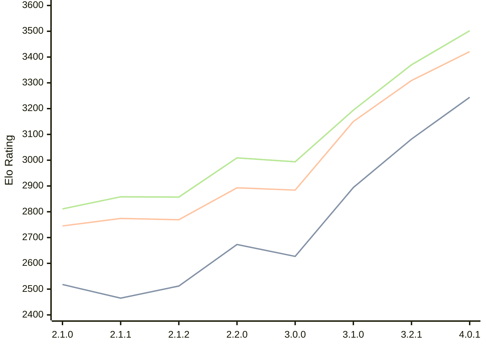

# Engine: Prune

Author: Thomas Girolami

Home: https://github.com/tgirolami09/Prune

## Elo Ratings

| Version | Published | STC 8.0+0.08s  | LTC 60.0+0.60s | VLTC 2m24s+1.12s | Comment |
| --- | --- | --- | --- | --- | --- |
| 4.0.1 | 2026-07-07 | 3244(+new) | 3421(+new) | 3502(+new) |  |
| 4.0.0 | 2026-06-27 |  |  |  |  |
| 3.2.1 | 2026-02-24 | 3082(+new) | 3309(+new) | 3370(+new) |  |
| 3.2.0 | 2026-02-22 |  |  |  | Skipped for 3.2.1 |
| 3.1.0 | 2026-01-10 | 2894(+267) | 3150(+266) | 3194(+200) |  |
| 3.0.0 | 2025-12-06 | 2627(-46) | 2884(-9) | 2994(-15) |  |
| 2.2.0 | 2025-11-20 | 2673(+161) | 2893(+124) | 3009(+152) |  |
| 2.1.2 | 2025-11-06 | 2512(+47) | 2769(-5) | 2857(-1) |  |
| 2.1.1 | 2025-11-05 | 2465(-53) | 2774(+29) | 2858(+47) |  |
| 2.1.0 | 2025-11-02 | 2518(+new) | 2745(+new) | 2811(+new) |  |
| 2.0.1 | 2025-10-21 |  |  |  |  |
| 2.0.0 | 2025-10-19 |  |  |  |  |
| 1.0.1 | 2025-10-15 |  |  |  |  |
| 1.0.0 | 2025-10-05 |  |  |  |  |
 | | | cElo (∆ prev) | cElo (∆ prev) | cElo (∆ prev) | 

<a href="https://github.com/computer-chess-index/cci/issues/new?template=submit-version.yml&title=[VERSION]+Prune+<version>&body=###%20Engine%20name%0APrune%0A%0A###%20Version%0A4.0.1" target="_blank">Submit new version</a>

 Test Conditions:

GUI/CLI: <a href=https://github.com/cutechess/cutechess target="_blank">Cute-Chess</a> 
Elo Calculation: <a href=https://www.remi-coulom.fr/Bayesian-Elo/ target="_blank">Bayesian-Elo</a> 
CPU: Intel(R) Core(TM) i5-7500T 2.70GHz 
Opening book: 8_moves_v3 
\* STC: 8.0+0.08s, LTC: 60.0+0.60s, VLTC: 2m24s+1.12s

 Lists:
Ratings: <a href=https://github.com/computer-chess-index/cci/blob/main/lists/CCIRatings.csv target="_blank">Complete list</a>

Generated: 2026-07-17 06:27:56

## Ratings Verlauf

## Ratings Verlauf

⬛ STC (8.0+0.08s) &nbsp;&nbsp; 🟧 LTC (60.0+0.60s) &nbsp;&nbsp; 🟩 VLTC (2m24s+1.12s)

dark mode: 🟩STC (8.0+0.08s) 🟧LTC (60.0+0.60s) ⬜VLTC (2m24s+1.12s)

## Detailed Evaluation Results

| Version | Time Control | Elo  | Range +/- | Matches | Score | Average Opponent Elo | Draws |
| --- | --- | --- | --- | --- | --- | --- | --- |
| 4.0.1 | VLTC (2m24s+1.12s) | 3502 | 37 | 170 | 52% | 3487 | 82% |
| 4.0.1 | LTC (60.0+0.60s) | 3421 | 30 | 268 | 49% | 3424 | 72% |
| 4.0.1 | STC (8.0+0.08s) | 3244 | 41 | 160 | 52% | 3231 | 59% |
| --- | --- | --- | --- | --- | --- | --- | --- |
| 3.2.1 | VLTC (2m24s+1.12s) | 3370 | 24 | 410 | 50% | 3367 | 75% |
| 3.2.1 | LTC (60.0+0.60s) | 3309 | 25 | 398 | 52% | 3295 | 70% |
| 3.2.1 | STC (8.0+0.08s) | 3082 | 24 | 482 | 51% | 3065 | 62% |
| --- | --- | --- | --- | --- | --- | --- | --- |
| 3.1.0 | VLTC (2m24s+1.12s) | 3194 | 32 | 284 | 51% | 3189 | 50% |
| 3.1.0 | LTC (60.0+0.60s) | 3150 | 31 | 288 | 52% | 3137 | 53% |
| 3.1.0 | STC (8.0+0.08s) | 2894 | 33 | 276 | 51% | 2876 | 44% |
| --- | --- | --- | --- | --- | --- | --- | --- |
| 3.0.0 | VLTC (2m24s+1.12s) | 2994 | 35 | 236 | 48% | 3009 | 46% |
| 3.0.0 | LTC (60.0+0.60s) | 2884 | 36 | 236 | 52% | 2870 | 42% |
| 3.0.0 | STC (8.0+0.08s) | 2627 | 39 | 212 | 47% | 2655 | 37% |
| --- | --- | --- | --- | --- | --- | --- | --- |
| 2.2.0 | VLTC (2m24s+1.12s) | 3009 | 72 | 56 | 57% | 2954 | 46% |
| 2.2.0 | LTC (60.0+0.60s) | 2893 | 66 | 72 | 49% | 2909 | 36% |
| 2.2.0 | STC (8.0+0.08s) | 2673 | 90 | 40 | 55% | 2631 | 30% |
| --- | --- | --- | --- | --- | --- | --- | --- |
| 2.1.2 | VLTC (2m24s+1.12s) | 2857 | 54 | 108 | 49% | 2871 | 37% |
| 2.1.2 | LTC (60.0+0.60s) | 2769 | 54 | 108 | 45% | 2830 | 43% |
| 2.1.2 | STC (8.0+0.08s) | 2512 | 55 | 118 | 40% | 2627 | 30% |
| --- | --- | --- | --- | --- | --- | --- | --- |
| 2.1.1 | VLTC (2m24s+1.12s) | 2858 | 95 | 32 | 50% | 2857 | 44% |
| 2.1.1 | LTC (60.0+0.60s) | 2774 | 64 | 72 | 47% | 2800 | 44% |
| 2.1.1 | STC (8.0+0.08s) | 2465 | 60 | 92 | 48% | 2480 | 25% |
| --- | --- | --- | --- | --- | --- | --- | --- |
| 2.1.0 | VLTC (2m24s+1.12s) | 2811 | 53 | 108 | 50% | 2805 | 42% |
| 2.1.0 | LTC (60.0+0.60s) | 2745 | 51 | 112 | 51% | 2738 | 45% |
| 2.1.0 | STC (8.0+0.08s) | 2518 | 53 | 116 | 46% | 2576 | 34% |
| --- | --- | --- | --- | --- | --- | --- | --- |