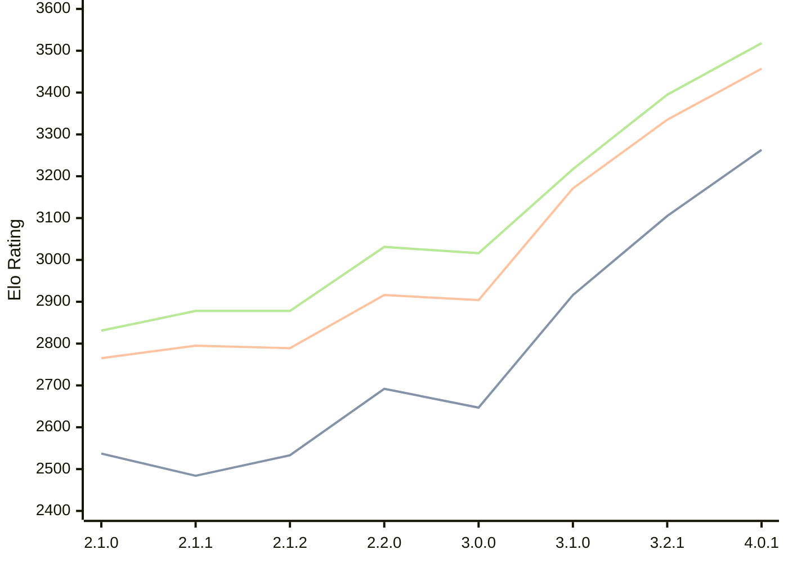

# Engine: Prune

Author: Thomas Girolami

Home: https://github.com/tgirolami09/Prune

## Elo Ratings E1

| Version | Published | STC 8.0+0.08s  | LTC 60.0+0.60s | VLTC 2m24s+1.12s | Comment |
| --- | --- | --- | --- | --- | --- |
| 4.0.1 | 2026-07-07 | 3179 | 3430 | 3484 |  |
 | | | cElo (∆ prev) | cElo (∆ prev) | cElo (∆ prev) | 

## Elo Ratings P1

| Version | Published | STC 8.0+0.08s  | LTC 60.0+0.60s | VLTC 2m24s+1.12s | Comment |
| --- | --- | --- | --- | --- | --- |
| 4.0.1 | 2026-07-07 | 3428 | 3669 | 3717 |  |
 | | | cElo (∆ prev) | cElo (∆ prev) | cElo (∆ prev) | 

## Elo Ratings T1

| Version | Published | STC 8.0+0.08s  | LTC 60.0+0.60s | VLTC 2m24s+1.12s | Comment |
| --- | --- | --- | --- | --- | --- |
| 4.0.1 | 2026-07-07 | 3263(+158) | 3457(+122) | 3518(+123) |  |
| 3.2.1 | 2026-02-24 | 3105(+189) | 3335(+164) | 3395(+178) |  |
| 3.1.0 | 2026-01-10 | 2916(+269) | 3171(+267) | 3217(+201) |  |
| 3.0.0 | 2025-12-06 | 2647(-45) | 2904(-12) | 3016(-15) |  |
| 2.2.0 | 2025-11-20 | 2692(+159) | 2916(+127) | 3031(+153) |  |
| 2.1.2 | 2025-11-06 | 2533(+49) | 2789(-6) | 2878(0) |  |
| 2.1.1 | 2025-11-05 | 2484(-53) | 2795(+30) | 2878(+47) |  |
| 2.1.0 | 2025-11-02 | 2537 | 2765 | 2831 |  |
 | | | cElo (∆ prev) | cElo (∆ prev) | cElo (∆ prev) | 

<a href="https://github.com/computer-chess-index/cci/issues/new?template=submit-version.yml&title=[VERSION]+Prune+<version>&body=###%20Engine%20name%0APrune%0A%0A###%20Version%0A4.0.1" target="_blank">Submit new version</a>

 Test Conditions:

GUI/CLI: <a href=https://github.com/cutechess/cutechess target="_blank">Cute-Chess</a> 
Elo Calculation: <a href=https://www.remi-coulom.fr/Bayesian-Elo/ target="_blank">Bayesian-Elo</a> 
CPU for P1: Intel(R) Core(TM) Ultra 7 265T (1.50 GHz) - P-Core 
CPU for E1: Intel(R) Core(TM) Ultra 7 265T (1.50 GHz) - E-Core 
CPU for T1: Intel(R) Core(TM) i5-7500T 2.70GHz 
Opening book: 8_moves_v3 
\* STC: 8.0+0.08s, LTC: 60.0+0.60s, VLTC: 2m24s+1.12s

 Lists:
Ratings: <a href=https://github.com/computer-chess-index/cci/blob/main/lists/CCIRatings.csv target="_blank">Complete list</a>

Generated: 2026-10-09 14:15:02

## Ratings Verlauf

```mermaid
%%{init: {"theme":"base","themeVariables":{"seriesColors:['#a3a3a3','#222221','#faa371']}}}%%
xychart-beta
  x-axis ["2.1.0", "2.1.1", "2.1.2", "2.2.0", "3.0.0", "3.1.0", "3.2.1", "4.0.1"]
  y-axis "Elo Rating" 2400 --> 3600
  line "" [2537, 2484, 2533, 2692, 2647, 2916, 3105, 3263]
  line "STC (8.0+0.08s)" [2537, 2484, 2533, 2692, 2647, 2916, 3105, 3263]
  line "LTC (60.0+0.60s)" [2765, 2795, 2789, 2916, 2904, 3171, 3335, 3457]
  line "" [2831, 2878, 2878, 3031, 3016, 3217, 3395, 3518]
  line "VLTC (2m24s+1.12s)" [2831, 2878, 2878, 3031, 3016, 3217, 3395, 3518]
```

## Detailed Evaluation Results

| Version | Time Control | Elo  | Range +/- | Matches | Score | Average Opponent Elo | Draws |
| --- | --- | --- | --- | --- | --- | --- | --- |
| 4.0.1 | VLTC (2m24s+1.12s) | 3518 | 24 | 400 | 50% | 3518 | 85% |
| 4.0.1 | VLTC (2m24s+1.12s) | 3717 | 38 | 164 | 48% | 3730 | 79% |
| 4.0.1 | VLTC (2m24s+1.12s) | 3484 | 31 | 242 | 48% | 3499 | 81% |
| 4.0.1 | LTC (60.0+0.60s) | 3457 | 24 | 418 | 51% | 3451 | 75% |
| 4.0.1 | LTC (60.0+0.60s) | 3669 | 40 | 150 | 50% | 3668 | 81% |
| 4.0.1 | LTC (60.0+0.60s) | 3430 | 34 | 214 | 50% | 3432 | 73% |
| 4.0.1 | STC (8.0+0.08s) | 3263 | 28 | 336 | 51% | 3258 | 65% |
| --- | --- | --- | --- | --- | --- | --- | --- |
| 4.0.1 | STC (8.0+0.08s) | 3428 | 38 | 180 | 49% | 3432 | 62% |
| --- | --- | --- | --- | --- | --- | --- | --- |
| 4.0.1 | STC (8.0+0.08s) | 3179 | 32 | 256 | 49% | 3189 | 61% |
| --- | --- | --- | --- | --- | --- | --- | --- |
| 3.2.1 | VLTC (2m24s+1.12s) | 3395 | 24 | 410 | 50% | 3393 | 75% |
| 3.2.1 | LTC (60.0+0.60s) | 3335 | 25 | 398 | 52% | 3321 | 70% |
| 3.2.1 | STC (8.0+0.08s) | 3105 | 24 | 482 | 51% | 3087 | 62% |
| --- | --- | --- | --- | --- | --- | --- | --- |
| 3.1.0 | VLTC (2m24s+1.12s) | 3217 | 32 | 284 | 51% | 3212 | 50% |
| 3.1.0 | LTC (60.0+0.60s) | 3171 | 31 | 288 | 52% | 3160 | 53% |
| 3.1.0 | STC (8.0+0.08s) | 2916 | 33 | 276 | 51% | 2897 | 44% |
| --- | --- | --- | --- | --- | --- | --- | --- |
| 3.0.0 | VLTC (2m24s+1.12s) | 3016 | 35 | 236 | 48% | 3032 | 46% |
| 3.0.0 | LTC (60.0+0.60s) | 2904 | 36 | 236 | 52% | 2892 | 42% |
| 3.0.0 | STC (8.0+0.08s) | 2647 | 39 | 212 | 47% | 2676 | 37% |
| --- | --- | --- | --- | --- | --- | --- | --- |
| 2.2.0 | VLTC (2m24s+1.12s) | 3031 | 72 | 56 | 57% | 2977 | 46% |
| 2.2.0 | LTC (60.0+0.60s) | 2916 | 66 | 72 | 49% | 2931 | 36% |
| 2.2.0 | STC (8.0+0.08s) | 2692 | 90 | 40 | 55% | 2650 | 30% |
| --- | --- | --- | --- | --- | --- | --- | --- |
| 2.1.2 | VLTC (2m24s+1.12s) | 2878 | 54 | 108 | 49% | 2893 | 37% |
| 2.1.2 | LTC (60.0+0.60s) | 2789 | 54 | 108 | 45% | 2850 | 43% |
| 2.1.2 | STC (8.0+0.08s) | 2533 | 55 | 118 | 40% | 2647 | 30% |
| --- | --- | --- | --- | --- | --- | --- | --- |
| 2.1.1 | VLTC (2m24s+1.12s) | 2878 | 95 | 32 | 50% | 2877 | 44% |
| 2.1.1 | LTC (60.0+0.60s) | 2795 | 64 | 72 | 47% | 2820 | 44% |
| 2.1.1 | STC (8.0+0.08s) | 2484 | 60 | 92 | 48% | 2499 | 25% |
| --- | --- | --- | --- | --- | --- | --- | --- |
| 2.1.0 | VLTC (2m24s+1.12s) | 2831 | 53 | 108 | 50% | 2827 | 42% |
| 2.1.0 | LTC (60.0+0.60s) | 2765 | 51 | 112 | 51% | 2757 | 45% |
| 2.1.0 | STC (8.0+0.08s) | 2537 | 53 | 116 | 46% | 2596 | 34% |
| --- | --- | --- | --- | --- | --- | --- | --- |