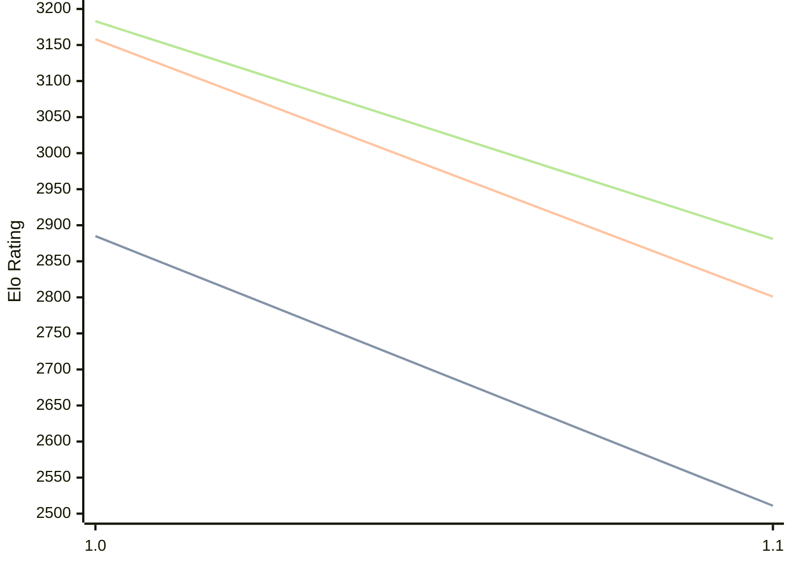

# Engine: Publius

Author: Pawel Koziol

Home: https://github.com/nescitus/publius

## Elo Ratings

| Version | Published | STC 8.0+0.08s  | LTC 60.0+0.60s | VLTC 2m24s+1.12s | Comment |
| --- | --- | --- | --- | --- | --- |
| 1.1 | 2025-12-31 | 2511(-374) | 2801(-357) | 2881(-302) |  |
| 1.0 | 2025-10-19 | 2885 | 3158 | 3183 |  |
 | | | cElo (∆ prev) | cElo (∆ prev) | cElo (∆ prev) | 

<a href="https://github.com/computer-chess-index/cci/issues/new?template=submit-version.yml&title=[VERSION]+Publius+<version>&body=###%20Engine%20name%0APublius%0A%0A###%20Version%0A1.1" target="_blank">Submit new version</a>

 Test Conditions:

GUI/CLI: <a href=https://github.com/cutechess/cutechess target="_blank">Cute-Chess</a> 
Elo Calculation: <a href=https://www.remi-coulom.fr/Bayesian-Elo/ target="_blank">Bayesian-Elo</a> 
CPU: Intel(R) Core(TM) i5-7500T 2.70GHz 
Opening book: 8_moves_v3 
\* STC: 8.0+0.08s, LTC: 60.0+0.60s, VLTC: 2m24s+1.12s

 Lists:
Ratings: <a href=https://github.com/computer-chess-index/cci/blob/main/lists/CCIRatings.csv target="_blank">Complete list</a>

Generated: 2026-05-12 06:28:04

## Ratings Verlauf

⬛ STC (8.0+0.08s) &nbsp;&nbsp; 🟧 LTC (60.0+0.60s) &nbsp;&nbsp; 🟩 VLTC (2m24s+1.12s)

dark mode: 🟩STC (8.0+0.08s) 🟧LTC (60.0+0.60s) ⬜VLTC (2m24s+1.12s)

## Detailed Evaluation Results

| Version | Time Control | Elo  | Range +/- | Matches | Score | Average Opponent Elo | Draws |
| --- | --- | --- | --- | --- | --- | --- | --- |
| 1.1 | VLTC (2m24s+1.12s) | 2881 | 28 | 414 | 48% | 2897 | 36% |
| 1.1 | LTC (60.0+0.60s) | 2801 | 27 | 432 | 50% | 2804 | 33% |
| 1.1 | STC (8.0+0.08s) | 2511 | 27 | 470 | 49% | 2503 | 30% |
| --- | --- | --- | --- | --- | --- | --- | --- |
| 1.0 | VLTC (2m24s+1.12s) | 3183 | 34 | 232 | 49% | 3194 | 57% |
| 1.0 | LTC (60.0+0.60s) | 3158 | 34 | 248 | 52% | 3131 | 55% |
| 1.0 | STC (8.0+0.08s) | 2885 | 36 | 232 | 53% | 2851 | 41% |
| --- | --- | --- | --- | --- | --- | --- | --- |