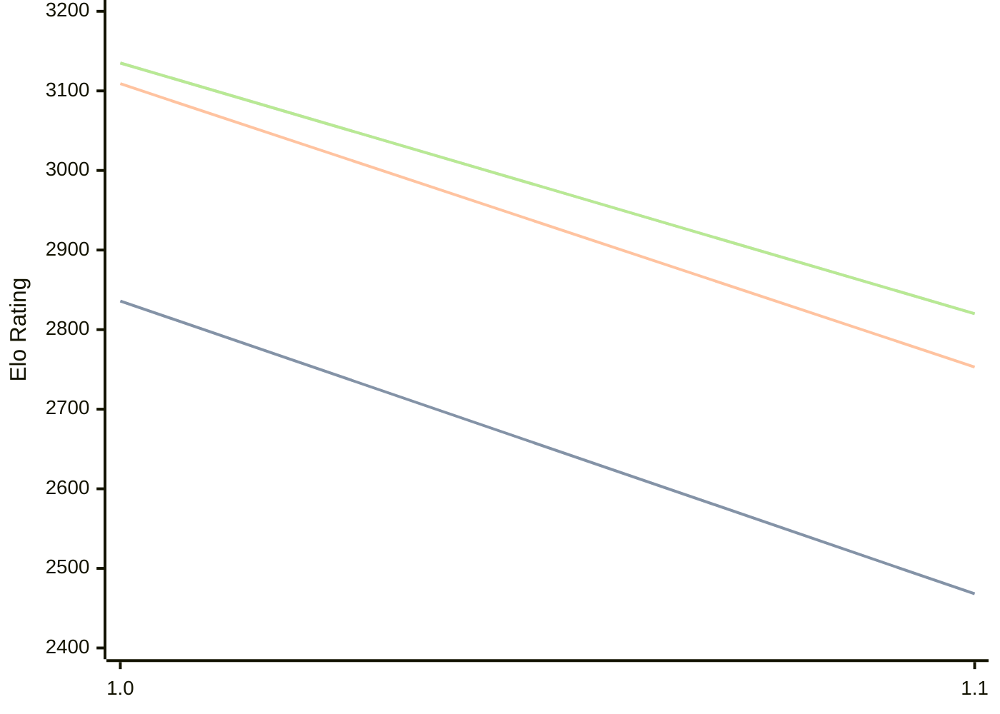

# Engine: Publius

Author: Pawel Koziol

Home: https://github.com/nescitus/publius

## Elo Ratings

| Version | Published | STC 8.0+0.08s  | LTC 60.0+0.60s | VLTC 2m24s+1.12s | Comment |
| --- | --- | --- | --- | --- | --- |
| 1.1 | 2025-12-31 | 2468(-368) | 2753(-356) | 2820(-315) |  |
| 1.0 | 2025-10-19 | 2836 | 3109 | 3135 |  |
 | | | cElo (∆ prev) | cElo (∆ prev) | cElo (∆ prev) | 

<a href="https://github.com/computer-chess-index/cci/issues/new?template=submit-version.yml&title=[VERSION]+Publius+<version>&body=###%20Engine%20name%0APublius%0A%0A###%20Version%0A1.1" target="_blank">Submit new version</a>

 Test Conditions:

GUI/CLI: <a href=https://github.com/cutechess/cutechess target="_blank">Cute-Chess</a> 
Elo Calculation: <a href=https://www.remi-coulom.fr/Bayesian-Elo/ target="_blank">Bayesian-Elo</a> 
CPU: Intel(R) Core(TM) i5-7500T 2.70GHz 
Opening book: 8_moves_v3 
\* STC: 8.0+0.08s, LTC: 60.0+0.60s, VLTC: 2m24s+1.12s

 Lists:
Ratings: <a href=https://github.com/computer-chess-index/cci/blob/main/lists/CCIRatings.csv target="_blank">Complete list</a>

Generated: 2026-09-06 06:27:17

## Ratings Verlauf

## Detailed Evaluation Results

| Version | Time Control | Elo  | Range +/- | Matches | Score | Average Opponent Elo | Draws |
| --- | --- | --- | --- | --- | --- | --- | --- |
| 1.1 | VLTC (2m24s+1.12s) | 2820 | 24 | 532 | 47% | 2844 | 37% |
| 1.1 | LTC (60.0+0.60s) | 2753 | 25 | 516 | 50% | 2753 | 35% |
| 1.1 | STC (8.0+0.08s) | 2468 | 23 | 682 | 49% | 2464 | 28% |
| --- | --- | --- | --- | --- | --- | --- | --- |
| 1.0 | VLTC (2m24s+1.12s) | 3135 | 34 | 232 | 49% | 3146 | 57% |
| 1.0 | LTC (60.0+0.60s) | 3109 | 34 | 248 | 52% | 3082 | 55% |
| 1.0 | STC (8.0+0.08s) | 2836 | 36 | 232 | 53% | 2803 | 41% |
| --- | --- | --- | --- | --- | --- | --- | --- |