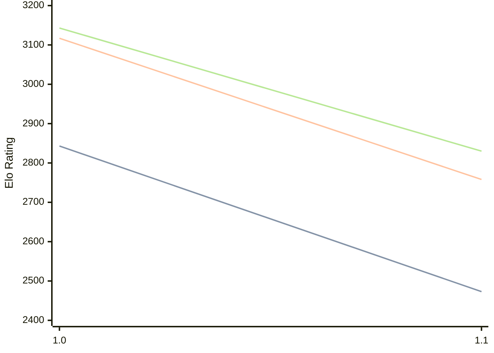

# Engine: Publius

Author: Pawel Koziol

Home: https://github.com/nescitus/publius

## Elo Ratings E1

| Version | Published | STC 8.0+0.08s  | LTC 60.0+0.60s | VLTC 2m24s+1.12s | Comment |
| --- | --- | --- | --- | --- | --- |
| 1.1 | 2025-12-31 | 2364 | 2657 | 2772 |  |
 | | | cElo (∆ prev) | cElo (∆ prev) | cElo (∆ prev) | 

## Elo Ratings P1

| Version | Published | STC 8.0+0.08s  | LTC 60.0+0.60s | VLTC 2m24s+1.12s | Comment |
| --- | --- | --- | --- | --- | --- |
| 1.1 | 2025-12-31 | 2527 | 2892 | 2947 |  |
 | | | cElo (∆ prev) | cElo (∆ prev) | cElo (∆ prev) | 

## Elo Ratings T1

| Version | Published | STC 8.0+0.08s  | LTC 60.0+0.60s | VLTC 2m24s+1.12s | Comment |
| --- | --- | --- | --- | --- | --- |
| 1.1 | 2025-12-31 | 2473(-370) | 2758(-359) | 2830(-313) |  |
| 1.0 | 2025-10-19 | 2843 | 3117 | 3143 |  |
 | | | cElo (∆ prev) | cElo (∆ prev) | cElo (∆ prev) | 

<a href="https://github.com/computer-chess-index/cci/issues/new?template=submit-version.yml&title=[VERSION]+Publius+<version>&body=###%20Engine%20name%0APublius%0A%0A###%20Version%0A1.1" target="_blank">Submit new version</a>

 Test Conditions:

GUI/CLI: <a href=https://github.com/cutechess/cutechess target="_blank">Cute-Chess</a> 
Elo Calculation: <a href=https://www.remi-coulom.fr/Bayesian-Elo/ target="_blank">Bayesian-Elo</a> 
CPU for P1: Intel(R) Core(TM) Ultra 7 265T (1.50 GHz) - P-Core 
CPU for E1: Intel(R) Core(TM) Ultra 7 265T (1.50 GHz) - E-Core 
CPU for T1: Intel(R) Core(TM) i5-7500T 2.70GHz 
Opening book: 8_moves_v3 
\* STC: 8.0+0.08s, LTC: 60.0+0.60s, VLTC: 2m24s+1.12s

 Lists:
Ratings: <a href=https://github.com/computer-chess-index/cci/blob/main/lists/CCIRatings.csv target="_blank">Complete list</a>

Generated: 2026-10-10 04:41:26

## Ratings Verlauf

```mermaid
%%{init: {"theme":"base","themeVariables":{"seriesColors:['#a3a3a3','#222221','#faa371']}}}%%
xychart-beta
  x-axis ["1.0", "1.1"]
  y-axis "Elo Rating" 2400 --> 3200
  line "" [2843, 2473]
  line "STC (8.0+0.08s)" [2843, 2473]
  line "LTC (60.0+0.60s)" [3117, 2758]
  line "" [3143, 2830]
  line "VLTC (2m24s+1.12s)" [3143, 2830]
```

## Detailed Evaluation Results

| Version | Time Control | Elo  | Range +/- | Matches | Score | Average Opponent Elo | Draws |
| --- | --- | --- | --- | --- | --- | --- | --- |
| 1.1 | VLTC (2m24s+1.12s) | 2772 | 36 | 264 | 51% | 2738 | 32% |
| 1.1 | VLTC (2m24s+1.12s) | 2830 | 24 | 560 | 48% | 2851 | 36% |
| 1.1 | VLTC (2m24s+1.12s) | 2947 | 52 | 136 | 51% | 2905 | 26% |
| 1.1 | LTC (60.0+0.60s) | 2657 | 38 | 242 | 56% | 2546 | 33% |
| 1.1 | LTC (60.0+0.60s) | 2758 | 25 | 522 | 50% | 2761 | 35% |
| 1.1 | LTC (60.0+0.60s) | 2892 | 47 | 152 | 48% | 2917 | 32% |
| 1.1 | STC (8.0+0.08s) | 2473 | 22 | 694 | 49% | 2472 | 29% |
| --- | --- | --- | --- | --- | --- | --- | --- |
| 1.1 | STC (8.0+0.08s) | 2527 | 43 | 176 | 47% | 2556 | 34% |
| --- | --- | --- | --- | --- | --- | --- | --- |
| 1.1 | STC (8.0+0.08s) | 2364 | 37 | 264 | 51% | 2353 | 21% |
| --- | --- | --- | --- | --- | --- | --- | --- |
| 1.0 | VLTC (2m24s+1.12s) | 3143 | 34 | 232 | 49% | 3154 | 57% |
| 1.0 | LTC (60.0+0.60s) | 3117 | 34 | 248 | 52% | 3090 | 55% |
| 1.0 | STC (8.0+0.08s) | 2843 | 36 | 232 | 53% | 2809 | 41% |
| --- | --- | --- | --- | --- | --- | --- | --- |