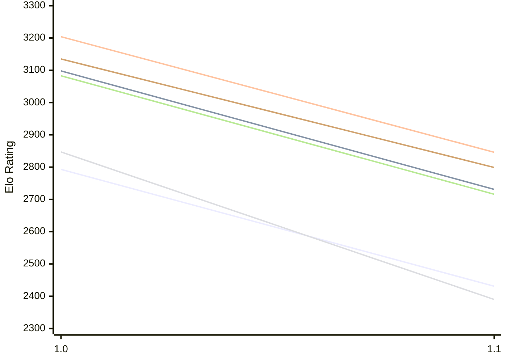
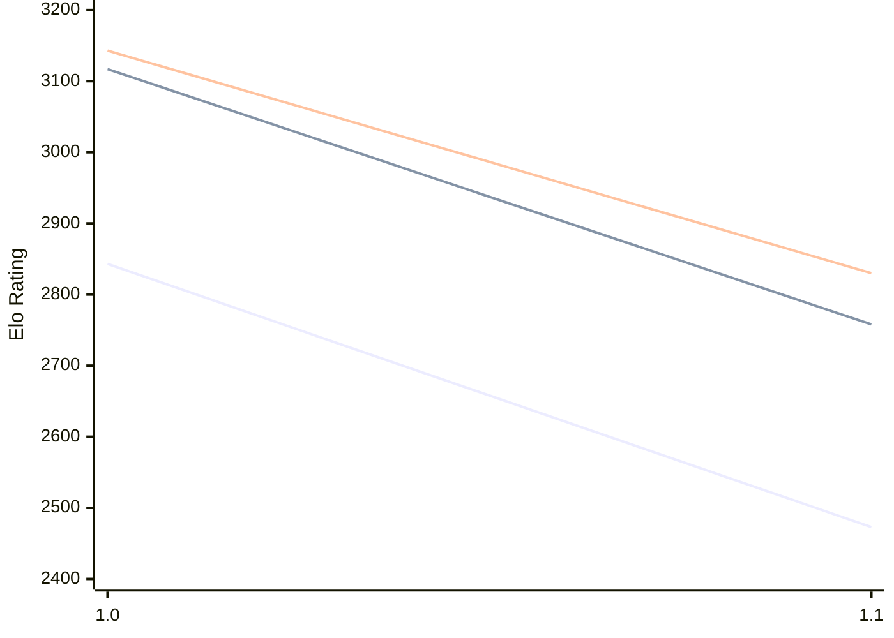

# Engine: Publius

Author: Pawel Koziol

Home: https://github.com/nescitus/publius

## Elo Ratings E1 (Ultra 7 265T (1.50 GHz) - E-Core)

| Version | Published | STC 8.0+0.08s  | LTC 60.0+0.60s | VLTC 2m24s+1.12s | Comment |
| --- | --- | --- | --- | --- | --- |
| 1.1 | 2025-12-31 | 2431(-362) | 2731(-367) | 2846(-358) |  |
| 1.0 | 2025-10-19 | 2793 | 3098 | 3204 |  |
 | | | cElo (∆ prev) | cElo (∆ prev) | cElo (∆ prev) | 

## Elo Ratings P1 (Ultra 7 265T (1.50 GHz) - P-Core)

| Version | Published | STC 8.0+0.08s  | LTC 60.0+0.60s | VLTC 2m24s+1.12s | Comment |
| --- | --- | --- | --- | --- | --- |
| 1.1 | 2025-12-31 | 2390(-457) | 2716(-367) | 2799(-336) |  |
| 1.0 | 2025-10-19 | 2847 | 3083 | 3135 |  |
 | | | cElo (∆ prev) | cElo (∆ prev) | cElo (∆ prev) | 

## Elo Ratings T1 (i5-7500T 2.70GHz)

| Version | Published | STC 8.0+0.08s  | LTC 60.0+0.60s | VLTC 2m24s+1.12s | Comment |
| --- | --- | --- | --- | --- | --- |
| 1.1 | 2025-12-31 | 2473(-370) | 2758(-359) | 2830(-313) |  |
| 1.0 | 2025-10-19 | 2843 | 3117 | 3143 |  |
 | | | cElo (∆ prev) | cElo (∆ prev) | cElo (∆ prev) | 

<a href="https://github.com/computer-chess-index/cci/issues/new?template=submit-version.yml&title=[VERSION]+Publius+<version>&body=###%20Engine%20name%0APublius%0A%0A###%20Version%0A1.1" target="_blank">Submit new version</a>

 Test Conditions:

GUI/CLI: <a href=https://github.com/cutechess/cutechess target="_blank">Cute-Chess</a> 
Elo Calculation: <a href=https://www.remi-coulom.fr/Bayesian-Elo/ target="_blank">Bayesian-Elo</a> 
CPU for P1: Intel(R) Core(TM) Ultra 7 265T (1.50 GHz) - P-Core 
CPU for E1: Intel(R) Core(TM) Ultra 7 265T (1.50 GHz) - E-Core 
CPU for T1: Intel(R) Core(TM) i5-7500T 2.70GHz 
Opening book: 8_moves_v3 
\* STC: 8.0+0.08s, LTC: 60.0+0.60s, VLTC: 2m24s+1.12s

 Lists:
Ratings: <a href=https://github.com/computer-chess-index/cci/blob/main/lists/CCIRatings.csv target="_blank">Complete list</a>

Generated: 2026-11-27 05:41:55

## Ratings Verlauf E1 / P1

```mermaid
%%{init: {"theme":"base","themeVariables":{"seriesColors:['#a3a3a3','#222221','#faa371']}}}%%
xychart-beta
  x-axis ["1.0", "1.1"]
  y-axis "Elo Rating" 2300 --> 3300
  line "E1: STC (8.0+0.08s)" [2793, 2431]
  line "E1: LTC (60.0+0.60s)" [3098, 2731]
  line "E1: VLTC (2m24s+1.12s)" [3204, 2846]
  line "P1: STC (8.0+0.08s)" [2847, 2390]
  line "P1: LTC (60.0+0.60s)" [3083, 2716]
  line "P1: VLTC (2m24s+1.12s)" [3135, 2799]
```

## Ratings Verlauf T1

```mermaid
%%{init: {"theme":"base","themeVariables":{"seriesColors:['#a3a3a3','#222221','#faa371']}}}%%
xychart-beta
  x-axis ["1.0", "1.1"]
  y-axis "Elo Rating" 2400 --> 3200
  line "T1: STC (8.0+0.08s)" [2843, 2473]
  line "T1: LTC (60.0+0.60s)" [3117, 2758]
  line "T1: VLTC (2m24s+1.12s)" [3143, 2830]
```

## Detailed Evaluation Results

| Version | Time Control | Variant | Elo  | Range +/- | Matches | Score | Average Opponent Elo | Draws |
| --- | --- |--- | --- | --- | --- | --- | --- | --- |
| 1.1 | VLTC (2m24s+1.12s) | T1 | 2830 | 24 | 560 | 48% | 2851 | 36% |
|  |  | P1 | 2799 | 38 | 244 | 50% | 2789 | 30% |
|  |  | E1 | 2846 | 27 | 472 | 51% | 2805 | 32% |
|  | LTC (60.0+0.60s) | T1 | 2758 | 25 | 522 | 50% | 2761 | 35% |
|  |  | P1 | 2716 | 34 | 282 | 46% | 2761 | 34% |
|  |  | E1 | 2731 | 28 | 424 | 52% | 2678 | 35% |
|  | STC (8.0+0.08s) | P1 | 2390 | 33 | 316 | 45% | 2448 | 29% |
|  |  | E1 | 2431 | 30 | 394 | 49% | 2444 | 22% |
|  |  | T1 | 2473 | 22 | 694 | 49% | 2472 | 29% |
| --- | --- |--- | --- | --- | --- | --- | --- | --- |
| 1.0 | VLTC (2m24s+1.12s) | E1 | 3204 | 52 | 100 | 53% | 3171 | 58% |
|  |  | T1 | 3143 | 34 | 232 | 49% | 3154 | 57% |
|  |  | P1 | 3135 | 58 | 100 | 60% | 2959 | 43% |
|  | LTC (60.0+0.60s) | T1 | 3117 | 34 | 248 | 52% | 3090 | 55% |
|  |  | P1 | 3083 | 57 | 96 | 61% | 2965 | 41% |
|  |  | E1 | 3098 | 44 | 162 | 46% | 3120 | 43% |
|  | STC (8.0+0.08s) | T1 | 2843 | 36 | 232 | 53% | 2809 | 41% |
|  |  | P1 | 2847 | 57 | 92 | 55% | 2774 | 47% |
|  |  | E1 | 2793 | 49 | 144 | 59% | 2699 | 31% |