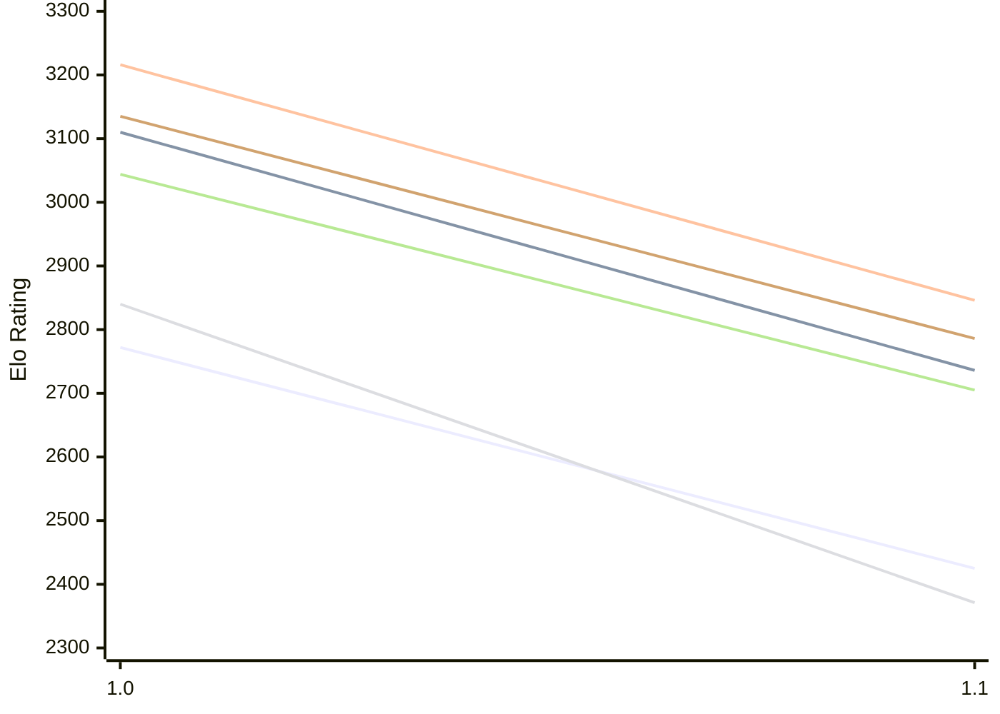
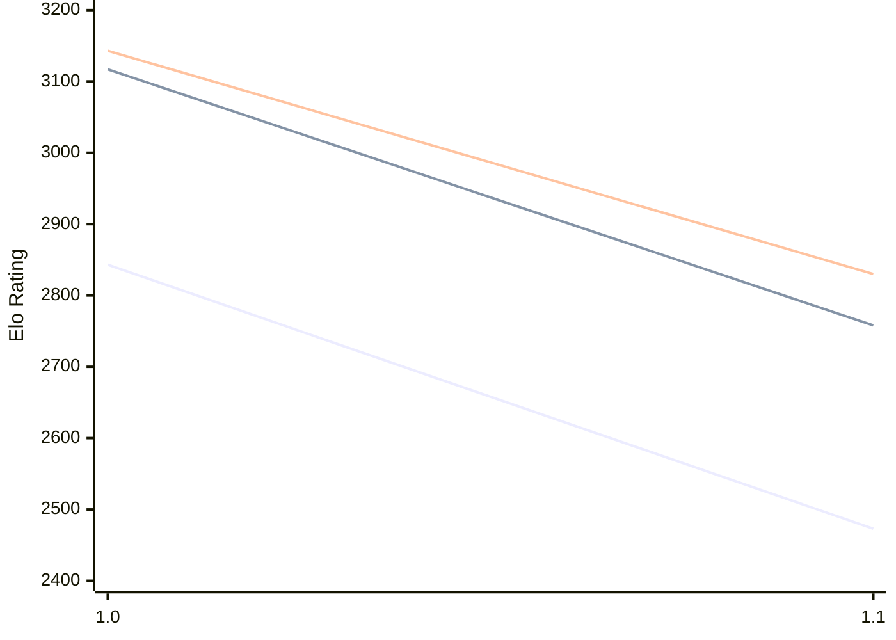

# Engine: Publius

Author: Pawel Koziol

Home: https://github.com/nescitus/publius

## Elo Ratings E1 (Ultra 7 265T (1.50 GHz) - E-Core)

| Version | Published | STC 8.0+0.08s  | LTC 60.0+0.60s | VLTC 2m24s+1.12s | Comment |
| --- | --- | --- | --- | --- | --- |
| 1.1 | 2025-12-31 | 2425(-347) | 2736(-374) | 2846(-370) |  |
| 1.0 | 2025-10-19 | 2772 | 3110 | 3216 |  |
 | | | cElo (∆ prev) | cElo (∆ prev) | cElo (∆ prev) | 

## Elo Ratings P1 (Ultra 7 265T (1.50 GHz) - P-Core)

| Version | Published | STC 8.0+0.08s  | LTC 60.0+0.60s | VLTC 2m24s+1.12s | Comment |
| --- | --- | --- | --- | --- | --- |
| 1.1 | 2025-12-31 | 2371(-469) | 2705(-339) | 2786(-349) |  |
| 1.0 | 2025-10-19 | 2840 | 3044 | 3135 |  |
 | | | cElo (∆ prev) | cElo (∆ prev) | cElo (∆ prev) | 

## Elo Ratings T1 (i5-7500T 2.70GHz)

| Version | Published | STC 8.0+0.08s  | LTC 60.0+0.60s | VLTC 2m24s+1.12s | Comment |
| --- | --- | --- | --- | --- | --- |
| 1.1 | 2025-12-31 | 2473(-370) | 2758(-359) | 2830(-313) |  |
| 1.0 | 2025-10-19 | 2843 | 3117 | 3143 |  |
 | | | cElo (∆ prev) | cElo (∆ prev) | cElo (∆ prev) | 

<a href="https://github.com/computer-chess-index/cci/issues/new?template=submit-version.yml&title=[VERSION]+Publius+<version>&body=###%20Engine%20name%0APublius%0A%0A###%20Version%0A1.1" target="_blank">Submit new version</a>

 Test Conditions:

GUI/CLI: <a href=https://github.com/cutechess/cutechess target="_blank">Cute-Chess</a> 
Elo Calculation: <a href=https://www.remi-coulom.fr/Bayesian-Elo/ target="_blank">Bayesian-Elo</a> 
CPU for P1: Intel(R) Core(TM) Ultra 7 265T (1.50 GHz) - P-Core 
CPU for E1: Intel(R) Core(TM) Ultra 7 265T (1.50 GHz) - E-Core 
CPU for T1: Intel(R) Core(TM) i5-7500T 2.70GHz 
Opening book: 8_moves_v3 
\* STC: 8.0+0.08s, LTC: 60.0+0.60s, VLTC: 2m24s+1.12s

 Lists:
Ratings: <a href=https://github.com/computer-chess-index/cci/blob/main/lists/CCIRatings.csv target="_blank">Complete list</a>

Generated: 2026-11-24 05:41:41

## Ratings Verlauf E1 / P1

```mermaid
%%{init: {"theme":"base","themeVariables":{"seriesColors:['#a3a3a3','#222221','#faa371']}}}%%
xychart-beta
  x-axis ["1.0", "1.1"]
  y-axis "Elo Rating" 2300 --> 3300
  line "E1: STC (8.0+0.08s)" [2772, 2425]
  line "E1: LTC (60.0+0.60s)" [3110, 2736]
  line "E1: VLTC (2m24s+1.12s)" [3216, 2846]
  line "P1: STC (8.0+0.08s)" [2840, 2371]
  line "P1: LTC (60.0+0.60s)" [3044, 2705]
  line "P1: VLTC (2m24s+1.12s)" [3135, 2786]
```

## Ratings Verlauf T1

```mermaid
%%{init: {"theme":"base","themeVariables":{"seriesColors:['#a3a3a3','#222221','#faa371']}}}%%
xychart-beta
  x-axis ["1.0", "1.1"]
  y-axis "Elo Rating" 2400 --> 3200
  line "T1: STC (8.0+0.08s)" [2843, 2473]
  line "T1: LTC (60.0+0.60s)" [3117, 2758]
  line "T1: VLTC (2m24s+1.12s)" [3143, 2830]
```

## Detailed Evaluation Results

| Version | Time Control | Variant | Elo  | Range +/- | Matches | Score | Average Opponent Elo | Draws |
| --- | --- |--- | --- | --- | --- | --- | --- | --- |
| 1.1 | VLTC (2m24s+1.12s) | T1 | 2830 | 24 | 560 | 48% | 2851 | 36% |
|  |  | P1 | 2786 | 39 | 232 | 51% | 2769 | 30% |
|  |  | E1 | 2846 | 27 | 468 | 51% | 2807 | 31% |
|  | LTC (60.0+0.60s) | T1 | 2758 | 25 | 522 | 50% | 2761 | 35% |
|  |  | P1 | 2705 | 35 | 266 | 45% | 2757 | 34% |
|  |  | E1 | 2736 | 29 | 412 | 53% | 2677 | 35% |
|  | STC (8.0+0.08s) | T1 | 2473 | 22 | 694 | 49% | 2472 | 29% |
|  |  | P1 | 2371 | 35 | 292 | 45% | 2430 | 29% |
|  |  | E1 | 2425 | 31 | 382 | 48% | 2442 | 22% |
| --- | --- |--- | --- | --- | --- | --- | --- | --- |
| 1.0 | VLTC (2m24s+1.12s) | T1 | 3143 | 34 | 232 | 49% | 3154 | 57% |
|  |  | P1 | 3135 | 66 | 80 | 63% | 2905 | 39% |
|  |  | E1 | 3216 | 60 | 80 | 55% | 3164 | 53% |
|  | LTC (60.0+0.60s) | T1 | 3117 | 34 | 248 | 52% | 3090 | 55% |
|  |  | P1 | 3044 | 64 | 76 | 61% | 2925 | 42% |
|  |  | E1 | 3110 | 56 | 98 | 46% | 3128 | 49% |
|  | STC (8.0+0.08s) | P1 | 2840 | 61 | 84 | 55% | 2761 | 44% |
|  |  | E1 | 2772 | 59 | 104 | 60% | 2661 | 30% |
|  |  | T1 | 2843 | 36 | 232 | 53% | 2809 | 41% |