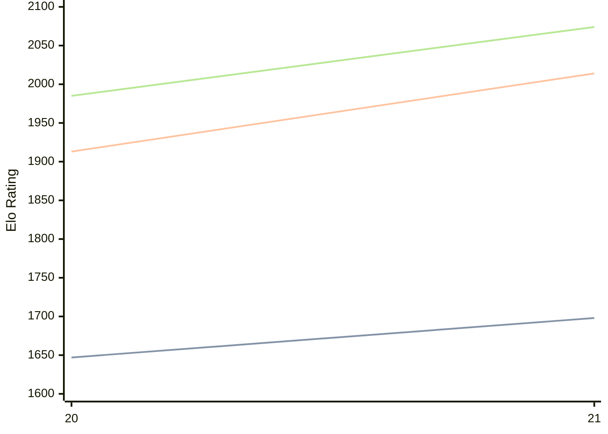

# Engine: PurplePanda

Author: Jakob Steininger

Home: https://github.com/Jakob256/PurplePanda

## Elo Ratings

| Version | Published | STC 8.0+0.08s  | LTC 60.0+0.60s | VLTC 2m24s+1.12s | Comment |
| --- | --- | --- | --- | --- | --- |
| 21 | 2026-07-12 | 1698(+51) | 2014(+101) | 2074(+89) |  |
| 20 | 2025-12-15 | 1647 | 1913 | 1985 |  |
 | | | cElo (∆ prev) | cElo (∆ prev) | cElo (∆ prev) | 

<a href="https://github.com/computer-chess-index/cci/issues/new?template=submit-version.yml&title=[VERSION]+PurplePanda+<version>&body=###%20Engine%20name%0APurplePanda%0A%0A###%20Version%0A21" target="_blank">Submit new version</a>

 Test Conditions:

GUI/CLI: <a href=https://github.com/cutechess/cutechess target="_blank">Cute-Chess</a> 
Elo Calculation: <a href=https://www.remi-coulom.fr/Bayesian-Elo/ target="_blank">Bayesian-Elo</a> 
CPU: Intel(R) Core(TM) i5-7500T 2.70GHz 
Opening book: 8_moves_v3 
\* STC: 8.0+0.08s, LTC: 60.0+0.60s, VLTC: 2m24s+1.12s

 Lists:
Ratings: <a href=https://github.com/computer-chess-index/cci/blob/main/lists/CCIRatings.csv target="_blank">Complete list</a>

Generated: 2026-09-20 04:40:59

## Ratings Verlauf

## Detailed Evaluation Results

| Version | Time Control | Elo  | Range +/- | Matches | Score | Average Opponent Elo | Draws |
| --- | --- | --- | --- | --- | --- | --- | --- |
| 21 | VLTC (2m24s+1.12s) | 2074 | 34 | 318 | 47% | 2111 | 17% |
| 21 | LTC (60.0+0.60s) | 2014 | 34 | 312 | 50% | 2029 | 19% |
| 21 | STC (8.0+0.08s) | 1698 | 34 | 336 | 50% | 1694 | 16% |
| --- | --- | --- | --- | --- | --- | --- | --- |
| 20 | VLTC (2m24s+1.12s) | 1985 | 25 | 566 | 48% | 2014 | 21% |
| 20 | LTC (60.0+0.60s) | 1913 | 25 | 580 | 50% | 1918 | 17% |
| 20 | STC (8.0+0.08s) | 1647 | 25 | 640 | 47% | 1675 | 16% |
| --- | --- | --- | --- | --- | --- | --- | --- |