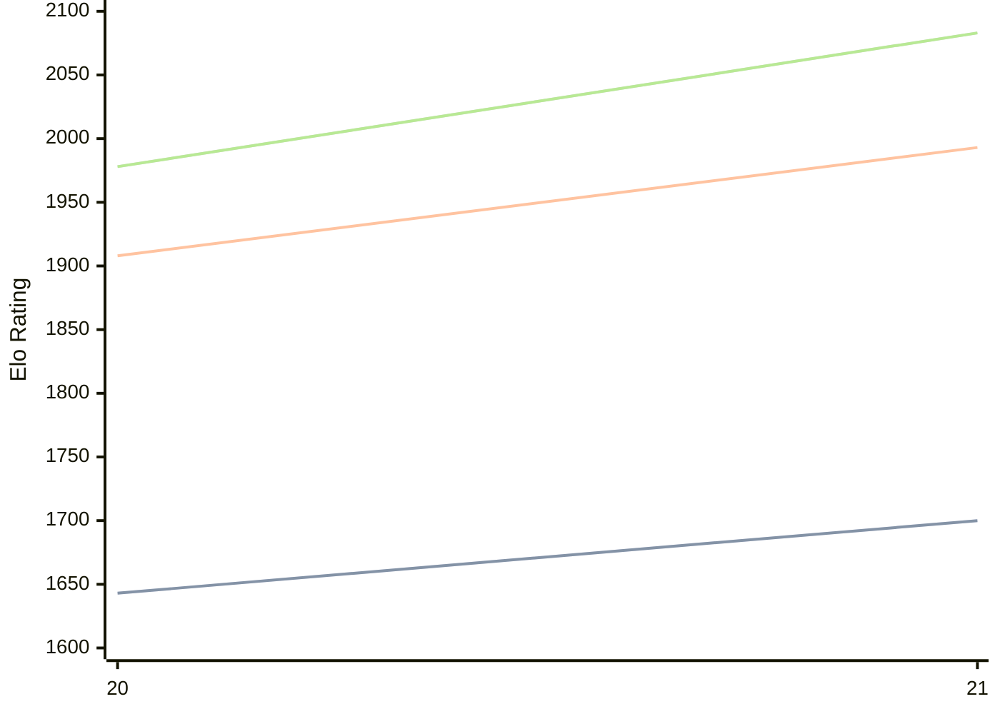

# Engine: PurplePanda

Author: Jakob Steininger

Home: https://github.com/Jakob256/PurplePanda

## Elo Ratings

| Version | Published | STC 8.0+0.08s  | LTC 60.0+0.60s | VLTC 2m24s+1.12s | Comment |
| --- | --- | --- | --- | --- | --- |
| 21 | 2026-07-12 | 1700(+57) | 1993(+85) | 2083(+105) |  |
| 20 | 2025-12-15 | 1643 | 1908 | 1978 |  |
 | | | cElo (∆ prev) | cElo (∆ prev) | cElo (∆ prev) | 

<a href="https://github.com/computer-chess-index/cci/issues/new?template=submit-version.yml&title=[VERSION]+PurplePanda+<version>&body=###%20Engine%20name%0APurplePanda%0A%0A###%20Version%0A21" target="_blank">Submit new version</a>

 Test Conditions:

GUI/CLI: <a href=https://github.com/cutechess/cutechess target="_blank">Cute-Chess</a> 
Elo Calculation: <a href=https://www.remi-coulom.fr/Bayesian-Elo/ target="_blank">Bayesian-Elo</a> 
CPU: Intel(R) Core(TM) i5-7500T 2.70GHz 
Opening book: 8_moves_v3 
\* STC: 8.0+0.08s, LTC: 60.0+0.60s, VLTC: 2m24s+1.12s

 Lists:
Ratings: <a href=https://github.com/computer-chess-index/cci/blob/main/lists/CCIRatings.csv target="_blank">Complete list</a>

Generated: 2026-08-21 06:29:20

## Ratings Verlauf

⬛ STC (8.0+0.08s) &nbsp;&nbsp; 🟧 LTC (60.0+0.60s) &nbsp;&nbsp; 🟩 VLTC (2m24s+1.12s)

dark mode: 🟩STC (8.0+0.08s) 🟧LTC (60.0+0.60s) ⬜VLTC (2m24s+1.12s)

## Detailed Evaluation Results

| Version | Time Control | Elo  | Range +/- | Matches | Score | Average Opponent Elo | Draws |
| --- | --- | --- | --- | --- | --- | --- | --- |
| 21 | VLTC (2m24s+1.12s) | 2083 | 37 | 270 | 49% | 2094 | 17% |
| 21 | LTC (60.0+0.60s) | 1993 | 37 | 264 | 48% | 2028 | 19% |
| 21 | STC (8.0+0.08s) | 1700 | 38 | 264 | 51% | 1696 | 16% |
| --- | --- | --- | --- | --- | --- | --- | --- |
| 20 | VLTC (2m24s+1.12s) | 1978 | 25 | 566 | 48% | 2007 | 21% |
| 20 | LTC (60.0+0.60s) | 1908 | 25 | 580 | 50% | 1913 | 17% |
| 20 | STC (8.0+0.08s) | 1643 | 25 | 640 | 47% | 1671 | 16% |
| --- | --- | --- | --- | --- | --- | --- | --- |