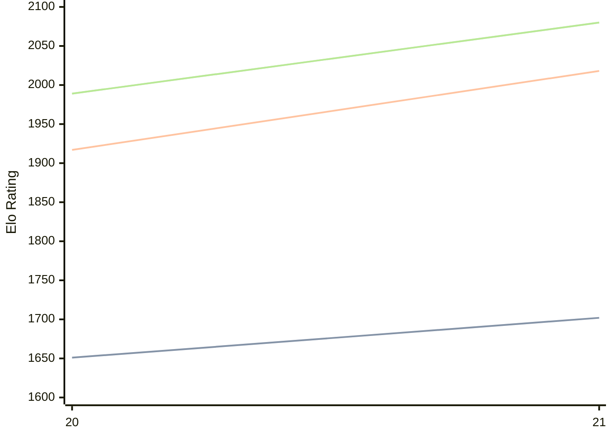

# Engine: PurplePanda

Author: Jakob Steininger

Home: https://github.com/Jakob256/PurplePanda

## Elo Ratings E1

| Version | Published | STC 8.0+0.08s  | LTC 60.0+0.60s | VLTC 2m24s+1.12s | Comment |
| --- | --- | --- | --- | --- | --- |
| 21 | 2026-07-12 | 1550 | 1875 | 1989 |  |
 | | | cElo (∆ prev) | cElo (∆ prev) | cElo (∆ prev) | 

## Elo Ratings P1

| Version | Published | STC 8.0+0.08s  | LTC 60.0+0.60s | VLTC 2m24s+1.12s | Comment |
| --- | --- | --- | --- | --- | --- |
| 21 | 2026-07-12 | 1743 | 2033 | 2145 |  |
 | | | cElo (∆ prev) | cElo (∆ prev) | cElo (∆ prev) | 

## Elo Ratings T1

| Version | Published | STC 8.0+0.08s  | LTC 60.0+0.60s | VLTC 2m24s+1.12s | Comment |
| --- | --- | --- | --- | --- | --- |
| 21 | 2026-07-12 | 1702(+51) | 2018(+101) | 2080(+91) |  |
| 20 | 2025-12-15 | 1651 | 1917 | 1989 |  |
 | | | cElo (∆ prev) | cElo (∆ prev) | cElo (∆ prev) | 

<a href="https://github.com/computer-chess-index/cci/issues/new?template=submit-version.yml&title=[VERSION]+PurplePanda+<version>&body=###%20Engine%20name%0APurplePanda%0A%0A###%20Version%0A21" target="_blank">Submit new version</a>

 Test Conditions:

GUI/CLI: <a href=https://github.com/cutechess/cutechess target="_blank">Cute-Chess</a> 
Elo Calculation: <a href=https://www.remi-coulom.fr/Bayesian-Elo/ target="_blank">Bayesian-Elo</a> 
CPU for P1: Intel(R) Core(TM) Ultra 7 265T (1.50 GHz) - P-Core 
CPU for E1: Intel(R) Core(TM) Ultra 7 265T (1.50 GHz) - E-Core 
CPU for T1: Intel(R) Core(TM) i5-7500T 2.70GHz 
Opening book: 8_moves_v3 
\* STC: 8.0+0.08s, LTC: 60.0+0.60s, VLTC: 2m24s+1.12s

 Lists:
Ratings: <a href=https://github.com/computer-chess-index/cci/blob/main/lists/CCIRatings.csv target="_blank">Complete list</a>

Generated: 2026-10-09 14:15:08

## Ratings Verlauf

```mermaid
%%{init: {"theme":"base","themeVariables":{"seriesColors:['#a3a3a3','#222221','#faa371']}}}%%
xychart-beta
  x-axis ["20", "21"]
  y-axis "Elo Rating" 1600 --> 2100
  line "" [1651, 1702]
  line "STC (8.0+0.08s)" [1651, 1702]
  line "LTC (60.0+0.60s)" [1917, 2018]
  line "" [1989, 2080]
  line "VLTC (2m24s+1.12s)" [1989, 2080]
```

## Detailed Evaluation Results

| Version | Time Control | Elo  | Range +/- | Matches | Score | Average Opponent Elo | Draws |
| --- | --- | --- | --- | --- | --- | --- | --- |
| 21 | VLTC (2m24s+1.12s) | 1989 | 43 | 210 | 49% | 2006 | 14% |
| 21 | VLTC (2m24s+1.12s) | 2080 | 34 | 322 | 47% | 2115 | 17% |
| 21 | VLTC (2m24s+1.12s) | 2145 | 45 | 178 | 49% | 2160 | 19% |
| 21 | LTC (60.0+0.60s) | 1875 | 42 | 206 | 47% | 1917 | 17% |
| 21 | LTC (60.0+0.60s) | 2018 | 34 | 312 | 50% | 2033 | 19% |
| 21 | LTC (60.0+0.60s) | 2033 | 51 | 144 | 47% | 2079 | 13% |
| 21 | STC (8.0+0.08s) | 1702 | 33 | 338 | 50% | 1698 | 16% |
| --- | --- | --- | --- | --- | --- | --- | --- |
| 21 | STC (8.0+0.08s) | 1743 | 49 | 160 | 50% | 1748 | 11% |
| --- | --- | --- | --- | --- | --- | --- | --- |
| 21 | STC (8.0+0.08s) | 1550 | 41 | 226 | 47% | 1578 | 13% |
| --- | --- | --- | --- | --- | --- | --- | --- |
| 20 | VLTC (2m24s+1.12s) | 1989 | 25 | 566 | 48% | 2018 | 21% |
| 20 | LTC (60.0+0.60s) | 1917 | 25 | 580 | 50% | 1922 | 17% |
| 20 | STC (8.0+0.08s) | 1651 | 25 | 640 | 47% | 1679 | 16% |
| --- | --- | --- | --- | --- | --- | --- | --- |