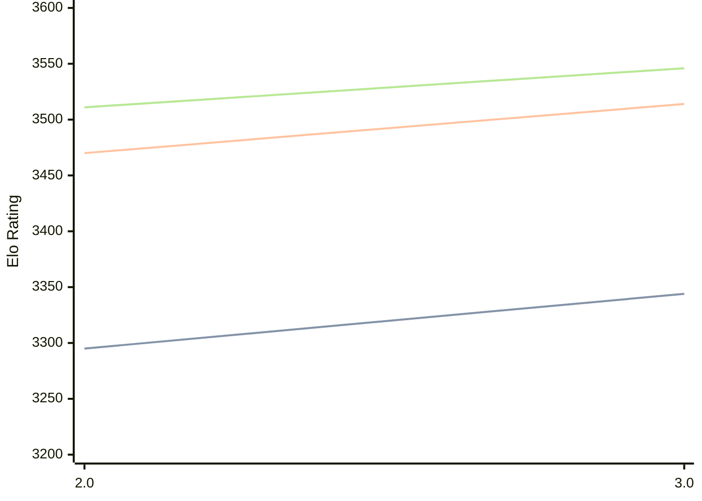

# Engine: Quanticade

Author: Martin Botka

Home: https://github.com/Quanticade/Quanticade

## Elo Ratings

| Version | Published | STC 8.0+0.08s  | LTC 60.0+0.60s | VLTC 2m24s+1.12s | Comment |
| --- | --- | --- | --- | --- | --- |
| 3.0 | 2025-12-15 | 3344(+49) | 3514(+44) | 3546(+35) |  |
| 2.0 | 2025-05-21 | 3295 | 3470 | 3511 |  |
 | | | cElo (∆ prev) | cElo (∆ prev) | cElo (∆ prev) | 

<a href="https://github.com/computer-chess-index/cci/issues/new?template=submit-version.yml&title=[VERSION]+Quanticade+<version>&body=###%20Engine%20name%0AQuanticade%0A%0A###%20Version%0A3.0" target="_blank">Submit new version</a>

 Test Conditions:

GUI/CLI: <a href=https://github.com/cutechess/cutechess target="_blank">Cute-Chess</a> 
Elo Calculation: <a href=https://www.remi-coulom.fr/Bayesian-Elo/ target="_blank">Bayesian-Elo</a> 
CPU: Intel(R) Core(TM) i5-7500T 2.70GHz 
Opening book: 8_moves_v3 
\* STC: 8.0+0.08s, LTC: 60.0+0.60s, VLTC: 2m24s+1.12s

 Lists:
Ratings: <a href=https://github.com/computer-chess-index/cci/blob/main/lists/CCIRatings.csv target="_blank">Complete list</a>

Generated: 2026-08-25 06:28:39

## Ratings Verlauf

⬛ STC (8.0+0.08s) &nbsp;&nbsp; 🟧 LTC (60.0+0.60s) &nbsp;&nbsp; 🟩 VLTC (2m24s+1.12s)

dark mode: 🟩STC (8.0+0.08s) 🟧LTC (60.0+0.60s) ⬜VLTC (2m24s+1.12s)

## Detailed Evaluation Results

| Version | Time Control | Elo  | Range +/- | Matches | Score | Average Opponent Elo | Draws |
| --- | --- | --- | --- | --- | --- | --- | --- |
| 3.0 | VLTC (2m24s+1.12s) | 3546 | 22 | 476 | 51% | 3540 | 89% |
| 3.0 | LTC (60.0+0.60s) | 3514 | 22 | 462 | 50% | 3513 | 87% |
| 3.0 | STC (8.0+0.08s) | 3344 | 20 | 642 | 50% | 3341 | 70% |
| --- | --- | --- | --- | --- | --- | --- | --- |
| 2.0 | VLTC (2m24s+1.12s) | 3511 | 26 | 340 | 50% | 3507 | 84% |
| 2.0 | LTC (60.0+0.60s) | 3470 | 26 | 352 | 50% | 3467 | 81% |
| 2.0 | STC (8.0+0.08s) | 3295 | 25 | 414 | 52% | 3282 | 64% |
| --- | --- | --- | --- | --- | --- | --- | --- |