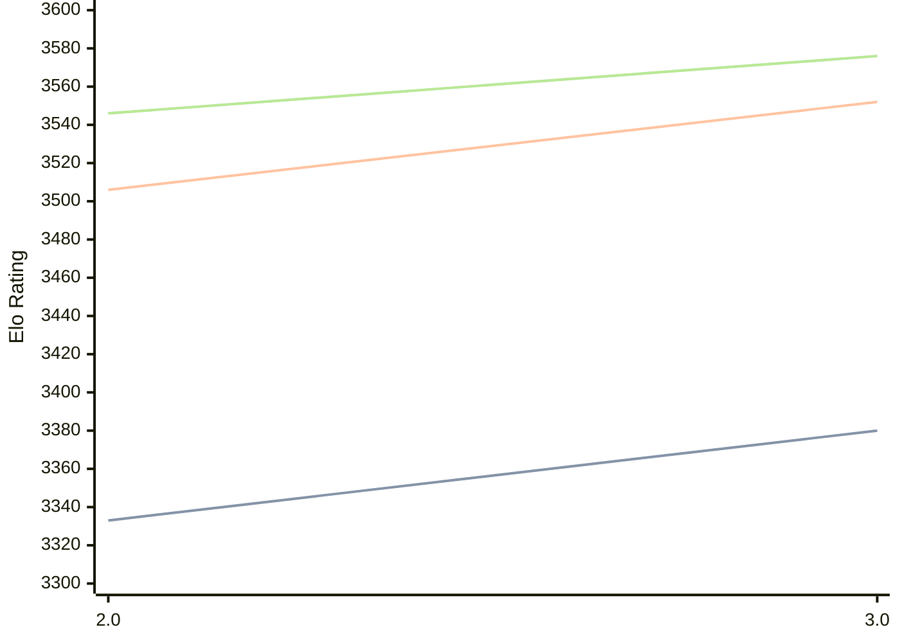

# Engine: Quanticade

Author: Martin Botka

Home: https://github.com/Quanticade/Quanticade

## Ratings nach Version

| Version | Published | STC 8.0+0.08s  | LTC 60.0+0.60s | VLTC 2m24s+1.12s | Comment |
| --- | --- | --- | --- | --- | --- |
| 3.0 | 2025-12-15 | 3380(+47) | 3552(+46) | 3576(+30) |  |
| 2.0 | 2025-05-21 | 3333(+new) | 3506(+new) | 3546(+new) |  |
| 1.0 Fenrir | 2025-03-10 |  |  |  |  |
| 1.2 Chimera | 2025-01-06 |  |  |  |  |
| 1.1 Chimera | 2025-01-02 |  |  |  |  |
| 1.0 Chimera | 2025-01-01 |  |  |  |  |
| 0.9 Electra | 2024-10-26 |  |  |  |  |
| 0.8.1 Aurora | 2024-09-11 |  |  |  |  |
| 0.8 Aurora | 2024-08-23 |  |  |  |  |
| 0.7 | 2024-07-19 |  |  |  |  |
| 0.6b | 2024-07-09 |  |  |  |  |
 | | | cElo (∆ prev) | cElo (∆ prev) | cElo (∆ prev) | 

<a href="https://github.com/computer-chess-index/cci/issues/new?template=submit-version.yml&title=[VERSION]+Quanticade+<version>&body=###%20Engine%20name%0AQuanticade%0A%0A###%20Version%0A3.0" target="_blank">Submit new version</a>

 Test Conditions:

GUI/CLI: <a href=https://github.com/cutechess/cutechess target="_blank">Cute-Chess</a> 
Elo Calculation: <a href=https://www.remi-coulom.fr/Bayesian-Elo/ target="_blank">Bayesian-Elo</a> 
CPU: Intel(R) Core(TM) i5-7500T 2.70GHz 
Opening book: 8_moves_v3 
\* STC: 8.0+0.08s, LTC: 60.0+0.60s, VLTC: 2m24s+1.12s

 Lists:
Ratings: <a href=https://github.com/computer-chess-index/cci/blob/main/lists/CCIRatings.csv target="_blank">Complete list</a>

Generated: 2026-04-24 06:27:47

## Ratings Verlauf

⬛ STC (8.0+0.08s) &nbsp;&nbsp; 🟧 LTC (60.0+0.60s) &nbsp;&nbsp; 🟩 VLTC (2m24s+1.12s)

dark mode: 🟩STC (8.0+0.08s) 🟧LTC (60.0+0.60s) ⬜VLTC (2m24s+1.12s)

