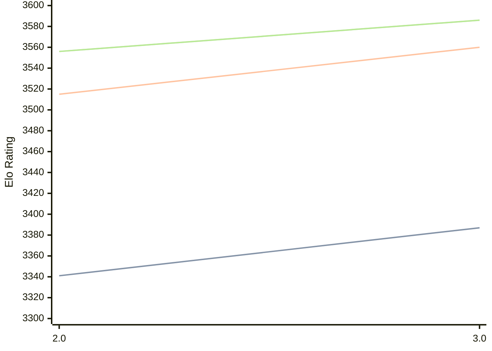

# Engine: Quanticade

Author: Martin Botka

Home: https://github.com/Quanticade/Quanticade

## Elo Ratings

| Version | Published | STC 8.0+0.08s  | LTC 60.0+0.60s | VLTC 2m24s+1.12s | Comment |
| --- | --- | --- | --- | --- | --- |
| 3.0 | 2025-12-15 | 3387(+46) | 3560(+45) | 3586(+30) |  |
| 2.0 | 2025-05-21 | 3341(+new) | 3515(+new) | 3556(+new) |  |
| 1.0 Fenrir | 2025-03-10 |  |  |  |  |
| 1.2 Chimera | 2025-01-06 |  |  |  |  |
| 1.1 Chimera | 2025-01-02 |  |  |  |  |
| 1.0 Chimera | 2025-01-01 |  |  |  |  |
| 0.9 Electra | 2024-10-26 |  |  |  |  |
| 0.8.1 Aurora | 2024-09-11 |  |  |  |  |
| 0.8 Aurora | 2024-08-23 |  |  |  |  |
| 0.7 | 2024-07-19 |  |  |  |  |
| 0.6b | 2024-07-09 |  |  |  |  |
 | | | cElo (∆ prev) | cElo (∆ prev) | cElo (∆ prev) | 

<a href="https://github.com/computer-chess-index/cci/issues/new?template=submit-version.yml&title=[VERSION]+Quanticade+<version>&body=###%20Engine%20name%0AQuanticade%0A%0A###%20Version%0A3.0" target="_blank">Submit new version</a>

 Test Conditions:

GUI/CLI: <a href=https://github.com/cutechess/cutechess target="_blank">Cute-Chess</a> 
Elo Calculation: <a href=https://www.remi-coulom.fr/Bayesian-Elo/ target="_blank">Bayesian-Elo</a> 
CPU: Intel(R) Core(TM) i5-7500T 2.70GHz 
Opening book: 8_moves_v3 
\* STC: 8.0+0.08s, LTC: 60.0+0.60s, VLTC: 2m24s+1.12s

 Lists:
Ratings: <a href=https://github.com/computer-chess-index/cci/blob/main/lists/CCIRatings.csv target="_blank">Complete list</a>

Generated: 2026-05-03 07:42:59

## Ratings Verlauf

⬛ STC (8.0+0.08s) &nbsp;&nbsp; 🟧 LTC (60.0+0.60s) &nbsp;&nbsp; 🟩 VLTC (2m24s+1.12s)

dark mode: 🟩STC (8.0+0.08s) 🟧LTC (60.0+0.60s) ⬜VLTC (2m24s+1.12s)

## Detailed Evaluation Results

| Version | Time Control | Elo  | Range +/- | Matches | Score | Average Opponent Elo | Draws |
| --- | --- | --- | --- | --- | --- | --- | --- |
| 3.0 | VLTC (2m24s+1.12s) | 3586 | 25 | 364 | 50% | 3583 | 90% |
| 3.0 | D1 | 941 | 34 | 296 | 51% | 923 | 29% |
| 3.0 | D10 | 3013 | 25 | 464 | 49% | 3019 | 52% |
| 3.0 | D11 | 3117 | 24 | 484 | 49% | 3127 | 54% |
| 3.0 | D12 | 3212 | 23 | 484 | 50% | 3212 | 61% |
| 3.0 | D13 | 3268 | 21 | 632 | 53% | 3248 | 59% |
| 3.0 | D14 | 3318 | 24 | 444 | 51% | 3312 | 67% |
| 3.0 | D15 | 3372 | 24 | 448 | 51% | 3364 | 71% |
| 3.0 | D16 | 3401 | 23 | 452 | 50% | 3402 | 72% |
| 3.0 | D17 | 3440 | 21 | 556 | 50% | 3441 | 78% |
| 3.0 | D18 | 3457 | 21 | 530 | 51% | 3452 | 77% |
| 3.0 | D19 | 3486 | 21 | 548 | 52% | 3471 | 82% |
| 3.0 | D2 | 1359 | 29 | 374 | 46% | 1411 | 42% |
| 3.0 | D20 | 3511 | 21 | 548 | 51% | 3506 | 82% |
| 3.0 | D3 | 1590 | 29 | 350 | 51% | 1581 | 45% |
| 3.0 | D4 | 1743 | 29 | 376 | 50% | 1740 | 43% |
| 3.0 | D5 | 1929 | 28 | 368 | 49% | 1936 | 48% |
| 3.0 | D6 | 2134 | 25 | 482 | 47% | 2157 | 44% |
| 3.0 | D7 | 2415 | 24 | 554 | 47% | 2427 | 41% |
| 3.0 | D8 | 2645 | 27 | 432 | 50% | 2635 | 43% |
| 3.0 | D9 | 2836 | 26 | 456 | 49% | 2834 | 41% |
| 3.0 | S10 | 3414 | 24 | 420 | 49% | 3422 | 75% |
| 3.0 | S40 | 3532 | 26 | 352 | 50% | 3533 | 82% |
| 3.0 | LTC (60.0+0.60s) | 3560 | 25 | 378 | 50% | 3559 | 88% |
| 3.0 | STC (8.0+0.08s) | 3387 | 23 | 500 | 50% | 3389 | 68% |
| --- | --- | --- | --- | --- | --- | --- | --- |
| 2.0 | VLTC (2m24s+1.12s) | 3556 | 26 | 340 | 50% | 3553 | 84% |
| 2.0 | D1 | 1126 | 30 | 396 | 51% | 1116 | 19% |
| 2.0 | D10 | 2935 | 29 | 344 | 50% | 2938 | 53% |
| 2.0 | D11 | 3019 | 27 | 388 | 48% | 3031 | 52% |
| 2.0 | D12 | 3127 | 27 | 368 | 50% | 3128 | 63% |
| 2.0 | D13 | 3193 | 27 | 356 | 49% | 3198 | 65% |
| 2.0 | D14 | 3259 | 26 | 368 | 51% | 3254 | 71% |
| 2.0 | D15 | 3332 | 25 | 410 | 50% | 3329 | 67% |
| 2.0 | D16 | 3344 | 24 | 452 | 51% | 3339 | 70% |
| 2.0 | D17 | 3389 | 27 | 340 | 49% | 3395 | 79% |
| 2.0 | D18 | 3424 | 26 | 352 | 50% | 3422 | 77% |
| 2.0 | D19 | 3437 | 25 | 378 | 49% | 3448 | 80% |
| 2.0 | D2 | 1546 | 34 | 320 | 54% | 1509 | 19% |
| 2.0 | D20 | 3461 | 25 | 386 | 48% | 3472 | 81% |
| 2.0 | D3 | 1704 | 33 | 320 | 46% | 1755 | 28% |
| 2.0 | D4 | 1805 | 32 | 340 | 48% | 1824 | 27% |
| 2.0 | D5 | 1949 | 32 | 324 | 49% | 1949 | 30% |
| 2.0 | D6 | 2115 | 30 | 352 | 49% | 2122 | 34% |
| 2.0 | D7 | 2303 | 31 | 340 | 50% | 2299 | 34% |
| 2.0 | D8 | 2515 | 30 | 372 | 47% | 2541 | 33% |
| 2.0 | D9 | 2691 | 30 | 344 | 51% | 2682 | 41% |
| 2.0 | S10 | 3382 | 26 | 380 | 49% | 3387 | 73% |
| 2.0 | S40 | 3517 | 25 | 380 | 50% | 3517 | 80% |
| 2.0 | LTC (60.0+0.60s) | 3515 | 26 | 352 | 50% | 3513 | 81% |
| 2.0 | STC (8.0+0.08s) | 3341 | 25 | 414 | 52% | 3328 | 64% |
| --- | --- | --- | --- | --- | --- | --- | --- |
| 1.0 Fenrir |  |  |  |  |  |  |  |
| 1.2 Chimera |  |  |  |  |  |  |  |
| 1.1 Chimera |  |  |  |  |  |  |  |
| 1.0 Chimera |  |  |  |  |  |  |  |
| 0.9 Electra |  |  |  |  |  |  |  |
| 0.8.1 Aurora |  |  |  |  |  |  |  |
| 0.8 Aurora |  |  |  |  |  |  |  |
| 0.7 |  |  |  |  |  |  |  |
| 0.6b |  |  |  |  |  |  |  |